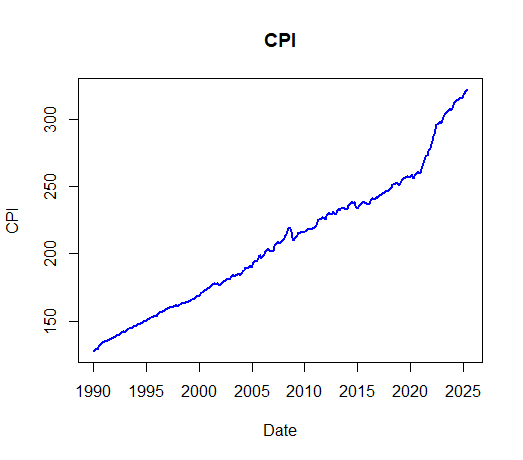
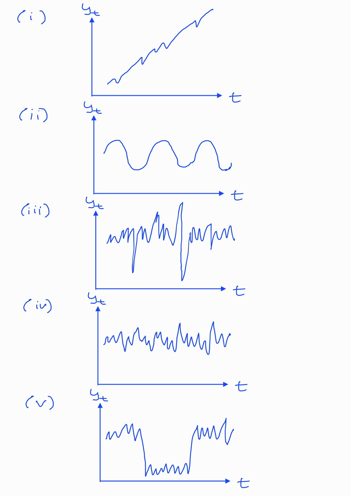
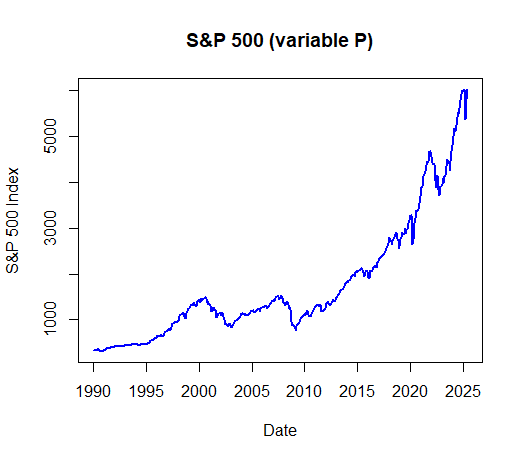
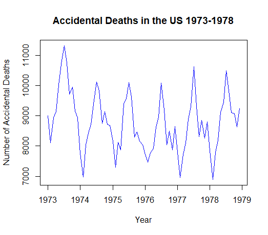
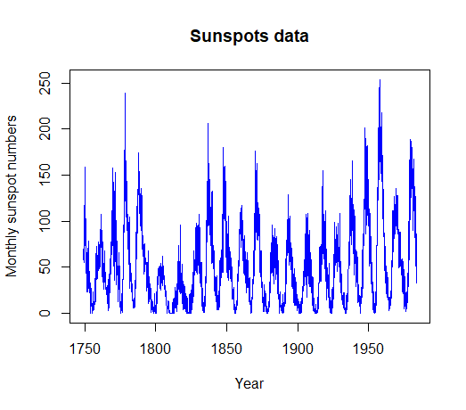
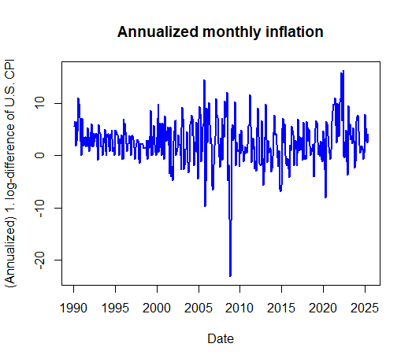
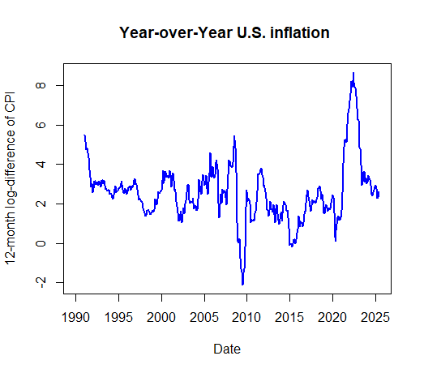
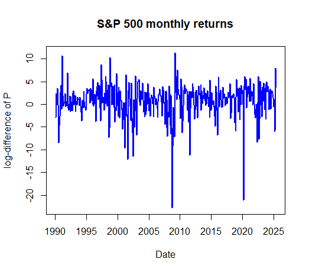

# Introduction {#part-intro .chapter-title}

## Time series data {#timeseriesdata}

A **time series** is a collection of data where observations correspond to consecutive time periods. A common notation for time series data is $y_{t}$, $t=1,\ldots,T$, where $t$ denotes the time period and $T$ the total number of observations. The interval between observations $y_{t-1}$ and $y_{t}$, or $y_{t}$ and $y_{t+1}$, represents a unit of time, for example, an hour, a month, a quarter or one year. In many cases, it is natural to use more concrete labels for the time periods, such as $t=2000,\ldots,2024$ for yearly data, or $t=2000:1, 2000:2,\ldots,2024:12$ for monthly observations. Therefore, occasionally $T$ may also refer to the final time label, such as 2024:12 (December 2024).

- Time series data are analyzed in various fields, including economics and finance, as well as social, natural, engineering, and medical sciences. 

- In (macro)economics and finance, data sets are typically time series, which has led to the specialized subfields of **macroeconometrics** and **financial econometrics**.

In this course, we assume that the observations are recorded at equally spaced time intervals (or can reasonably be treated as such). Irregularly spaced data require different methods and are not covered here. If the time series observations $y_{t}, \, t=1,\ldots,T,$ are scalar valued, we refer to them as a **univariate time series**. Conversely, if $\boldsymbol{y}_{t}=(y_{1t},\ldots,y_{Kt})^{\prime}$ is vector-valued (indicated by the bold symbol), we refer to it as a **multiple time series** or **vector-valued time series**. In these latter cases, relationships between two or more time series are of interest. 

We restrict ourselves to the common case where $y_t$ is a **real-valued** time series, or is **at least treated as such**, meaning that its realizations are real numbers. In discrete and limited dependent time series, $y_t$ takes only discrete values, such as binary values ($y_t=1$ or $y_t=0$) or values where the range is limited (such as the case where $y_t$ is nonnegative). These types of time series require specific nonlinear models, which we will not cover in this course, except for the models used in volatility modelling, where positive-valued variables are relevant.

When analyzing time series data, a useful and natural first step is to plot the data and inspect its main characteristics visually. Below, we plot the monthly Consumer Price Index (CPI) for the United States over the time period 1990:1--2025:6 (January 1990--June 2025). In this figure, as is almost always the case when plotting time series data, the line connects observation points to highlight the sequential nature of the data and the dependency between observations. 
```{r, uscpi, echo=FALSE, out.width="60%", fig.align = "center", fig.cap=""}

```
<span class="fig-caption">Figure: Monthly U.S. CPI index (levels) (1990:1--2025:6).</span>

&nbsp;

**The aim** of time series analysis is often to build a **statistical model** that represents the observed time series and its fluctuation over time. This typically involves examining the dependence structure among consecutive observations. **Autocorrelation** (serial correlation) between observations is a key property of time series and must be accounted for in statistical and econometric modelling.

- This violates the no-autocorrelation assumption typically imposed in linear regression models for cross-sectional datasets, as introduced in basic econometrics and statistics courses.

- With cross-sectional data, random sampling generally ensures that the error terms of the linear regression model are mutually independent (i.e., not autocorrelated), so autocorrelation is usually not an issue. 

As noted above, **plotting the series and inspecting its main characteristics visually** is a natural first step, to be done alongside any underlying theory or background knowledge of the phenomenon the time series represents. This provides at least a preliminary understanding of the dependence structures behind the **data generating process** (**DGP**). Some important questions to consider when examining a time series graph include:

:::: {.columns}
::: {.column width="50%"}
(i) Is there a **trend** (that is, do the values of the time series tend to increase or decrease over time)?

(ii) Are there **seasonal effects** (a repeating regular pattern of highs and lows related to, e.g., seasons, quarters, months or days of the week)?

(iii) Are there major **outliers** (observations far away from other data points)?

(iv) Is the **variability** (variance) relatively **constant over time**? 

(v) Are there any **abrupt changes**, such as **breaks** or **regime switches** (such as in figure (v)), in either the level or variance of the series?
:::

::: {.column width="50%"}
```{r, generalexamples, echo=FALSE, out.width=if (knitr::is_html_output()) "100%" else "55%", fig.align = "center", fig.cap=""}

```
:::
::::

As an example, in the U.S. CPI time series shown above, a clear feature is the persistent trend over time. However, rather than focusing on the level of the CPI, we are primarily interested in its changes as a measure of inflation, as will be discussed below.

An upward trend is also evident in the monthly S&P 500 stock market index. Stock prices have risen substantially between 1990 and 2025, and a pronounced upward surge is clearly visible. At the same time, several significant market corrections, commonly referred to as "bear markets", occurred during this period. It is important to note that this trending behavior differs markedly from that observed in the CPI series. The characteristics underlying these types of stochastic trends, particularly those seen in the S&P 500 index, will be explored later in this course when we discuss nonstationary time series.

```{r, SP500mlevels, echo=FALSE, out.width="60%", fig.align = "center", fig.cap=""}

```
<span class="fig-caption">Figure: S&P 500 stock market index between January 1990 and June 2025 (source: Shiller data).</span>


&nbsp;

The next figure depicts the monthly number of accidental deaths in the U.S. between 1973:1--1978:12. In this series, there is no apparent upward or downward trend. Instead, the series exhibits a clear **seasonal variation**, with the yearly maximum consistently occurring in July and the minimum in February.
```{r, accidents, echo=FALSE, out.width="60%", fig.align = "center", fig.cap=""}

```
<span class="fig-caption">Figure: Monthly accidental deaths in the U.S. between January 1973 and December 1978 (source: Brockwell and Davis, 1996).</span>

&nbsp;

The following figure shows the yearly number of sunspots for the period 1770--1870. This series has no trend or seasonal variation, although the **cyclical pattern** could easily be mistaken for seasonality. However, the pattern is not seasonal because the nature of the cycle changes over time. In particular, the distance between consecutive peaks is not constant, as it would be in the case of seasonal variation. Another apparent feature is the positive correlation between consecutive observations: a large observation is typically followed by another large one, and a small observation by another small one.
```{r, sunspots, echo=FALSE, out.width="60%", fig.align = "center", fig.cap=""}

```
<span class="fig-caption">Figure: The number of sunspots between the years 1770--1870 (source: Brockwell and Davis, 1996).</span>

&nbsp;

Overall, these visual findings may already suggest which type of **time series model** could be appropriate. Once a model has been selected, as we will consider in more detail in the following sections, one can then:

- Estimate the unknown parameters of the model,

- Assess whether the estimated model is compatible with the observed data,

- Test hypotheses concerning the model parameters, and

- Use the model for its intended end purpose.

The ultimate purpose of the statistical model depends on the context and the field of application.

- One common use is to provide a **summarized description** of the observed dataset, which can help in understanding the underlying data-generating process. 

- Another central use of a time series model is to **predict (forecast)** future values of one or more series. In the multivariate case, a series of interest can be predicted using its own past values but also information contained in other series as explanatory or predictive variables. 

- A further objective is to explore potential **temporal and contemporaneous dependencies** between time series, such as the relationship between inflation and stock market returns (after applying relevant transformations, as discussed next). For example, one may investigate whether higher inflation tends to occur simultaneously with rising stock prices.


&nbsp;


## Transformations

As described above, in time series modelling a good first step is always to plot the time series under investigation. This provides an initial view of its main characteristics, such as trends, seasonal patterns, and any sudden breaks or outliers. In the following sections, we assume that such patterns are absent. If the observed series does exhibit these features, appropriate transformations should be applied to remove or mitigate them.

In time series analysis, several transformations and adjustments ("manipulations") are commonly used. These are natural and often essential components of empirical analysis in many applications.

- **The first lag** of the time series $y_t$ is denoted by $y_{t-1}$. Generally, the **$k$th lag** is $y_{t-k}$.

- Perhaps the most commonly used transformation for time series data is **differencing**. The **first difference** of the series, $\Delta y_t$, is the **change** between $y_t$ and $y_{t-1}$. In other words,
\begin{equation*}
\Delta y_t = y_t - y_{t-1}.
\end{equation*}

- Often differencing is combined with taking natural **logarithms** (when assuming $y_t > 0, \, \forall t$). Taking logarithms is common especially when the series exhibits exponential growth or when the variation in the series increases as the level increases.
  - Recall that if $y_t = \exp(\delta t)$, then $\log(y_t) = \delta t$.

The **logarithmic change** is 
\begin{equation*}
\Delta \log(y_t) = \log(y_t) - \log(y_{t-1}).
\end{equation*}
Importantly, the logarithmic changes can be interpreted as relative changes when the changes are small:
\begin{equation*}
\Delta \log(y_t) \approx (y_t - y_{t-1})/y_{t-1}.
\end{equation*}

  - Why so? Recall that $\log(1+x) \approx x$ when $x$ is small. Therefore,
  \begin{equation*}
  \Delta \log(y_t) = \log\left(\frac{y_t}{y_{t-1}} \right) = \log\left(1 + \frac{y_t}{y_{t-1}} -1 \right)  \approx (y_t - y_{t-1})/y_{t-1}.
  \end{equation*}

- The **percentage of change** between periods $t$ and $t-1$ can be approximated as $100 \Delta \log(y_t)$. For quarterly data $y_t$, **annualized growth rates** are obtained by multiplying by 400, that is, $400 \Delta \log(y_t)$. Similarly, for monthly data, annualized growth rates are computed as $1200 \Delta \log(y_t)$. 

As an example, consider the monthly U.S. CPI time series. Taking log-differences (first applying the logarithm and then differencing) and multiplying the resulting series by 1200, we obtain a proxy for the annualized inflation rate. Because the CPI typically exhibits an upward trend, log-differencing removes this trend, resulting in a series without a clear deterministic trend. This detrending implies that, instead of an increasing level, the transformed series has a positive mean, which reflects the average inflation rate over the sample period.

```{r, usinflationm, echo=FALSE, out.width="60%", fig.align = "center", fig.cap=""}

```
<span class="fig-caption">Figure: Annualized U.S. inflation (CPI inflation) rate from February 1990 to June 2025 (1990:2--2025:6).</span>

&nbsp;

**More on differencing**. Differencing may also happen with a longer lag than the first lag: $y_{t}-y_{t-s},\, \left(s\geq1\right)$.

- As discussed above, the case $s=1$ is the most common (representing the change from one period to another). 

- In the case of seasonal variation, $s$ is often selected to match the length of the seasonal pattern. That is, for example, $s=4$ for quarterly data and $s=12$ for monthly series.

If we temporarily denote by $y_t$ the log CPI, taking the seasonal difference $100 (y_{t}-y_{t-12})$ yields another proxy for U.S. inflation (cf. the time series above).

- An example case of seasonal log-differencing for quarterly data: $\log(y_t) - \log(y_{t-4}) = \Delta \log(y_t) + \Delta \log(y_{t-1}) + \Delta \log(y_{t-2}) + \Delta \log(y_{t-3})$. 

```{r, usinflationytoy, echo=FALSE, out.width="60%", fig.align = "center", fig.cap=""}

```
<span class="fig-caption">Figure: U.S. inflation (CPI inflation) obtained as year-to-year changes in the CPI (1991:1--2025:6).</span>

&nbsp;

Another use of differencing, especially in financial econometrics and empirical finance, is to obtain the returns that different assets yield for investors. Let $P_t$ be the price of an asset at time $t$. Holding the asset for one period from $t-1$ to $t$ yields the simple return
\begin{equation*}
R_t = \frac{P_t}{P_{t-1}} - 1 = \frac{P_t - P_{t-1}}{P_{t-1}}.
\end{equation*}
In addition, the so-called continuously compounded returns (or log returns) are obtained as
\begin{equation*}
r_t = \log(1+R_t) = \log \Big(\frac{P_t}{P_{t-1}}\Big) =p_t - p_{t-1},
\end{equation*}
where $p_t = \log (P_t)$. Log returns have several advantages over simple returns, such as time-additivity and better behavior under compounding. In both cases, percentage returns are obtained by multiplying $r_t$ or $R_t$ by 100.

- Importantly, in many financial applications, dividend (and similar) payments must be considered when computing returns. If an asset pays dividends periodically, the definition of return needs to be adjusted accordingly. We will not explore these issues in detail in this course; they are left for more advanced studies in finance.

Below, we depict the log-differences of the monthly S&P 500 index, multiplied by 100 to express them as percentage returns. These log-differences approximate monthly percentage returns for a broad U.S. market index. The shape of the return time series is clearly very different from the S&P 500 index level data shown above.
```{r, sp500mreturns, echo=FALSE, out.width="60%", fig.align = "center", fig.cap=""}

```
<span class="fig-caption">Figure: Monthly percentage changes (log returns) in the S&P 500 index.</span>


&nbsp;

**Detrending**. The trend and/or seasonal patterns in the original time series are often removed through transformations (if necessary), which may require estimating certain parameters. For example, in the case of a linear trend, one can fit a trend line using least squares regression and then consider the resulting residual series using time series methods. In that case, the observed time series $y_t$ would be replaced by the (residual) time series
\begin{equation*}
    \widehat{x}_{t}=y_{t}-\widehat{\alpha}-\widehat{\beta}t,\,\,t=1,\ldots,T,
\end{equation*}
where the estimates $\widehat{\alpha}$ and $\widehat{\beta}$ are obtained by regressing $y_{t}$ on a constant and $t$. More generally, instead of the linear function of time, one can use higher-order polynomials or other functional forms to capture more complex trends. 

- To model seasonal variation, one could use trigonometric functions of time. 

- An often used alternative to remove seasonal variation (if not using already existing seasonally adjusted data) is the so-called seasonal indicators. As an example of this, for quarterly data, one would obtain seasonally-adjusted series by
\begin{equation*}
    \widehat{x}_{t}=y_{t}-\widehat{\beta}_{1}d_{1t}-\cdots-\widehat{\beta}_{4}d_{4t},\,\,t=1,\ldots,T,
\end{equation*}
where the $i$th seasonal indicator $d_{it}$ takes value one when the observation in question corresponds to quarter $i$ and zero otherwise ($i=1,\ldots,4$).

As for additional (extra) information, there is a substantial body of literature on advanced detrending techniques beyond simple differencing and seasonal dummy variables in econometrics.


&nbsp;


## Assumptions and limitations of this course

In summary, we consider time series models/processes under the assumption that the observed time series do not exhibit clear seasonal patterns. If necessary, such patterns have been removed through an appropriate transformation or a **seasonal adjustment method**, so that the modelling is applied to the transformed series.

- A common approach, especially with macroeconomic data, is to use **seasonally adjusted datasets** provided by official statistical agencies, such as Statistics Finland. Therefore, we can reasonably assume that seasonal effects have already been accounted for to a satisfactory degree.

Concerning trends, we mainly focus on **stationary time series processes** and their realizations (i.e. observed time series) in Sections 2--11. These models assume that the time series does not exhibit clear trends or very persistent/trending behaviour. 

- That is, the time series considered here resemble the U.S. inflation series and stock market returns (as depicted above), rather than the CPI level series or the S&P 500 price series.

- For now, it is sufficient to understand that non-stationary time series can usually (though not always) be transformed through differencing so that the stationarity assumption holds reasonably well. This allows us to model the resulting series as a stationary process, such as an ARMA($p,q$) process, which will be introduced later.

- An exception to this focus on stationary time series occurs in the latter part of the material, where trending behaviour is examined in more detail. The basics of non-stationary processes will be discussed in Sections 12--13, where modelling deterministic and, especially, stochastic trends becomes important in several applications. 

Finally, we begin with univariate time series, meaning we analyze a single series at a time in Sections 2--9. Later, in Sections 10--11 and 13, we will introduce the basics of multivariate time series analysis, where multiple time series are modeled jointly.


&nbsp;


:::: {.content-visible when-format="html"}

## R Lab

All the R code examples considered in this section are compiled in the following tab. Note that you may need to download certain datasets from the course website and place them in the same folder as this file to successfully replicate the analyses. 

::: {.callout-tip collapse="true"}
## R Lab, Section 1

<!-- <div class="toggle-button" onclick="toggleCode('code2')">Show/Hide R codes (full section)</div> 
<div id="code2" style="display:none;"> -->
```{r, message=FALSE, warning=FALSE}

# Introduction

# Shiller data

# This script reads monthly data and creates separate plots for CPI and 
# S&P 500 (variable P) using both base R and the ggplot2 package.

# --- Setup ---

# Install and load necessary packages
# If you don't have these packages, uncomment the following lines to install them
# install.packages("ggplot2")
# install.packages("zoo")

library(ggplot2)
library(zoo) # Used for handling year.month date formats in this Shiller data

# Set locale to English to ensure month names are not localized
Sys.setlocale("LC_TIME", "C")


# --- Define/select data and sample period ---

# Set the sample period. The format (for this monthly data) is "YYYY-MM".
start_period <- "1990-01"
end_period <- "2025-06"

# Define the data file name
data_file <- "Shiller_data_031025.txt"


# --- Load and prepare data ---

# Read the data from the text file. This assumes a tab-separated file with a header.
# If your separator is different (e.g., a comma), use read.csv() instead.
tryCatch({
  shiller_data <- read.delim(data_file, header = TRUE)
}, error = function(e) {
  stop(paste("Error reading the file:", 
             data_file, ". Make sure it's in the same folder as the script."))
})

# Convert the 'Date' column to a proper time series date object
shiller_data$Date_ts <- as.yearmon(as.character(shiller_data$Date), "%Y.%m")

# Filter the data to the desired sample period
data_subset <- subset(shiller_data, Date_ts >= as.yearmon(start_period) & 
                        Date_ts <= as.yearmon(end_period))


# --- Create Time Series Objects for Base R plotting ---

# Get the start year and month from the first data point in our subset
start_year <- floor(as.numeric(data_subset$Date_ts[1]))
start_month <- cycle(data_subset$Date_ts[1])

# Create 'ts' (time series) objects, here monthly data
cpi_ts <- ts(data_subset$CPI, start = c(start_year, start_month), frequency = 12)
p_ts <- ts(data_subset$P, start = c(start_year, start_month), frequency = 12)


# --- Plot (i): CPI Time Series ---

# Base R Implementation for CPI using plot.ts
plot.ts(cpi_ts,col = "blue",lwd = 2,main = "CPI",xlab = "Date",ylab = "CPI")


# --- Plot (ii): S&P 500 (P) Time Series ---

# Base R Implementation for S&P 500 (P) using plot.ts
plot.ts(p_ts,col = "blue",lwd = 2,main = "S&P 500 (variable P)",
        xlab = "Date", ylab = "S&P 500 Index")


# --- Differencing: Calculate and plot log-differences ---

# Calculate log-differences. The result is shorter, so we add NA to align it.
data_subset$cpi_log_diff_1m <- c(NA, 1200*diff(log(data_subset$CPI))) # annualized
data_subset$cpi_log_diff_12m <- c(rep(NA, 12), 100*diff(log(data_subset$CPI), 12))
data_subset$p_log_diff <- c(NA, 100*diff(log(data_subset$P)))

# Create new 'ts' objects for the differenced series
cpi_log_diff_1m_ts <- ts(data_subset$cpi_log_diff_1m, start = c(start_year, 
                        start_month), frequency = 12)
cpi_log_diff_12m_ts <- ts(data_subset$cpi_log_diff_12m, start = c(start_year, 
                        start_month), frequency = 12)
p_log_diff_ts <- ts(data_subset$p_log_diff, start = c(start_year, 
                        start_month), frequency = 12)


# --- Plot (iii): 1. log-difference in CPI (Monthly Inflation) ---

# (iii) Base R Implementation
plot.ts(cpi_log_diff_1m_ts, col = "blue", lwd = 2, 
        main = "Annualized monthly inflation", xlab = "Date",
        ylab = "(Annualized) 1. log-difference of U.S. CPI")

# (iii) ggplot2 Implementation
ggplot(data_subset, aes(x = Date_ts, y = cpi_log_diff_1m)) +
  geom_line(color = "purple", linewidth = 1) +
  labs(title = "Annualized monthly inflation (ggplot2)",
    subtitle = "(Annualized) 1. log-difference of CPI",
    x = "Date", y = "Log-Difference"
  ) +
  theme_minimal() + theme(plot.title = element_text(hjust = 0.5),
        plot.subtitle = element_text(hjust = 0.5))


# --- Plot (iv): 12-month log-difference in CPI (Year-over-Year Inflation) ---

# (iv) Base R Implementation
plot.ts(cpi_log_diff_12m_ts,col = "blue", lwd = 2,
        main = "Year-over-Year U.S. inflation ", xlab = "Date", 
        ylab = "12-month log-difference of CPI")

# (iv) ggplot2 Implementation
ggplot(data_subset, aes(x = Date_ts, y = cpi_log_diff_12m)) + 
  geom_line(color = "orange", linewidth = 1) + labs(
    title = "Year-over-Year Inflation (ggplot2)",
    subtitle = "12-month log-difference of CPI",
    x = "Date", y = "Log-Difference"
  ) +
  theme_minimal() +
  theme(plot.title = element_text(hjust = 0.5),
        plot.subtitle = element_text(hjust = 0.5))


# --- Plot (v): Log-difference of P (S&P 500 monthly returns) ---

# (v) Base R Implementation
plot.ts(p_log_diff_ts,col = "blue",lwd = 2, main = "S&P 500 monthly returns",
        xlab = "Date",
        ylab = "log-difference of P")

# (v) ggplot2 Implementation
ggplot(data_subset, aes(x = Date_ts, y = p_log_diff)) +
  geom_line(color = "red", linewidth = 1) +
  labs(
    title = "S&P 500 monthly returns (ggplot2)",
    subtitle = "log-difference of P",
    x = "Date", y = "Log-Difference") +
  theme_minimal() +
  theme(plot.title = element_text(hjust = 0.5),
        plot.subtitle = element_text(hjust = 0.5))


# --- Plot Built-in Datasets: sunspots ---
# Note: the built-in 'sunspots' is the MONTHLY series; the annual series
# plotted in the figure above corresponds to 'sunspot.year'.
plot(sunspots, main = "Sunspots data (monthly)", xlab = "Year",
     ylab = "Monthly sunspot numbers")

plot(sunspot.year, main = "Sunspots data (annual)", xlab = "Year",
     ylab = "Yearly sunspot numbers")


# --- Plot Built-in Dataset: USAccDeaths ---
plot.ts(USAccDeaths,main = "Accidental Deaths in the US 1973-1978",
        xlab = "Year", ylab = "Number of Accidental Deaths")


```
:::


&nbsp;

::::