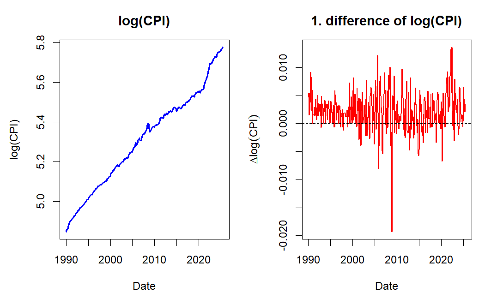
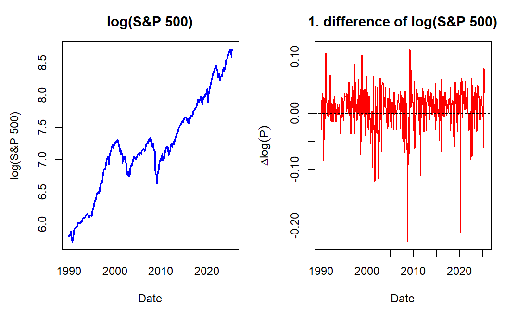

# Nonstationary processes {#part-ch12 .chapter-title}

## Integrated process

In some application fields, such as economics and finance, the existence of trends in the analyzed time series is common.

- Here the term "trend" is used quite generally. 

Earlier in this material, it was discussed that nonstationary time series containing a trend can be investigated using methods developed for stationary time series if the trend is first removed using a suitable transformation. The most popular of such transformations is taking differences, which amounts to modelling the differenced series $\Delta y_t = y_t-y_{t-1}$

- These series might seem stationary and thus be modelled with stationary models reasonably well. 

- If the differences still include some sort of trend, it is natural to extend this procedure to the difference of these differences $\Delta^2 y_{t}$, and so on. This, however, is very rare in practice, and typically only first differences are considered when differencing data.

&nbsp;

Based on the aforementioned, let us introduce the following definition (here for univariate time series processes):

**Integrated process**. A stochastic process $\{y_t, t=1,2,\dots\}$ is said to be **an integrated process of order $d$**, or an $I(d)$ **process**, if the $d$ times differenced process 
\begin{equation*}
\Delta^d y_t
\end{equation*}
is stationary (or asymptotically stationary), but the $(d-1)$ differenced process $\Delta^{d-1} y_t$ is not. 

- In some definitions, the process is first centered by subtracting its mean, that is $\Delta^d(y_t-\mathsf{E}(y_t)), \quad t=1,2,\dots,$ is stationary, while $\Delta^{d-1}(y_t-\mathsf{E}(y_t))$ is not. <!-- This form accounts for the deterministic component of the process. -->

If $y_t$ is an $I(d)$ **process**, we denote 
\begin{equation*}
y_t\sim \mathrm{I}(d) \,\,\, (d\geq 1).
\end{equation*}
In this course, we will consider only $d=1$ and $d=0$.

&nbsp;

**Random walk**. The simplest example of an $I(1)$ process is **random walk**, which was briefly covered already in connection to the AR(1) process. Here the random walk is defined with a drift term $\nu$:
\begin{equation*}
    \Delta y_t = \nu + u_t, \,\, t=1,2,\ldots,
\end{equation*}
where $u_t\sim \mathsf{iid}(0,\sigma^2)$. By recursive substitutions, we get
\begin{equation*}
    y_t=y_0+\nu t + \sum_{j=1}^{t}u_j, \,\,\, t=1,2,\dots
\end{equation*}

- Sometimes, depending on the time series and application that we are considering, it is assumed that $\nu=0$, that is, we have a **random walk without drift**, and hence the term $\nu t$ above vanishes. 

<!-- - Differences $y_t-y_{t-1}=u_t$ from the process $y_t=y_0+\sum_{j=0}^{t-1}u_{t-j}$ are stationary, and this holds even if instead of $u_t\sim\mathsf{iid}(0,\sigma^2)$ we only assume $u_t$ is stationary. -->

Assuming the initial (starting) value $y_0$ as constant, for the random walk we get (details are left as an exercise)
\begin{equation*}
    \mathsf{E}(y_t)=y_0+\nu t,
\end{equation*}
\begin{equation*}
    \mathsf{Var}(y_t)=\mathsf{Var}\left(\sum_{j=1}^{t}u_j\right)=\sigma^2t,
\end{equation*}
\begin{equation*}
    \mathsf{Cor}(y_t,y_{t+k})=\frac{1}{\sqrt{1+k/t}}, \,\, k\geq 0.
\end{equation*}
Here we can observe that random walk is not stationary even if the value of $y_0$ is altered. 

- As $\Delta y_t\sim\mathsf{iid}(\nu,\sigma^2)$ is stationary, we can conclude that the random walk is an $I(1)$ process.

- From the calculations above, we can observe that for random walk $\mathsf{Var}(y_t)\rightarrow\infty$ and $\mathsf{Cor}(y_t,y_{t+k})\rightarrow 1$ with any $k>0$ as $t\rightarrow\infty$. Therefore, random walk processes are strongly autocorrelated, and due to their wandering nature, they exhibit trend-like features.

In other words, we can summarize: 

- An $I(0)$ process is stationary: it fluctuates around a constant mean, has constant variance, and autocorrelations decay relatively quickly (depending on the persistence). It is often described as mean-reverting and has short memory.

- An $I(1)$ process is non-stationary: it exhibits a **stochastic trend** (see below) and **wanders** over time. Each innovation has a permanent effect, and autocorrelations decay slowly, indicating long memory.

&nbsp;

**ARIMA processes and trends in time series**. Random walk is the simplest example of so-called **ARIMA processes**, as we already briefly discussed in Section 5. 

- The acronym stands for AutoRegressive Integrated Moving Average, where the letter $I$ refers to integration, the idea that the process is formed by summing (or "integrating") past innovations, $y_t = y_0 + \sum_{j=1}^{t} u_{j}$.

Many economic and financial time series exhibit trends, and these trends are of two fundamentally different types. The distinction matters, because it determines which transformation makes the series stationary.

- A **deterministic trend** is a fixed, non-random function of time (typically linear, $\beta t$), around which the series fluctuates due to stationary noise. A process of the form
\begin{equation*}
y_t = \alpha + \beta t + \psi(B) u_t,
\end{equation*}
where $\psi(B)$ is the MA($\infty$) representation of a stationary ARMA process (including the special case $\psi(B) = 1$), is called **trend stationary**: removing the deterministic trend $\alpha + \beta t$ leaves a stationary process, shocks have only temporary effects, and the series reverts to the trend.

- A **stochastic trend** results from the accumulation of random shocks, as in the random walk above. Such a process is **difference stationary**: stationarity is achieved by differencing, not by removing a deterministic function of time. Shocks have permanent effects, and the series wanders without reverting to any fixed path.

- The two can also appear together. In the random walk with drift, $y_t = y_0 + \nu t + \sum_{j=1}^{t}u_j$, the stochastic trend $\sum_{j=1}^{t}u_j$ is superimposed on the deterministic trend $y_0 + \nu t$.

Choosing the wrong one matters in practice: removing a deterministic trend does not make a difference-stationary series stationary, and differencing a trend-stationary series creates the artificial patterns discussed below (overdifferencing, see below). Empirical evidence suggests that stochastic trends are often more appropriate for modelling macroeconomic and financial time series.

&nbsp;

## ARIMA($p$,$d$,$q$) process

If the process $y_t, \, t=0,1,\dots$, is non-stationary, but the difference $\Delta y_t$ is stationary and follows an invertible ARMA($p,q$) process, $y_t$ is called an **ARIMA($p,1,q$) process**. 

- The order in the middle refers to the fact, that stationarity is achieved by differencing the process once. 

- If the process is non-stationary after being differenced once, but the second differences $\Delta^2y_t$ follow a stationary and invertible ARMA($p,q$) process, $y_t$ is called an ARIMA($p,2,q$) process. 

In general, $y_t$ is called an **ARIMA($p,d,q$) process** if it becomes a stationary and invertible ARMA($p,q$) process after differencing $d$ times.

- That is, $\Delta^d y_t \sim \mathrm{ARMA}(p,q)$. 

- In practice, $d=1$ is by far the most common case, $d=2$ can be encountered quite rarely, and $d>2$ can be safely ignored. 

- With $d=0$, we obtain the special case of an ARMA($p,q$) process.

<!-- - It is worth noting that the ARIMA($p,d,q$) process ($d>0$) has to be defined by fixing the starting point $t=1$, so that $y_1$ can be generated from the starting values $y_0,\dots, y_{1-p-d}$ and innovations $u_1,\dots,u_{1-q}$.  -->

The typical properties of an ARIMA($p$,1,$q$) process are generally the same as for random walk. The realizations exhibit a wandering nature explained by the variance growing as a function of $t$ and strong autocorrelation even though the autocorrelation function cannot be defined like with stationary processes.

&nbsp;

**A warning on overdifferencing**. While differencing is a fundamental tool for making a nonstationary time series stationary, applying it too many times, a problem known as **overdifferencing**, can be counterproductive. It is a common pitfall to assume that if one difference helps, a second one might help more. Even more often, **you should not mechanically difference a time series that is already "stationary enough"**. 

- Doing so without a strong theoretical justification (e.g., an economic model suggesting a process is integrated of order two, I(2)), is highly unlikely and can even harm your statistical/econometric analysis. 

Overdifferencing does not make a series "more stationary". Instead, it introduces new artificial patterns into the data that were not present in the original process. This complicates model building and can lead to poor analyses and forecasts.

- The most significant problem is that overdifferencing creates a specific, predictable correlation structure.

**Illustration: Overdifferencing white noise**. Let us see what happens when we difference a series that is already stationary: a white noise process, $y_t = u_t$, where $u_t \sim \mathsf{wn}(0, \sigma^2)$. This series has by definition zero autocorrelation at all lags. If we mistakenly difference it, we create a new series, $z_t= \Delta y_t = y_t - y_{t-1} = u_t - u_{t-1}$. This new series, $z_t$, is no longer white noise. Let's examine its properties:

- $\mathsf{Var}(z_t) = \mathsf{Var}(u_t - u_{t-1}) \stackrel{wn}{=} \mathsf{Var}(u_t) + \mathsf{Var}(u_{t-1}) = 2\sigma^2$. We have doubled the variance!

- Autocorrelation: The autocovariance at lag 1 is 
\begin{equation*}
\mathsf{Cov}(z_t, z_{t-1}) = \mathsf{Cov}(u_t - u_{t-1}, u_{t-1} - u_{t-2}) = -\mathsf{Var}(u_{t-1}) = -\sigma^2.
\end{equation*}
The autocorrelation at lag 1 is therefore:
\begin{equation*}
\rho_1 = \frac{\mathsf{Cov}(z_t, z_{t-1})}{\sqrt{\mathsf{Var}(z_t)\mathsf{Var}(z_{t-1})}} = \frac{-\sigma^2}{\sqrt{2\sigma^2 \cdot 2\sigma^2}} = \frac{-\sigma^2}{2\sigma^2} = -0.5.
\end{equation*}

By differencing a series with zero autocorrelation, we created a new series with a perfectly defined negative autocorrelation of $-0.5$ at lag 1. In fact, $z_{t}=u_{t}-u_{t-1}$ is an MA(1) process with $\theta_{1}=-1$, that is, a **non-invertible** MA process (a unit root in the MA polynomial). Such a process cannot be approximated with a finite-order AR model, which is a further reason why overdifferencing complicates the subsequent model building. 

As we will discuss later on, always check for stationarity using tools like the ACF plot and unit root tests (e.g., ADF test, see the coming section), and visual inspection, before applying another round of differencing. If the series already appears stationary enough, stop!


&nbsp;


## Unit root process

Let's consider the (univariate) AR($p$) process 
\begin{equation*}
a(B)z_t=u_t,
\end{equation*}
where $a(B)=1-a_1 B-\dots-a_p B^p$. 

- Here notation $z_t$, as in Section 2, will be used when the unit root process is not assumed to have a constant or other deterministic trends. 

It can be shown (see the Extra tag below) that the polynomial $a(B)$ can be rewritten as
\begin{equation*}
a\left(B\right) =\Delta -\phi B - \phi _{1}\Delta B -\cdots -\phi _{p-1}\Delta B^{p-1}, \quad  \phi =-a\left( 1\right),
\end{equation*}
so the process $z_t$ can be represented as 
\begin{equation*}
\Delta z_{t}=\phi z_{t-1}+\phi _{1}\Delta z_{t-1}+\cdots +\phi _{p-1}\Delta z_{t-p+1}+ u _{t}, \quad t=1,2,\ldots,
\end{equation*}
where $u _{t}\sim \mathsf{iid}(0,\sigma ^{2})$ (or that $u_t$ is white noise).

Let's assume that for $a(z)$ the following holds:
\begin{equation*}
    \text{If} \,\, a(z)=0, \,\, \mathrm{then} \,\, |z|>1 \,\, \mathrm{or} \,\, |z|=1.
\end{equation*}
In other words, the roots of the polynomial $a(z)$ lie outside or at the unit circle on the complex plane. 

- If all the roots lie outside the unit circle, $z_t$ is (at least) asymptotically stationary (as meeting the stationarity condition of the AR($p$) process).

Let us now assume there is exactly one **unit root**. From the known properties of polynomials, it follows that 
\begin{equation*}
a(z)=(1-z)b(z),
\end{equation*}
where $b(z)$ is a polynomial of the degree (at most) $p-1$ with its roots inevitably lying outside the unit circle (see the Extra tag below). 

- It is clear that this is equivalent to $\phi=0$ above. When $\phi=0$, the above-mentioned polynomial becomes $b(z) =1-\phi _{1}z-\cdots -\phi_{p-1}z^{p-1}:=\phi(z)$. 

Thus, $\Delta z_t$ is $I(0)$ and as the roots of the polynomial $\phi(z)$ lie outside the unit circle, such initial values $\Delta z_{t-1},...,\Delta z_{t-p+1}$ can be found that $\Delta z_t$ is stationary. 

- Therefore, the process $\Delta z_t$ can be written as $\Delta z_{t}=\phi(B)^{-1}u _{t}$, which is a special case of the random walk we looked at earlier but with the stationary AR($p-1$) process $\phi(B) ^{-1}u _{t}$ replacing the innovation $u_t$.

&nbsp;

::: {.callout-note collapse="true"}
## Extra: Polynomials and power series


Consider polynomial function of power $m$
\begin{equation*}
    p\left(z\right)=\sum_{k=0}^{m}a_{k}z^{k},
\end{equation*}
where $a_k$ and $z$ are real or complex numbers and $a_m\neq 0$. In the case of complex numbers $z\in\mathbb{C}$, by the \textit{fundamental theorem of algebra} the polynomial $p(z)$ can be given the form 
\begin{equation*}
    p\left(z\right)=a_{m}\left(z-\zeta_{1}\right) \cdots \left(z-\zeta_{m}\right) ,
\end{equation*}
where $\zeta _{1},...,\zeta_{m}$ are the roots of $p\left(z\right)$ and thus $p\left(\zeta _{k}\right) =0$. The case $\zeta_{k}=\zeta _{l}$ $\left(k\neq l\right)$ is possible and in the case of a real coefficient $a_k\in\mathbb{R}$ the roots occur as complex conjugates for all $k$; that is if $\zeta_{k}=x_{k}+iy_{k}$ $\left(i^{2}=-1\right)$, for some $l\neq k$ it holds $\zeta_{l}=x_{k}-iy_{k}=:\bar{\zeta}_{k}$.

Let's return to a normal polynomial $p\left(z\right)=\sum_{k=0}^{m}a_{k}z^{k}$. It is easy to conclude that $p(z)$ can be written as
\begin{equation*}
    p\left(z\right)=p\left(1\right)+\left(1-z\right)q\left(z\right),
\end{equation*}
where
\begin{equation*}
    q\left(z\right)=\sum_{k=0}^{m-1}b_{k}z^{k}, \quad b_{k}=-\sum_{j=k+1}^{m}a_{j}, \quad k=0,1,...,m-1.
\end{equation*}
A corresponding alternative way to present this would be
\begin{equation*}
    p\left(z\right)=p\left(1\right) z+\left(1-z\right) r\left(z\right),
\end{equation*}
where
\begin{equation*}
    r\left(z\right)=\sum_{k=0}^{m-1}c_{k}z^{k}, \quad c_{0}=a_{0} \quad \mathrm{and} \quad c_{k}=-\sum_{j=k+1}^{m}a_{j}, \, k=1,...,m-1
\end{equation*}
These can be generalized to the power series, that is to say to the case
\begin{equation*}
    p\left(z\right)=\sum_{k=0}^{\infty }a_{k}z^{k} \quad \left(\left\vert z\right\vert \leq 1\right) .
\end{equation*}
If we assume
\begin{equation*}
    \sum_{k=1}^{\infty}k\left\vert a_{k}\right\vert<\infty ,
\end{equation*}
it can be easily concluded that the above equations hold when $\left\vert z\right\vert \leq 1$ and $m$ are replaced with $\infty$. In addition $\sum_{k=1}^{\infty}\left\vert b_{k}\right\vert<\infty$ and $\sum_{k=1}^{\infty}\left\vert c_{k}\right\vert<\infty$.

:::

&nbsp;

As discussed above in connection to integrated and ARIMA processes, the presence of a unit root is a particularly interesting question from an economic point of view. In unit root processes, shocks (such as policy or technological interventions and disruptions) have persistent effects that last forever, whereas with stationary cases such shocks have only a temporary effect. Therefore, it is of particular interest to test the unit root hypothesis in $y_t$.

&nbsp;

## ADF unit root test

Let us continue to work with unit root processes and examine how the unit root can be tested. Among various alternatives, we focus on the Augmented Dickey-Fuller (ADF) test, which is the most commonly used unit root test.

Additional background and motivation for unit root testing are provided below in the Extra tab before proceeding to the ADF test.

&nbsp;

::: {.callout-note collapse="true"}
## Extra: Background and details on the unit root test statistics


Let us continue with the autoregressive unit root process from the previous section
\begin{equation*}
    \Delta z_{t}=\phi z_{t-1}+u _{t}, \quad t=1,2,\ldots,
\end{equation*}
where for the sake of simplicity $z_0=0$ and $u_t \sim \mathsf{iid}(0,\sigma^2)$. The question of interest is to **test the unit root hypothesis**
\begin{equation*}
    \mathsf{H}_0:\phi =0
\end{equation*}
against the stationary (or stable) alternative $\phi<0$. Recall that $\phi = -a(1)$, where $a(B)$ is the autoregressive polynomial, so that $\phi=0$ corresponds to a unit root ($a(1)=0$) and $\phi<0$ is a necessary (though in the general AR($p$) case not sufficient) condition for stability.

It seems natural to base the test on the least squares estimator of $\phi$:
\begin{equation*}
\widehat{\phi}=\left(\sum_{t=1}^{T} z_{t-1}^{2}\right)^{-1} \sum_{t=1}^{T} z_{t-1} \Delta z_{t} \overset{\mathsf{H}_0}{=} \left(\sum_{t=1}^{T} z_{t-1}^{2}\right)^{-1} \sum_{t=1}^{T} z_{t-1} u_{t},
\end{equation*}
where $T$ is the number of observations. The unit root test can be based directly on the estimator $\widehat{\phi}$, but it is more common to use the "t-ratio" printed by different statistical programs
\begin{equation*}
    \tau :=\frac{\widehat{\phi}}{\mathrm{s.e.}(\widehat{\phi})} = \frac{\sqrt{\sum_{t=1}^{T}z_{t-1}^{2}}}{\widehat{\sigma}}\,\widehat{\phi},
\end{equation*}
which follows, under the null (unit root) hypothesis, a **nonstandard** asymptotic distribution.

- The limiting distribution is free of the unknown parameters (in particular of $\sigma^2$) and can therefore be tabulated; tables are presented in books and computer programs.

- The percentage points of the limiting distributions have no closed form and are obtained by numerical integration or simulation. Both the (suitably normalized) estimator and the "t-ratio" $\tau$ have a non-Gaussian, left-skewed asymptotic distribution. For example, for the $\tau$ statistic the asymptotic 5\% percentage point is about $-1.94$, while for a $\mathsf{N}(0,1)$ distribution it would be $-1.645$. Since the rejection region is of the form $\tau < \text{critical value}$, using standard normal critical values would reject the unit root hypothesis far too easily.

- Note that $\widehat{\phi}$ is *superconsistent* under $\mathsf{H}_0$: it converges at the rate $T$ rather than the usual $\sqrt{T}$, so it is $T\widehat{\phi}$, and not $\sqrt{T}\widehat{\phi}$, that has a nondegenerate limiting distribution.

The above unit root test can be generalized to a case with a deterministic constant and trend (if appropriate due to the shape of the time series or background information on it). A common model for this is
\begin{equation*}
    y_{t}=\mu_{t}+z_{t}, \quad t=1,2,\ldots,
\end{equation*}
where $z_t$ is as determined above and the deterministic term is
\begin{equation*}
\mu_{t}=\mu  \quad \mathrm{or} \quad \mu_{t}=\mu _{1}+\mu _{2}t.
\end{equation*}
Indicator variables can also be used to account for seasonal variation if necessary.

- The limiting distribution of the "t-ratio" can again be tabulated. It deviates from the one with no constant and is located further to the left (the asymptotic 5\% percentage point is now about $-2.86$).

- The limiting distribution shifts still further to the left when the "t-ratio"-based test is generalized to the linear trend case $\mu_{t}=\mu _{1}+\mu_{2}t$ (the asymptotic 5\% percentage point is then about $-3.41$; further details are skipped here).

- The critical values above are asymptotic. In finite samples the appropriate percentage points are somewhat further to the left, and modern software (and the tables of MacKinnon) reports critical values or $p$-values interpolated as a function of the sample size.

**The asymptotic distributions.** Under the null hypothesis $z_{t}=\sum_{j=1}^{t}u _{j}$ is a random walk, so the usual limit theorems for stationary processes do not apply and the analysis instead relies on functional central limit theory. It can be shown that
\begin{equation*}
    T\widehat{\phi} \overset{d}{\rightarrow} \left( \int_{0}^{1}W\left( u\right) ^{2}du\right)^{-1}\int_{0}^{1}W\left( u\right) dW(u)
\end{equation*}
and that the "t-ratio" follows the (non-standard) asymptotic distribution
\begin{equation*}
    \tau :=\frac{\sqrt{\sum_{t=1}^{T}z_{t-1}^{2}}}{\widehat{\sigma}}\widehat{\phi}
    \overset{d}{\rightarrow }\left( \int_{0}^{1}W\left( u\right) ^{2}du\right)^{-1/2}\int_{0}^{1}W\left( u\right) dW(u),
\end{equation*}
where $\widehat{\sigma}^{2}=(T-1)^{-1}\sum_{t=1}^{T}(\Delta z_{t}-\widehat{\phi}z_{t-1})^{2}$ is the usual regression estimator for the error variance $\sigma^2$ ($T$ can also be used as the denominator) and $W(u)$ is standard Brownian motion. Note that normality of $u_t$ is *not* needed for these results; the Brownian motion arises from a functional central limit theorem.

In the case with a constant term, applying the operator $\Delta -\phi B$ to both sides of the equation $y_{t}=\mu +z_{t}$ (and using $(\Delta - \phi B)z_t = u_t$ and $(\Delta - \phi B)\mu = -\phi\mu$), we get
\begin{equation*}
    \Delta y_{t}=\nu +\phi y_{t-1}+u _{t},\quad t=1,2,\ldots,
\end{equation*}
where $u_{t}\sim \mathsf{iid}\left( 0,\sigma^{2}\right)$ and $\nu =-\phi \mu$. When the unit root hypothesis holds, for the "t-ratio" $\tau_\mu$ of the parameter $\phi$ it holds that
\begin{equation*}
    \tau _{\mu }\overset{d}{\rightarrow }\left( \int_{0}^{1}\bar{W}\left(
    u\right) ^{2}du\right) ^{-1/2}\int_{0}^{1}\bar{W}\left( u\right) dW(u),
\end{equation*}
where $\bar{W}(u) = W(u) - \int_0^1 W(s)ds$ is the centered (demeaned) version of the standard Brownian motion. In the linear trend case the corresponding result holds with $\bar{W}$ replaced by the residual of the projection of $W$ on a constant and a linear trend; this is what shifts the distribution still further to the left.

An important practical implication of the parameterization $\nu = -\phi\mu$ is that **under $\mathsf{H}_0$ the intercept vanishes**, $\nu = 0$: the constant-only test regression corresponds to a random walk *without drift* under the null. This is why software also reports joint tests of $\phi$ and the deterministic parameters (see below).

:::

&nbsp;

**Augmented Dickey-Fuller (ADF) test**. Based on the discussion in the previous section, assume (for simplicity) that $y_t = \mu + z_t$, where $z_t \sim \text{AR}(p)$, and hence $y_t$ also follows an AR($p$) process. To test for a unit root in $y_t$, we use the following test regression model
\begin{equation*}
\Delta y_t = \nu + \phi y_{t-1} + \sum_{j=1}^{p-1} \phi_j \Delta y_{t-j} + u_t, \quad u_t \sim \mathsf{iid}(0, \sigma^2), \quad t = 1, 2, \ldots
\end{equation*}
This is simply a reparameterization of the AR($p$) model, obtained from the autoregressive polynomial $a(B)$ with $\phi = -a(1)$; the lagged differences $\Delta y_{t-j}$ ("augmentation") are what allow the errors $u_t$ to be serially uncorrelated even though $y_t$ is autocorrelated.

The null hypothesis is $\mathsf{H}_0: \phi = 0$, which implies that $y_t$ has a unit root and is non-stationary. Under the alternative hypothesis $\mathsf{H}_1: \phi < 0$, the process is stationary around a deterministic mean.

- The interpretation of $\mathsf{H}_0$ as "a unit root" rests on a **maintained assumption**: the remaining roots of $a(B)$ are assumed to lie outside the unit circle, i.e. $y_t$ has at most one unit root and no explosive or seasonal unit roots. If $y_t$ were, say, $\mathsf{I}(2)$, the test would be applied to $\Delta y_t$ first (testing "from the top down").

- Here in the ADF test the intercept term $\nu$ is related to the mean of the process via $\nu = -\phi \mu$. Consequently $\nu = 0$ under $\mathsf{H}_0$, so that the constant-only specification treats the null as a driftless random walk. In practice $\nu$ is nevertheless left unrestricted in the test regression, which is what makes the test statistic invariant to the value of $\mu$.

- The test statistic is the **t-ratio** of the estimated coefficient $\widehat{\phi}$, often denoted $\tau_\phi = \frac{\widehat{\phi}}{\mathrm{s.e.} (\widehat{\phi})}$. Its asymptotic distribution under the null is non-standard but known, and critical values are tabulated in the literature. The relevant table depends on which deterministic terms are included in the test regression, not on the true data generating process. Note that the test is one-sided: the null hypothesis is rejected only for sufficiently large *negative* values of $\tau_{\phi}$.

- Importantly, the asymptotic properties of the test hold even without assuming normality of the errors; it is sufficient that $u_t$ are independent and identically distributed with finite variance (a martingale difference sequence with finite variance would in fact suffice).

If the null hypothesis of a unit root ($\mathsf{H}_0: \phi=0$) cannot be rejected, according to the above equation an AR($p-1$) model can be built on the differences $\Delta y_t$.

- In other words, this implies the need to take first differences to get a stationary time series.

- Note also that failing to reject $\mathsf{H}_0$ is *not* evidence in favour of a unit root. Unit root tests have low power against stationary alternatives with a root close to unity, especially in short samples, and the conclusion should be supported by graphical inspection, economic reasoning, and possibly a stationarity test such as KPSS, in which stationarity is the null hypothesis.

&nbsp;

**Determining the lag length $p$ and deterministic terms in the ADF test**. Executing the ADF test regression requires specifying the lag length $p$, which can be selected using information criteria (such as AIC or BIC), sequential testing (covered in the next section), or based on common fixed choices related to the data frequency.

- The choice involves a trade-off: too few lags leave the errors autocorrelated, which invalidates the asymptotic distribution and distorts the size of the test, whereas too many lags reduce the power of the test.

- Whichever rule is used, the residuals of the chosen test regression should be checked for remaining autocorrelation.

- It is generally advisable to try a few different values of $p$ and compare the resulting test outcomes for robustness.

- Be careful with the terminology used by software: in the R function `ur.df`, the argument `lags` is the number of **lagged differences** $\Delta y_{t-j}$ in the test regression, that is, $p-1$ in the notation above. The default is `lags = 1` together with `selectlags = "Fixed"`; setting `selectlags = "AIC"` or `"BIC"` selects the number of lagged differences automatically up to the value given in `lags`. The default `type = "none"` includes no deterministic terms at all, which is rarely what one wants with economic data.

The ADF test regression can also be extended to include a trend (together with the constant). In this case, the test regression includes the term $\delta_0 + \delta_1 t$, allowing for a deterministic trend in the data:
\begin{equation*}
\Delta y_t = \delta_0 + \delta_1 t + \phi y_{t-1} + \sum_{j=1}^{p-1} \phi_j \Delta y_{t-j} + u_t.
\end{equation*}
The null hypothesis remains $\mathsf{H}_0:\phi = 0$, indicating a unit root.

- As in the constant-only case, the coefficients of the test regression are linked to the deterministic terms of the process. Writing $y_t = \mu_1 + \mu_2 t + z_t$ gives $\delta_1 = -\phi\mu_2$ and $\delta_0 = \mu_2 - \phi\mu_1 + \phi\mu_2$. Hence under $\mathsf{H}_0$ we have $\delta_1 = 0$ and $\delta_0 = \mu_2$: the null model is a random walk **with drift**, and the trend term drops out. Including $t$ in the regression nonetheless makes the test invariant to the values of $\mu_1$ and $\mu_2$.

- In `ur.df` (with `type = "drift"` or `"trend"`) the summary also reports joint F-type statistics `phi1`, `phi2` and `phi3` for hypotheses that restrict $\phi$ *and* the deterministic parameters simultaneously (e.g. `phi1`: $\nu = \phi = 0$; `phi3`: $\delta_1 = \phi = 0$). These have their own non-standard distributions and their own tables — the usual $F$ critical values do not apply.

Deciding which deterministic terms to include is a crucial step, and the decision matters in both directions.

- A constant term is typically included by default, while the inclusion of a trend term depends on whether a trending pattern is evident in the data. This decision can be guided by graphical inspection or theoretical considerations relevant to the application.

- Omitting a needed trend makes the test badly biased towards non-rejection (the test is then inconsistent against trend-stationary alternatives), whereas including an unnecessary trend shifts the critical values to the left and costs power.

- A practical rule of thumb: include the deterministic terms that would be needed to describe the series under the *alternative* hypothesis.

- Finally, note that a structural break in the level or slope of a stationary series makes the ADF test strongly favour the unit root hypothesis. If a break is suspected, tests that explicitly allow for it (e.g. Zivot-Andrews) should be used instead.

&nbsp;

::: {.callout-note collapse="true"}
## Extra: Some other unit root tests


Other widely used unit root tests include the Phillips-Perron test, which handles serial correlation non-parametrically instead of by augmentation, and the DF-GLS (Elliott-Rothenberg-Stock) test, which detrends the series by GLS and has better power than the ADF test. They are not discussed further here.

:::


&nbsp;


**Empirical examples**. Let us consider unit root testing for the few time series considered above in different parts. As discussed, the first thing in the ADF test is to determine which deterministic terms to include in the test regression. Basically you should always include a constant term, but whether the deterministic trend component should be included as well should be determined based on visual inspection and background knowledge on the time series at hand.

In the following illustrations, for simplicity, we fix the number of lagged differences in the ADF test regression to 6, 8 or 10. The lag length could and should be varied to examine whether the testing results are intact for this selection.

(i) Consider **log** of the CPI time series (Introduction): In this case, there is clearly an upward trend present. It seems reasonable to argue that due to different (economic) reasons we can think that price level is steadily going up and a deterministic trend seems reasonable to be included in the ADF test. 

```{r, logCPI, echo=FALSE, out.width="90%", fig.align = "center", fig.cap=""}

```
<center>
<span style="color: #0069d9;">Figure: Monthly log(CPI) time series (left) and its first difference $\Delta \log(CPI_t)$ (right), 1990:1--2025:6.</span></center>

&nbsp;

The first difference is shown next to the level series for comparison: the level series trends upwards throughout the sample, whereas the differenced series fluctuates around a constant (positive) level without any trend. This is exactly the visual signature of an $I(1)$ series, and it anticipates the test results reported in part (iii) below.

&nbsp;

```markdown
ADF-test (deterministic terms: constant and trend)
p=8: Test statistic: -1.113, p-value: 0.925 
p=6: Test statistic: -1.517, p-value: 0.823 
p=10: Test statistic: -1.451, p-value: 0.845
```

&nbsp;

(ii) Log of the S&P 500 index. Rising stock prices illustrate a possible stochastic trend very well, but it is difficult to argue that there is a deterministic upward trend in stock prices. Therefore, including a constant in the ADF test is surely a good choice, but for robustness we can also examine the unit root hypothesis when a deterministic trend is included as well (together with the constant) in the ADF regression.

```{r, logSP500, echo=FALSE, out.width="90%", fig.align = "center", fig.cap=""}

```

<center>
<span style="color: #0069d9;">Figure: Monthly log(S\&P 500) time series (left) and its first difference $\Delta \log(P_t)$ (right), 1990:1--2025:6.</span>
</center>

&nbsp;

Again the differenced series is plotted next to the level series. The first difference, that is, the monthly log-return, shows no trend and fluctuates around a constant level, although the size of the fluctuations clearly varies over time (recall the volatility clustering discussed in the AR-GARCH section).

&nbsp;

```markdown
ADF-test (deterministic terms: constant)
p=8: Test statistic: -0.769, p-value: 0.826
p=6: Test statistic: -0.302, p-value: 0.922 
p=10: Test statistic: -0.772, p-value: 0.825 

ADF-test (deterministic terms: constant and trend)
p=8: Test statistic: -2.193, p-value: 0.492
```

&nbsp;

(iii) The log-differences of the CPI and S&P 500 indices are the series plotted on the right-hand side of the two figures above (and, up to scaling, the series previously shown in the Introduction). A visual inspection alone suggests that the unit root hypothesis is no longer reasonable for these differenced series. To confirm this, let's examine the Augmented Dickey-Fuller (ADF) test results below. The test includes a constant, as a deterministic trend is clearly no longer present in the data.

These conclusions are reinforced by the test results for their log-differences, which appear to be stationary (i.e., $I(0)$ variables). This provides a consistent picture: the original series are non-stationary $I(1)$, but their first differences are stationary ($I(0)$).

```markdown
ADF-tests (deterministic terms: constant)

logdiff(CPI): 
p=8: Test Statistic: -7.744 , p-value: 1.248e-11 
p=6: Test Statistic: -4.764, p-value: 7.568e-05
p=10: Test Statistic: -7.886, p-value: 5.331e-12

logdiff(S&P 500)
p=8: Test statistic: -6.095, p-value: 1.303e-07 
p=6: Test statistic: -7.011, p-value: 8.741e-10 
p=10: Test statistic: -5.451, p-value: 3.299e-06
```

Putting the unit root testing results together, the results show that the ADF tests fail to reject the unit root hypothesis for the original level series of both the CPI and the S&P 500.

- For the CPI levels, even after including a constant and a linear trend in the test regression, we still cannot reject the null hypothesis of a unit root. This strongly suggests that the CPI can be treated as an $I(1)$ process (integrated of order one).

- A similar conclusion holds for the S&P 500 index.


&nbsp;

**A critical limitation: The low power of the ADF test**. An important limitation of the ADF test is its low statistical power. In practical terms, this means: **The ADF test often fails to reject the null hypothesis of a unit root, even when the time series process is actually stationary**.

- In other words, the ADF (or other) unit root test is not always very good at correctly identifying a stationary process, especially if the process is close to non-stationary (e.g., an AR(1) process where the autoregressive coefficient $\phi_1$ is close to 1). 

- If we are unable to reject the presence of a unit root, it does not necessarily mean that it is true and the process is necessarily $I(1)$. It could just be (but of course not always!) that there is not sufficient amount of information in the data to reject the unit root.

- The practical takeaway is that it's common for a truly stationary time series to produce a p-value from the ADF test that is too high to be considered statistically significant. You can observe this phenomenon by running the following code, which simulates AR(1) processes and computes the ADF test statistic, with a varying value of the AR(1) coefficient.

From an empirical point of view, the choice whether the process is a unit root process (nonstationary) or a "near" unit root process (stationary) is interesting but at times complicated.

- One practical remedy is to complement the ADF test with a test that reverses the roles of the hypotheses, such as the KPSS test, in which stationarity is the null hypothesis. Agreement between the two tests strengthens the conclusion; disagreement is a sign that the data are not informative enough to settle the question.

- Particularly ambiguous are, for example, interest rates. Interest rates are highly persistent and the unit root hypothesis cannot often be rejected, although nonstationary such as random walk interest rates do not seem to be very plausible from an economic point of view.


```markdown
# Simulating AR(1) process with different values of phi_1 
# - Change n_obs and phi_1

# Load the libraries
library(urca)
library(tseries)

n_obs = 200     # number of observations (do not name this T: T is TRUE in R)
phi_1 = 0.98    
adf_lags = 8    # number of lagged differences in the ADF test regression

epsilon = rnorm(n_obs)  # random draws from nid(0,1)
y = epsilon
y[1] = 0 # for simplicity and E(y_t) = 0
for(i in 2:n_obs) y[i] = phi_1*y[i-1]+epsilon[i]
plot(y, type="l", main="Simulated realization")

# The simulated process has zero mean, so the test regression needs no
# deterministic terms: type = "none" and, correspondingly, trend = "nc".
test_ur_none <- ur.df(y, type = "none", lags = adf_lags)
stat_none <- test_ur_none@teststat[1, 1]
p_val_none <- punitroot(q = stat_none, N = length(test_ur_none@res), trend = "nc")
cat("Test statistic:", stat_none, "\n")
cat("P-value:", p_val_none, "\n")
```

&nbsp;

:::: {.content-visible when-format="html"}

## R Lab

All the R codes considered in this section are compiled in the following tab:

::: {.callout-tip collapse="true"}
## R Lab: Unit root testing (ADF test)

```{r, message=FALSE, warning=FALSE}
# Unit root testing (ADF test)

# Install packages if you haven't already
# install.packages("urca")
# install.packages("tseries")

# Load the libraries
library(urca)
library(tseries)
library(zoo) # Used for handling year.month date formats in this Shiller data


# Create a reproducible non-stationary series (a random walk!)
set.seed(42)
non_stationary_series <- cumsum(rnorm(200))

# It's always a good idea to plot the data first
plot(non_stationary_series, type = 'l', main = "Simulated random walk (no drift)")


# ------------------ Going back to Introduction -------------------------

# --- Define/select data and sample period ---

# Set the sample period. The format (for this monthly data) is "YYYY-MM".
start_period <- "1990-01"
end_period <- "2025-06"

# Define the data file name
data_file <- "Shiller_data_031025.txt"


# --- Load and prepare data ---

# Read the data from the text file. This assumes a tab-separated file with a header.
# If your separator is different (e.g., a comma), use read.csv() instead.
tryCatch({
  shiller_data <- read.delim(data_file, header = TRUE)
}, error = function(e) {
  stop(paste("Error reading the file:", 
             data_file, ". Make sure it's in the same folder as the script."))
})

# Convert the 'Date' column to a proper time series date object
shiller_data$Date_ts <- as.yearmon(as.character(shiller_data$Date), "%Y.%m")

# Filter the data to the desired sample period
data_subset <- subset(shiller_data, Date_ts >= as.yearmon(start_period) & 
                        Date_ts <= as.yearmon(end_period))


# --- Create Time Series Objects for Base R plotting ---

# Get the start year and month from the first data point in our subset
start_year <- floor(as.numeric(data_subset$Date_ts[1]))
start_month <- cycle(data_subset$Date_ts[1])

# Create 'ts' (time series) objects, here monthly data
cpi_ts <- ts(data_subset$CPI, start = c(start_year, start_month), frequency = 12)
p_ts <- ts(data_subset$P, start = c(start_year, start_month), frequency = 12)

# --- First differences of the log-series ---
# diff() on a 'ts' object keeps the time series attributes and shifts
# the starting date by one period automatically.

dlog_cpi_ts <- diff(log(cpi_ts))   # 1. difference of log(CPI)
dlog_p_ts   <- diff(log(p_ts))     # 1. difference of log(S&P 500)


# (i) CPI: the level series and its first difference NEXT TO EACH OTHER
# Uncomment the png()/dev.off() lines to save the figure used in the text;
# with them commented out the plot is drawn on screen as usual.
# png("logCPI_levels_diff.png", width = 1000, height = 400)
par(mfrow = c(1, 2), mar = c(4.5, 4.5, 3, 1))

plot.ts(log(cpi_ts), col = "blue", lwd = 2, main = "log(CPI)",
        xlab = "Date", ylab = "log(CPI)")
plot.ts(dlog_cpi_ts, col = "red", lwd = 1.5,
        main = "1. difference of log(CPI)",
        xlab = "Date", ylab = expression(Delta*log(CPI)))
abline(h = 0, lty = 2)   # the differenced series fluctuates around a constant level

par(mfrow = c(1, 1))
# dev.off()


# (ii) S&P 500: the level series and its first difference NEXT TO EACH OTHER
# png("logSP500_levels_diff.png", width = 1000, height = 400)
par(mfrow = c(1, 2), mar = c(4.5, 4.5, 3, 1))

plot.ts(log(p_ts), col = "blue", lwd = 2, main = "log(S&P 500)",
        xlab = "Date", ylab = "log(S&P 500)")
plot.ts(dlog_p_ts, col = "red", lwd = 1.5,
        main = "1. difference of log(S&P 500)",
        xlab = "Date", ylab = expression(Delta*log(P)))
abline(h = 0, lty = 2)

par(mfrow = c(1, 1))
# dev.off()


# --- The scaled versions of the same differences used in the Introduction ---
# (annualized inflation and monthly percentage returns; only the scale differs)

data_subset$cpi_log_diff_1m <- c(NA, 1200*diff(log(data_subset$CPI))) # annualized
data_subset$p_log_diff <- c(NA, 100*diff(log(data_subset$P)))

cpi_log_diff_1m_ts <- ts(data_subset$cpi_log_diff_1m, start = c(start_year, 
                                                                start_month), frequency = 12)
p_log_diff_ts <- ts(data_subset$p_log_diff, start = c(start_year, 
                                                      start_month), frequency = 12)

plot.ts(cpi_log_diff_1m_ts, col = "blue", lwd = 2, 
        main = "Annualized monthly inflation", xlab = "Date",
        ylab = "(Annualized) 1. log-difference of U.S. CPI")

plot.ts(p_log_diff_ts,col = "blue",lwd = 2, main = "S&P 500 monthly returns",
        xlab = "Date",
        ylab = "log-difference of P")


# ----------------- Select the time series to be tested --------------------

# NOTE: activate exactly ONE of the following lines at a time (the others
# must stay commented out), otherwise the last one overwrites the others.

y <- log(cpi_ts)              # level series, log(CPI)
# y <- log(p_ts)              # level series, log(S&P 500)
# y <- dlog_cpi_ts            # first difference of log(CPI)
# y <- dlog_p_ts              # first difference of log(S&P 500)
# y <- non_stationary_series  # the simulated random walk


# Manually set the number of lags in the ADF test
adf_lags <- 8


# --- 2. ur.df() EXAMPLES ---

# # Case 1: No constant, no trend (not typically used)
#cat("--- ur.df() | type = 'none' ---\n")
#test_ur_none <- ur.df(y, type = "none", lags = adf_lags)
#stat_none <- test_ur_none@teststat[1, 1]
#p_val_none <- punitroot(q = stat_none, N = length(test_ur_none@res), trend = "nc")
#cat("Test Statistic:", stat_none, "\n")
#cat("P-value:", p_val_none, "\n")


# Case 2: Constant (drift) only
cat("\n--- ur.df() | type = 'drift' ---\n")
test_ur_drift <- ur.df(y, type = "drift", lags = adf_lags)
stat_drift <- test_ur_drift@teststat[1, 1]
p_val_drift <- punitroot(q = stat_drift, N = length(test_ur_drift@res), trend = "c")
cat("Test Statistic:", stat_drift, "\n")
cat("P-value:", p_val_drift, "\n")


# Case 3: Constant and trend
cat("\n--- ur.df() | type = 'trend' ---\n")
test_ur_trend <- ur.df(y, type = "trend", lags = adf_lags)
stat_trend <- test_ur_trend@teststat[1, 1]
p_val_trend <- punitroot(q = stat_trend, N = length(test_ur_trend@res), trend = "ct")
cat("Test Statistic:", stat_trend, "\n")
cat("P-value:", p_val_trend, "\n")


# --- adf.test() ---

# ?adf.test

# Manually set the number of lags to adf_lags
# Note: This function has no argument to control for constant/trend.
# - This procedure contains the constant and trend

k <- adf_lags

cat("\n--- adf.test() | Deterministic terms are implicit ---\n")
test_adf <- adf.test(y, k = adf_lags)
print(test_adf)


```
:::


&nbsp;

::::