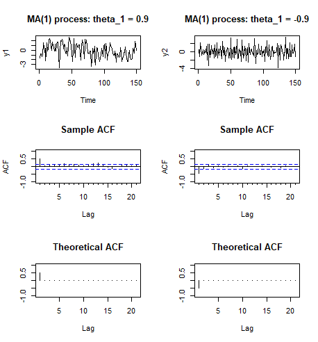
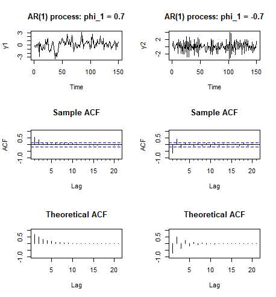
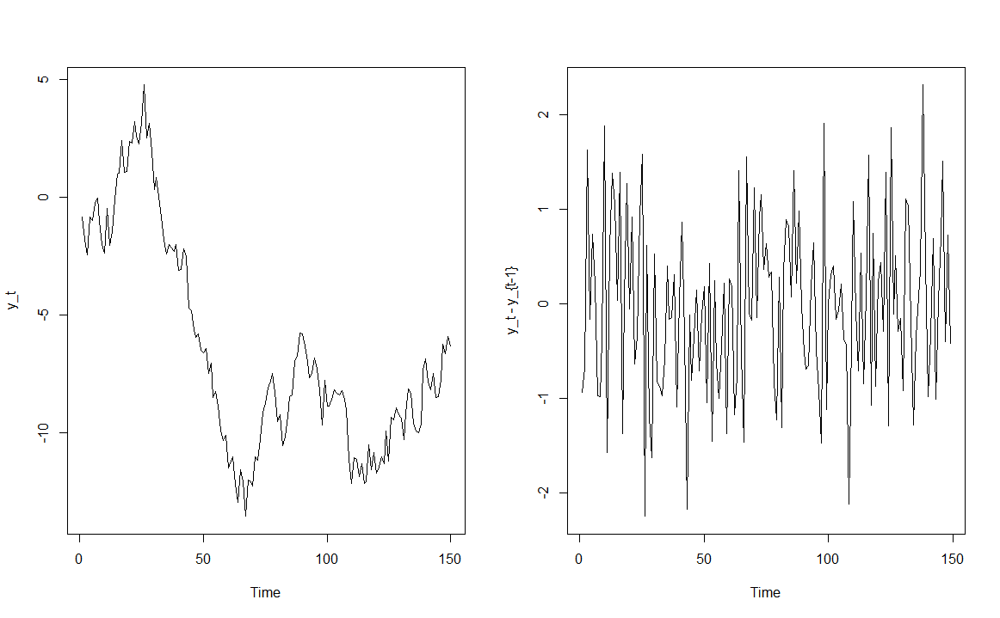

# Linear process {#part-ch4 .chapter-title}

## MA(1) process

As was mentioned, white noise processes can be used to define more complicated processes. A simple example and special case is the **moving average process of order one**, or **MA(1) process**,
\begin{equation*}
y_{t} = \mu + u_{t} + \theta_1 u_{t-1}, \quad u_{t}\sim\mathsf{iid}(0,\sigma^{2}).
\end{equation*}
The values of the process are hence assumed to be generated as a weighted average of two independent and unobserved random shocks.

- In this process (model equation), we also include the mean of the process $\mathsf{E}(y_t)=\mu$. Alternatively, we can write the MA(1) process as
\begin{equation*}
y_{t} - \mu \equiv z_t = u_{t}+\theta_1 u_{t-1}, \quad u_{t}\sim\mathsf{iid}(0,\sigma^{2}).
\end{equation*}

- Notice that possible other deterministic components than a nonzero mean can also be readily included if necessary.

MA(1) processes are strictly stationary (see above and the property SS4) and also weakly stationary. Simple calculations show that
\begin{equation*}
\mathsf{E}\left(y_{t}\right) = \mathsf{E}(\mu) + \mathsf{E}\left(u_{t}\right)+\theta_1 \mathsf{E}\left(u_{t-1}\right)=\mu,
\end{equation*}
\begin{eqnarray*}
\mathsf{Var}\left(y_{t}\right) &=& \mathsf{E}\Big(y_t- \mathsf{E}(y_t)\Big)^2 \\
&=& \mathsf{Var}\left(z_{t}\right) \\ 
&\stackrel{\mathsf{iid}}{=}& \mathsf{Var}\left(u_{t}\right)+\theta_1^{2}\mathsf{Var}\left(u_{t-1}\right) \\ 
&=& \sigma^{2}\left(1+\theta_1^{2}\right),
\end{eqnarray*}
and, for $h>0$,
\begin{eqnarray*}
\mathsf{Cov}\left(y_{t},y_{t+h}\right) &=& \mathsf{Cov}\left(z_{t},z_{t+h}\right) \\
&=& \mathsf{E}[\left(u_{t}+\theta_1 u_{t-1}\right)\left(u_{t+h}+\theta_1 u_{t+h-1}\right)] \\
&=& \mathsf{E}\left(u_{t}u_{t+h}\right)+\theta_1 \mathsf{E}\left(u_{t}u_{t+h-1}\right)+\theta_1 \mathsf{E}\left(u_{t-1}u_{t+h}\right)+\theta_1^{2}\mathsf{E}\left(u_{t-1}u_{t+h-1}\right) \\
&=& \left\{
    \begin{array}
    [c]{l}
        \theta_1 \sigma^{2},\,\, h=1, \\
        0,\,\, h>1.
    \end{array}
\right.
\end{eqnarray*}
The latter two calculations make use of the independence of the process $u_{t}$. These results show the weak stationarity of the MA(1) process.

- The same moment results are also obtained if the assumption $u_{t}\sim\mathsf{iid}(0,\sigma^{2})$ is replaced with the milder assumption $u_{t}\sim\mathsf{wn}(0,\sigma^{2})$, but in this case one cannot deduce the strict stationarity of $y_{t}$. The same comment holds also to the more general results to be presented in the next section. 

Based on these calculations, the autocorrelation function of an MA(1) process takes the form
\begin{equation*}
\rho_{h}=\left\{
\begin{array}
[c]{l}
    1,\,\, h=0,\\
    \theta_1 \Big/\left(1+\theta_1^{2}\right), \,\,h=1,\\
    0,\,\, h>1.
\end{array}
\right.
\end{equation*}
Therefore, a typical feature of an MA(1) process is that **the autocorrelation function drops to zero after lag one**.

- Thus, observations more than one period apart are uncorrelated and, when assumption $u_{t}\sim \mathsf{iid}(0,\sigma^{2})$ holds, even independent. 

- The same conclusion could, of course, be immediately made from the MA(1) model equation above.

&nbsp;

The following figure presents two simulated realizations of length 150 ($T=150$) of an MA(1) process with $u_{t}\sim\mathsf{nid}(0,1)$. Sample autocorrelation function based on the observations as well as the theoretical autocorrelation function are also shown.
```{r, MAsimul, echo=FALSE, out.width="85%", fig.align = "center", fig.cap=""}

```
<span class="fig-caption">Figure: Two simulated realizations of the MA(1) process and their (sample) autocorrelations, starting from the first autocorrelations ($\mathsf{r}_1$ and $\rho_1$).</span>

&nbsp;

In the figure, on the left, the MA(1) coefficient $\theta_1$ is 0.9, on the right $\theta_1= -0.9$. In addition to simulated time series, the figure plots sample autocorrelations ("sample ACF") and theoretical autocorrelations ("theoretical ACF") of these two processes. In these figures the values $\mathsf{r}_0=1$ and $\rho_0=1$ are not depicted.

- In both simulated series, the observations vary around their mean (zero) according to their theoretical standard deviation ($\approx1.345$).

- In the left panel, the series has positive autocorrelation, which manifests itself as positive observations, typically followed by another positive observation. 

- In the right panel, due to negative autocorrelation, positive and negative observations typically alternate. 

The estimated sample autocorrelation functions resemble rather closely their theoretical counterparts. In particular, in both cases, the estimated $\mathsf{r}_{1}$ is well outside the approximate 95\% confidence bands implied by the assumption $\rho_{h}=0$ $\left(  \forall h>0\right)$. The remaining estimated sample autocorrelations fall mostly within these bands. 

- Due to random variation, some of the remaining 20 estimates may naturally occasionally fall outside these bands. 

- Furthermore, as we will discuss later, in the case of an MA(1) process, the confidence bands used above are actually too narrow.

An obvious generalization of the MA(1) is obtained by adding a linear combination of the variables $u_{t-2},\ldots,u_{t-q}$ $\left(q<\infty\right)$ to the right hand side of the MA(1). This leads to the so-called MA($q$) process, to be considered in more detail in Section 5.


&nbsp;


## Causal linear process

The MA(1) process introduced in the previous section, and its generalization the MA($q$) process ($q$ $<\infty$) to be introduced later on, are special cases of the **linear process**
\begin{equation*}
y_{t} = \mu + \sum_{j=-\infty}^{\infty}\psi_{j}u_{t-j}, \quad  u_{t}\sim\mathsf{iid}(0,\sigma^{2}).
\end{equation*}
It is clear that the infinite sum on the right hand side of this equation requires further care and cannot be well defined without suitable further restrictions on the coefficients $\psi_{j}$.

- We will assume that
\begin{equation*}
\sum_{j=-\infty}^{\infty}\psi_{j}^{2}<\infty.
\end{equation*}
Under this assumption the infinite sum on the right hand side of the linear process is well defined.

The mean and autocovariance function of $y_{t}$ (general linear process) can be calculated in a similar fashion as for the MA(1) process regardless of the infinite sum: 
\begin{equation*}
\mathsf{E}\left(y_{t}\right) = \mu + \sum_{j=-\infty}^{\infty}\mathsf{E}\left(\psi_{j}u_{t-j}\right) = \mu + \sum_{j=-\infty}^{\infty}\psi_{j}\mathsf{E}\left(u_{t-j}\right)=\mu,
\end{equation*}
and denoting (cf. Section 2 on deterministic components) $z_t \equiv y_t - \mu$, we get
\begin{equation*}
\mathsf{Var}\left(y_{t}\right)= \mathsf{Var}\left(z_{t}\right) =\sum_{j=-\infty}^{\infty}\mathsf{Var}\left(\psi_{j}u_{t-j}\right)=\sum_{j=-\infty}^{\infty}\psi_{j}^{2}\mathsf{Var}\left(u_{t-j}\right)=\sigma^{2}\sum_{j=-\infty}^{\infty}\psi_{j}^{2}.
\end{equation*}
Moreover, because $\mathsf{Cov}\left(y_{t},y_{t+h}\right) = \mathsf{Cov}\left(z_{t},z_{t+h}\right)$, for $h>0$,
\begin{eqnarray*}
\mathsf{Cov}\left(y_{t},y_{t+h}\right)  &=& \mathsf{E}\left(\sum_{j=-\infty}^{\infty}\psi_{j}u_{t-j}\sum_{i=-\infty}^{\infty}\psi_{i}u_{t+h-i}\right) \\
&=& \sum_{j=-\infty}^{\infty}\sum_{i=-\infty}^{\infty}\mathsf{E}\left(\psi_{j}\psi_{i}u_{t-j}u_{t+h-i}\right) \\
&=& \sum_{j=-\infty}^{\infty}\sum_{i=-\infty}^{\infty}\psi_{j}\psi_{i}\mathsf{E}\left(  u_{t-j}u_{t+h-i}\right) \\
&=& \sigma^{2}\sum_{j=-\infty}^{\infty}\psi_{j}\psi_{j+h},
\end{eqnarray*}
where the calculations also make use of the properties of the process $u_{t}$ (compare the results to the MA(1) process). These calculations show that $y_{t}$ is weakly stationary. 

- Notice that the strict stationarity follows from the strict stationarity of $u_{t}$ and the property SS4.

&nbsp;

<!-- Because the linear process defined above contains an infinite number of unknown parameters (the $\psi_{j}$'s), it cannot be used in practice to obtain a useful statistical model unless we place some further restrictions on $\psi_{j}$. 
- Despite this, the general linear model is a useful theoretical device because many processes used in practice are special cases of it. -->

**Causal linear (MA($\infty$)) process**. It typically holds that $\psi_{j}=0$ for $j<0$, in which case the general linear process reduces to
\begin{equation*}
y_{t} = \mu + \sum_{j=0}^{\infty}\psi_{j}u_{t-j}, \quad u_{t}\sim\mathsf{iid}(0,\sigma^{2}). 
\end{equation*}
Because $y_{t}$ no longer depends on future values of the $u_{t}$ variables, one often speaks of a causal linear process or a causal MA($\infty$) process. 

- The values of the process $y_{t}$ are assumed to be generated as a weighted sum of (possibly) infinitely many independent and unobserved random shocks. 

- In the **noncausal case** the future shocks $u_{t+j}$ $\left(j>0\right)$ affect the present value of the process $y_{t}$. In this course, we do not consider noncausal models in more detail.


&nbsp;


## AR(1) process

A simple special case of a causal linear process containing only one unknown parameter (and constant term) is achieved by assuming that $\psi_{j}=\phi_1^{j}$. A process defined like this leads to the autoregressive process of order one, that is an **AR(1) process**
\begin{equation*}
y_{t} = \nu + \phi_1 y_{t-1}+u_{t}, \quad u_{t}\sim \mathsf{iid}(0,\sigma^{2}).
\end{equation*}
Here one interprets the present value of the process to linearly depend on the previous value of the process as well as on an unobserved random shock (or error term) similarly as in the linear process. Furthermore, $\nu$ denotes the constant term of the process, whose connection to the mean $\mathsf{E}(y_t)=\mu$ will be examined below.

Referring to the causal linear process, for the condition $\sum_{j=0}^{\infty}\psi_{j}^{2}<\infty$ to be satisfied, it needs to be assumed that $\left\vert \phi_1\right\vert<1$. The necessity of condition $\left\vert \phi_1\right\vert <1$ can be demonstrated by making use of repetitive substitutions. 

- First, substitute $y_{t-1} = \nu + \phi_1 y_{t-2}+u_{t-1}$ on the right hand side of the AR(1) equation. 

- Then substitute $y_{t-2} = \nu + \phi_1 y_{t-3}+u_{t-2}$ to the resulting expression, and so on. 

Continuing in this fashion, we obtain
\begin{equation*}
    y_{t}=\phi_1^{k}y_{t-k} + \nu \sum_{j=0}^{k-1}\phi_1^{j} + \sum_{j=0}^{k-1}\phi_1^{j}u_{t-j}.
\end{equation*}
When $\left\vert \phi_1\right\vert<1$, this leads us to the limiting solution
\begin{equation*}
y_{t} = \nu \sum_{j=0}^{\infty}\phi_1^{j} + \sum_{j=0}^{\infty}\phi_1^{j}u_{t-j}.
\end{equation*}
Because the AR(1) process with $|\phi_1| < 1$ is clearly a special case of the causal linear process, it is both strictly and weakly stationary. 

The first and second moments can be deduced from the general formulae derived in the previous section. The expected value, variance and autocovariance functions take the form (given $\left\vert \phi_1\right\vert<1$)
\begin{equation*}
\mathsf{E}\left(y_{t}\right) \equiv \mu = \nu \sum_{j=0}^{\infty}\phi_1^{j} + \mathsf{E}\Big(\sum_{j=0}^{\infty}\phi_1^{j}u_{t-j}\Big) =  \nu \sum_{j=0}^{\infty}\phi_1^{j} = \nu / (1-\phi_1),
\end{equation*}
\begin{equation*}
\mathsf{Var}\left(y_{t}\right)=\sigma^{2}\sum_{j=0}^{\infty}\phi_1^{2j}=\sigma^{2}/\left(1-\phi_1^{2}\right),
\end{equation*}
and, for $h>0$,
\begin{eqnarray*}
   \gamma_h &=& \mathsf{Cov}\left(y_{t},y_{t+h}\right) \\
   &=& \sigma^{2}\sum_{j=0}^{\infty}\phi_1^{j}\phi_1^{j+h} \\
   &=& \sigma^{2}\phi_1^{h}/\left(1-\phi_1^{2}\right) \\
   &=& \phi_1 \gamma _{h-1}.
\end{eqnarray*}

**The autocorrelation function of the AR(1) process** hence becomes
\begin{equation*}
\rho_{h}=\left\{
\begin{array}
[c]{l}
1, \, h=0, \\
\phi_1^{h}, \, h>0.
\end{array}
\right.
\end{equation*}
Unlike in the case of an MA(1) process, the autocorrelation function differs from zero for all lags (unless $\phi_1=0$). Note, however, that the condition $\gamma_{h}\rightarrow 0$ when $h \rightarrow \infty$, is satisfied. 

- Later, we will study a generalization of the AR(1) process, called an AR($p$) process, which is obtained by adding a linear combination of the variables $y_{t-2},\ldots,y_{t-p}, \left(p<\infty\right)$ on the right hand side of the AR(1) process.

&nbsp;

**Persistence**. In the AR(1) process, the autoregressive parameter $\phi_1$ clearly measures the persistence of a random shock to the time series. 

- If $\phi_1$ is close to unity, autocorrelation is high and the series (process) is "strongly persistent".

- If $\phi_1$ is close to zero, there is no persistence and the effect of the shock is temporary.

The sign of $\phi_1$ determines whether the time series is positively or negatively autocorrelated.

- If $\phi_1$ is positive, then the positive values of $y_t$ are tending to follow positive values, and similarly with negative values.

- If $\phi_1$ is negative, then positive values tend to follow negative values, and vice versa. 


```{r, ARsimul, echo=FALSE, out.width="85%", fig.align = "center", fig.cap=""}

```
<span class="fig-caption">Figure: Two simulated realizations of the AR(1) process and their autocorrelations, starting from the first autocorrelations ($\mathsf{r}_1$ and $\rho_1$).</span>

&nbsp;

The figure presents two simulated realizations of length 150 of an AR(1) process with $u_{t}\sim\mathsf{nid}(0,1)$. On the left, the AR coefficient $\phi_1$ is 0.7 and on the right -0.7. For simplicity, the constant term (and hence the mean) is set to 0. In addition to simulated time series, the figure plots sample autocorrelations and theoretical autocorrelations of these two processes.

- Being stationary series, the time series vary around their mean (zero) according to their theoretical standard deviation ($\approx1.4$).

- When $\phi_1 = 0.7$ (left), the observations have relatively strong positive autocorrelation and, as a consequence, several consecutive observations occur above the mean, as well as below the mean. This gives the time series a "smooth" flavour. 

- When $\phi_1 = -0.7$ (right), the sign of the autocorrelation coefficient alternates with the distance between the observations. This alternation between positive and negative autocorrelations gives the observed time series a jagged/zigzag pattern.

- In both cases, the estimated sample autocorrelation functions are rather close to their theoretical counterparts. Moreover, several estimated autocorrelation coefficients are outside of the 95\% confidence bands based on the assumption of $\rho_{h}=0$ $\left(\forall h>0\right)$.

&nbsp;

::: {.callout-note collapse="true"}
## Extra: Noncausal AR process


The definition of an AR(1) process is usually based on its model equation as described above. In connection with this, the condition $\left\vert \phi_1\right\vert<1$ is often called the stationarity condition of an AR(1) process. This terminology is somewhat misleading because AR(1) equation has a stationary solution also in the case $\left\vert \phi_1\right\vert >1$, although this solution cannot be represented in the form of linear process. When $\left\vert \phi_1\right\vert>1$, and setting $\nu=0$ for simplicity, the AR(1) equation can be rewritten as
\begin{equation*}
    y_{t}=\phi_1^{-1}y_{t+1}-\phi_1^{-1}u_{t+1}
\end{equation*}
by increasing the time index $t$ by one step. Using repetitive substitutions forward in time in a fashion similar as above, this leads to
\begin{equation*}
    y_{t}=\phi_1^{-k-1}y_{t+1+k}-\sum_{j=0}^{k}\phi_1^{-j-1}u_{t+1+j}.
\end{equation*}
This leads to the limiting solution
\begin{equation*}
    y_{t}=-\sum_{j=1}^{\infty}\phi_1^{-j}u_{t+j}.
\end{equation*}
Note that we can arrive to the (more or less) same (except for an unimportant minus sign) solution by starting from the linear process and by assuming $\psi_{j}=\phi_1^{j}$, when $j<0,$ and $\psi_{j}=0,$ when $j\geq0$ $\left(\left\vert \phi_1\right\vert >1\right)$. This solution of the AR(1) equation is called noncausal. This kind of noncausal AR processes have received some attention in the recent literature. However, in this course we restrict our attention to causal AR processes (as do most textbooks).

:::

&nbsp;

## Random walk

For the AR(1) model, and for any initial value $y_{0}$, we obtain a representation (after recursive substitutions)
\begin{equation*}
y_{t}=\phi_1^{t}y_{0} + \nu \sum_{j=0}^{t-1}\phi_1^{j} + \sum_{j=0}^{t-1}\phi_1^{j}u_{t-j}, \quad t=1,2,\ldots\text{ }.
\end{equation*}
If we assume the initial value $y_{0}$ to be independent of the variables $u_{t}$, $t\geq1$, one can use the assumption $u_{t}\sim\mathsf{iid}(0,\sigma^{2})$ to deduce
\begin{equation*}
\mathsf{E}\left(y_{t}\right)=\phi_1^{t}\mathsf{E}\left(y_{0}\right) + \nu \sum_{j=0}^{t-1}\phi_1^{j}
\end{equation*}
and
\begin{eqnarray*}
\mathsf{Var}\left(y_{t}\right) &=& \mathsf{E} \Big(y_t- \mathsf{E}(y_t) \Big)^2 \\
&=& \mathsf{Var}\left(\phi_1^{t}y_{0}\right)+\mathsf{Var}\left(\sum_{j=0}^{t-1}\phi_1^{j}u_{t-j}\right) \\
&=& \phi_1^{2t}\mathsf{Var}\left(y_{0}\right)+\sigma^{2}\sum_{j=0}^{t-1}\phi_1^{2j}.
\end{eqnarray*}
When $\left\vert \phi_1\right\vert =1$, the expected value of $y_{t}$, or at least its variance, clearly depends on $t$ regardless of how $y_{0}$ (or its distribution) is chosen. 

- In this case, the AR(1) process therefore has no stationary solution. 

When $\phi_1=1$ and $t\geq1$, the AR(1) process reduces to
\begin{equation*}
y_{t} = \nu + y_{t-1}+u_{t},\,\, u_{t}\sim \mathsf{iid}(0,\sigma^{2}).
\end{equation*}
This is called a **random walk**. This name is due to the "wandering" nature of the realizations of the process. 

- The left panel of the figure below illustrates this. For simplicity, we assume here $\nu=0$ (that is the random walk without drift) and $u_t \sim \mathsf{nid}(0,1)$.

- The right panel illustrates the obvious fact that the differences $y_{t}-y_{t-1}=u_{t}$ of a random walk without drift, $y_{t}=y_{0}+\sum_{j=0}^{t-1}u_{t-j}$, are stationary. 

```{r, RWsimul, echo=FALSE, out.width="75%", fig.align = "center", fig.cap=""}

```
<span class="fig-caption">Figure: A simulated realization of the random walk process (assuming $u_t \sim \mathsf{nid}(0,1)$) (left) and its first-differenced series (right).</span>

&nbsp;

The random walk and its generalizations play a central role in the analysis of **nonstationary time series**. We will come back to this in Sections 12--13.

&nbsp;

## Lag operator

A concept easing the algebraic manipulations of time series processes is the so-called **backshift operator** or **lag operator**. For any process (or simply a sequence of numbers) $x_{t}$, define the operation with the equation $Bx_{t}=x_{t-1}$. More generally, $B^{2}x_{t}=B\left(Bx_{t}\right)=Bx_{t-1}=x_{t-2}$, and inductively define
\begin{equation*}
B^{k}x_{t}=B\left(B^{k-1}x_{t}\right)=x_{t-k}, \,\, B^{0}x_{t}=x_{t}.
\end{equation*}

- Here $k$ can also be negative, and when $k<0$, the operator becomes a "forward shift" operator, for example $B^{-1}x_{t}=x_{t+1}$, $B^{-2}x_{t}=x_{t+2}$ etc.

- At times backshift or lag operator is denoted by $L^k$ instead of $B^k$.

Using the lag operator, one can also define polynomials.

- For example, $\theta\left(B\right)=1+\theta_1 B$ and, e.g., $\psi\left(B\right)=\sum_{j=-\infty}^{\infty}\psi_{j}B^{j}$. 

One can algebraically operate with the lag operator exactly as if $B$ were a real or a complex number. 

- For instance, the MA(1) process can be written as
\begin{equation*}
y_{t}= \mu + u_{t}+\theta_1 u_{t-1} = \mu + \theta\left(B\right)u_{t}.
\end{equation*}

- When differencing (some) process $y_{t}$ twice, we obtain
\begin{eqnarray*}
\Delta^2 y_{t} &=& \left(1-B\right)^{2}y_{t} \\
&=& \left(1-B\right)\left[\left(1-B\right)  y_{t}\right] \\
&=&\left(  1-B\right)  \left(  y_{t}-y_{t-1}\right) \\
&=& y_{t}-y_{t-1}-y_{t-1}+y_{t-2} \\
&=& \left(1-2B+B^{2}\right)y_{t}.
\end{eqnarray*}

&nbsp;


## ARMA(1,1) process

Using the lag operator, the general linear process can be defined by the equation
\begin{equation*}
y_{t} - \mu = \psi\left(B\right)u_{t}, \quad u_{t}\sim\mathsf{iid}(0,\sigma^{2}),
\end{equation*}
where $\psi\left(B\right)=\sum_{j=-\infty}^{\infty}\psi_{j}B^{j}$. The operator $\psi\left(B\right)$ is sometimes thought as a **linear filter**, which transforms the white noise sequence $\left\{  u_{t}\right\}$ to the process $\left\{y_{t}\right\}$. 

<!-- - In this context, and especially in the causal case $\psi_{j}=0$, $j<0$, the white noise $u_{t}$ is often called the **innovation** sequence of the process $y_{t}$. -->

In what follows, we will often consider the special case of the (causal) linear process in which the filter $\psi\left(B\right)$ is rational, that is,
\begin{equation*}
\psi\left(B\right)=\sum_{j=0}^{\infty}\psi_{j}B^{j}=\theta\left(B\right)\phi\left(B\right)^{-1},
\end{equation*} 
where $\phi\left(B\right)$ and $\theta\left(B\right)$ are polynomials of finite order. In the simplest case, these polynomials are of order one so that
\begin{equation*}
\phi\left(B\right)=1-\phi_1 B \quad \mathrm{and} \quad \theta\left(B\right)=1+\theta_1 B.
\end{equation*}

- It is clear that to obtain stationarity, some restrictions have to be placed on the coefficients of the polynomial $\phi\left(B\right)$. 

&nbsp;

Based on our discussion on the AR(1) process above, it is clear that in the first-order case a sufficient stationarity condition is that $\left\vert \phi_1\right\vert <1$. Then the condition $\sum_{j=-\infty}^{\infty}\psi_{j}^{2}<\infty$ attached to the linear process is satisfied and the process
\begin{equation*}
y_{t}-\mu =\left[\theta\left(B\right)\phi\left(B\right)^{-1}\right] u_{t}
\end{equation*}
is well defined. Multiplying both sides of this equation with the polynomial $\phi\left(B\right)$, we obtain the representation 
\begin{equation*}
\phi\left(B\right) (y_{t}-\mu) = \theta\left(B\right)u_{t}
\end{equation*}
or
\begin{equation*}
y_{t} = \nu + \phi_1 y_{t-1}+u_{t}+\theta_1 u_{t-1}, \quad u_{t}\sim\mathsf{iid}(0,\sigma^{2}),
\end{equation*}
where $\nu = \phi\left(B \right) \mu \equiv \phi\left(1\right) \mu = (1- \phi_1)\mu$ (see the properties of the backshift operator). A process defined like this is called the **autoregressive moving average process of order one**, or the **ARMA(1,1) process**. 

- This combines the AR(1) and MA(1) processes introduced earlier, and these processes can still be obtained as special cases. 

- Later we will study a generalization of this process called the ARMA($p,q$) process, which can be obtained by generalizing ARMA(1,1) in a similar fashion as discussed around AR(1) and MA(1) processes.

- The coefficients $\psi_j$ of the filter $\psi\left(B\right)=\sum_{j=0}^{\infty}\psi_{j}B^{j}$ can be solved fairly straightforwardly from equation $\psi\left(B\right)=\theta\left(B\right)\phi\left(B\right)^{-1}$. 

The above shows that the autocorrelation function of an ARMA(1,1) process can then be derived by applying the general formulae obtained for the general linear process. Details of these calculations are left as exercises.


&nbsp;


## Wold decomposition

The following famous result (named after Herman Wold) shows that every weakly stationary non-deterministic process can be expressed as a sum of a deterministic process and a causal MA$\left(\infty\right)$ process (the proof of this result is beyond the scope of this course and omitted). In other words, every weakly stationary non-deterministic process $y_{t}$ ($t=0,\pm1,\pm2,\ldots$) has a representation
\begin{equation*}
y_{t} = \sum_{j=0}^{\infty}\psi_{j}u_{t-j}+d_{t},
\end{equation*}
where 

- $\mathrm{(i)}$ $\psi_{0}=1$, $\sum_{j=0}^{\infty}\psi_{j}^{2}<\infty$, 

- $\mathrm{(ii)}$ $u_{t}\sim\mathsf{wn}(0,\sigma^{2})$, 
<!-- and $u_{t}$ is a mean square limit of linear combinations of the random variables $y_{t},\ldots,y_{t-n}$ as $n\rightarrow\infty$, -->

- $\mathrm{(iii)}$ $d_{t}$ is deterministic, and 

- $\mathrm{(iv)}$ $\mathsf{Cov}\left(  u_{t},d_{s}\right)=0$ for all $t$ and $s$. $\qquad \square$

Part (iii) means that the process $d_{t}$ can be predicted linearly using the variables $y_{t-1}, y_{t-2},\ldots$, with no error. This and part (ii) together imply that $u_{t}$ can be interpreted as a forecast error when forecasting $y_{t}$ linearly using the lags of $y_t$. Modelling $d_{t}$ can thus be thought of as modelling a trend as discussed in Sections 1--2. 

- In the case $d_{t}=0$ the process $y_{t}$ is called "purely non-deterministic".

- A simple example of a process $d_{t}$ is that it is constant. Such a realization of $d_{t}$ can in practice be interpreted as the expected value of process $y_{t}$, $\mathsf{E}(y_t) = \mu$, or at least be included in it. 

The task of modelling a weakly stationary process reduces to the task of modelling the linear filter $\psi\left(B\right)=\sum_{j=0}^{\infty}\psi_{j}B^{j}$. 

<!-- - Furthermore, in the case of the ARMA($p,q$) processes to be investigated shortly, this means assuming that the filter $\psi\left(B\right)$ is rational, or in other words that $\psi\left(B\right)=\theta\left(B\right)\phi\left(B\right)^{-1}$, where $\phi\left(B\right)$ is a polynomial of order $p$ and $\theta\left(B\right)$ is a polynomial of order $q$.  -->

<!-- As a remark, we note that the significance of the Wold decomposition should be evaluated keeping in mind that it concerns weakly stationary processes and linear forecasting. Although every weakly stationary process can be represented by the Wold decomposition, this does not mean that the decomposition is the best way to describe the process. There exist (strictly) stationary processes for which linear prediction is not optimal (in the sense of minimising mean-square forecast error). -->


&nbsp;

::: {.callout-note collapse="true"}
## Extra: Deterministic and non-deterministic processes/parts


Consider the weakly stationary process
\begin{equation*}
y_{t}=A\cos\left(\lambda t\right)+B\sin\left(\lambda t\right), \qquad t=0,\pm1,\pm2,\ldots,
\end{equation*}
where $\lambda\in\lbrack0,\pi)$ is a constant and the random variables $A$ and $B$ satisfy the conditions $\mathsf{E}\left(A\right)=\mathsf{E}\left(B\right)=0$, $\mathsf{Var}\left(A\right)=\mathsf{Var}\left(B\right)=\sigma^{2}$ and $\mathsf{Cov}\left(A,B\right)=0$. Because
\begin{equation*}
y_{t}+y_{t-2}=A\left[\cos\left(\lambda t\right)+\cos\left(\lambda\left(  t-2\right)\right)\right]+B\left[\sin\left(\lambda t\right)+\sin\left(  \lambda\left(t-2\right)\right)\right],
\end{equation*}
we can use the trigonometric identities
\begin{equation*}
\sin\left(x_{1}\right)+\sin\left(x_{2}\right)=2\sin\left(\frac{x_{1}+x_{2}}{2}\right)\cos\left(\frac{x_{1}-x_{2}}{2}\right)
\end{equation*}
and
\begin{equation*}
\cos\left(x_{1}\right)+\cos\left(x_{2}\right)=2\cos\left(\frac{x_{1}+x_{2}}{2}\right)\cos\left(\frac{x_{1}-x_{2}}{2}\right)
\end{equation*}
to derive the result $y_{t}+y_{t-2}=2\cos\left(\lambda\right)y_{t-1}$ or, in other words,
\begin{equation*}
y_{t}=2\cos\left(\lambda\right)y_{t-1}-y_{t-2}, \quad t=0,\pm1,\pm2,\ldots.
\end{equation*}
The process $y_{t}$ is somewhat peculiar in that when $y_{t-1}$ and $y_{t-2}$ (and the value of the constant $\lambda$) are known, the value for the current period $y_{t}$ can be predicted using a simple linear formula with perfect precision without any forecast error. A process with such a property is called a *deterministic* process. More generally, the forecast of $y_{t}$ is allowed to be any linear function of the past values of the process $y_{t-1},y_{t-2},\ldots$ so that the forecast is a linear combination of the variables $y_{t-1},\ldots,y_{t-n}$ or a mean square limit of such linear combinations as $n\rightarrow\infty$. If a process is not deterministic, then it is called *non-deterministic*.

:::


&nbsp;


## Properties of sample mean and sample autocorrelations {#meanautocorprop} 

Because the sample mean and the sample autocorrelation function are central tools in the analysis of time series, we next briefly discuss some of their statistical properties. 

We can show that (see below) that the **sample mean** 
\begin{equation*}
\bar{y}=\frac{1}{T}\left(y_{1}+\cdots+y_{T}\right)
\end{equation*}
is

- **unbiased** and **consistent estimator** of the population mean $\mu=\mathsf{E}\left(y_{t}\right)$, and

- **asymptotically normally distributed** 

&nbsp;

::: {.callout-note collapse="true"}
## Extra: Proof of unbiasedness and consistency of the sample mean


In the following discussion, we assume both weak and strict stationarity of the process. 

For the sample mean $\bar{y}=T^{-1}\left(y_{1}+\cdots+y_{T}\right)$, it holds that
\begin{equation*}
\mathsf{E}\left(\bar{y}\right)=\frac{1}{T}\left(\mathsf{E}\left(y_{1}\right)+\cdots+\mathsf{E}\left(y_{T}\right)\right)=\mu
\end{equation*}
so that it is an *unbiased estimator* of the population mean $\mu=\mathsf{E}\left(y_{t}\right)$ (recall that in general, an estimator $\widehat{\vartheta}$ of a population parameter $\vartheta$ is called unbiased if $\mathsf{E}(\widehat{\vartheta})=\vartheta$). 

For the variance of $\bar{y}$, we can construct
\begin{eqnarray*}
\mathsf{Var}\left(\bar{y}\right) &=& \frac{1}{T^{2}}\sum_{t=1}^{T}\sum_{s=1}^{T}\mathsf{Cov}\left(y_{t},y_{s}\right) \\
&=& \frac{1}{T^{2}}\sum_{t-s=-(T-1)}^{T-1}\left(T-\left\vert t-s\right\vert\right)\gamma_{t-s}\\
&=& \frac{1}{T}\sum_{h=-(T-1)}^{T-1}\left(1-\frac{\left\vert h\right\vert}{T}\right)\gamma_{h}.
\end{eqnarray*}
The second equality above can be justified by noting that the preceding double sum is the sum of the elements of the matrix $\left[\gamma_{t-s}\right]_{t,s=1,..,T}$. Now assume that

\begin{equation*}
\sum_{h=-\infty}^{\infty}\left\vert\gamma_{h}\right\vert<\infty,
\end{equation*}
a requirement more stringent than condition $\gamma_{h}\rightarrow0, \,\, \mathrm{when} \,\, h\rightarrow\infty$. This condition is satisfied by many processes used in practice (for instance, by the AR(1) and MA(1) processes). Making use of the triangle inequality, we now obtain the result
\begin{equation*}
\mathsf{Var}\left(\bar{y}\right)=\mathsf{E}\left(\bar{y}-\mu\right)^{2}\leq\frac{1}{T}\sum_{h=-(T-1)}^{T-1}\left(1-\frac{\left\vert h\right\vert}{T}\right)\left\vert\gamma_{h}\right\vert\rightarrow0, \quad \mathrm{as} \quad T\rightarrow\infty.
\end{equation*}
In other words, the sample mean is a consistent estimator for the expected value.

If we strengthen the assumptions made above and additionally assume that the process $y_{t}$ is Gaussian, the sample mean is also normally distributed with the mean and variance as indicated above. Furthermore, the following asymptotic result can be established (we omit the details)
\begin{equation*}
\sqrt{T}\left(  \bar{y}-\mu\right)  \overset{d}{\rightarrow}\mathsf{N}\left(0,\sum\nolimits_{h=-\infty}^{\infty}\gamma_{h}\right) 
\quad \mathrm{or} \quad
\bar{y}\underset{as}{\sim}\mathsf{N}\left(  \mu,\frac{1}{T}\sum\nolimits_{h=-\infty}^{\infty}\gamma_{h}\right).
\end{equation*}
This result can be derived without assuming $y_t$ to be Gaussian. 

The purpose here is to show the law of large numbers and the central limit theorem to apply to stationary processes with "reasonable assumptions". To use this result to construct tests and confidence intervals for $\mu$, we also need to estimate the infinite sum $\sum\nolimits_{h=-\infty}^{\infty}\gamma_{h}$. A suitable estimator is (compare the expression of $\mathsf{Var}\left(\bar{y}\right)$ above) $\sum_{h=-K}^{K}\left(1-\left\vert h\right\vert /T\right)\mathsf{c}_{h}$, where $\mathsf{c}_{h}$ is the sample autocovariance coefficient defined earlier, and $K$ is a "suitably" chosen number smaller than $T$ (for example, $K\approx\sqrt{T}$). For large values of $h$, the estimator $\mathsf{c}_{h}$ becomes unprecise, and for this reason $K$ should not be too large compared to $T$.

:::

&nbsp;

The statistical properties of the sample autocorrelation coefficients $\mathsf{r}_{h}=\mathsf{c}_{h}/\mathsf{c}_{0}$ are more complicated to derive than those of the sample mean, so we will not attempt to provide any detailed justifications. Under "reasonably general assumptions", consistency and asymptotic normality of them can be established. 

**Important special case**: For the important special case of $y_{t}\sim\mathsf{iid}(\mu,\sigma^{2})$, it holds that
\begin{equation*}
\left(\mathsf{r}_{1},\ldots,\mathsf{r}_{H}\right)^{\prime} \underset{as}{\sim}\mathsf{N}\left(\boldsymbol{0},T^{-1}\boldsymbol{I}_{H}\right),
\end{equation*}
with a $H$-dimensional zero mean vector and $\boldsymbol{I}_{H}$ $\left(H\times H\right)$ denotes an identity matrix. This result can be used to test whether it is realistic to consider an observed time series as an uncorrelated time series process. Under the hypothesis to be tested (uncorrelatedness), the estimators $\mathsf{r}_{1},\ldots,\mathsf{r}_{H}$ are approximately independent with distribution $\mathsf{N}\left(0,T^{-1}\right)$. Based on this, we get 
\begin{equation*}
\mathsf{P}(\left\vert \mathsf{r}_{h}\right\vert \geq1.96/\sqrt{T})\approx 0.05,
\end{equation*}
a result that can be used to evaluate the significance of individual sample autocorrelation coefficients. 

To obtain a joint test for several autocorrelation coefficients, that is to test the null hypothesis of no autocorrelation $\mathsf{H}_0: \rho_1 = \cdots = \rho_H = 0$, one can use the test statistic
\begin{equation*}
Q=T\sum_{h=1}^{H}\mathsf{r}_{h}^{2}\underset{as}{\sim}\chi_{H}^{2},
\end{equation*}
whose large values would lead to rejection. Note that the asymptotic $\chi_{H}^{2}$--distribution follows from the distribution result above for $\left(\mathsf{r}_{1},\ldots,\mathsf{r}_{H}\right)$ and the definition of the chi-squared distribution. In practice, an alternative and slightly different test statistic
\begin{equation*}
Q_{\mathrm{LB}}=T\left(T+2\right)\sum_{h=1}^{H}\mathsf{r}_{h}^{2}/\left(T-h\right)\underset{as}{\sim}\chi_{H}^{2},
\end{equation*}
called the **Ljung-Box test statistic** is preferred because in small samples its distribution has been found to be closer to the $\chi_{H}^{2}$--distribution than that of the test statistic $Q$. It should be clear that both tests need $H$ not to be too large compared to $T$ to work well.

&nbsp;

**Nonlinear dependencies**. The autocorrelation function can be used to reveal linear dependences between the observations, but not nonlinear ones (with the exception of Gaussian processes). <!-- For example, the process in Example 2.2(ii) is uncorrelated, but not independent (if $\mathsf{E}\left(  y_{t}^{4}\right)<\infty$ is assumed, this can be seen concretely by computing the first autocovariance coefficient of the squared process $y_{t}^{2}$, which is nonzero except in the case $\alpha=0$). -->
To investigate the presence of potential nonlinear dependence over time, one (somewhat limited) approach is to test for autocorrelation in the squared observations. 

- Assuming $y_{t}\sim\mathsf{iid}(\mu,\sigma^{2})$ and $\mathsf{E}\left(  y_{t}^{4}\right)<\infty$, what was said above about the sample autocorrelations also holds for sample autocorrelations computed from the squared observations $y_{t}^{2}$. In particular, the asymptotic result(s) remain valid when the autocorrelations are computed from squared observations, and also the Ljung-Box test has its indicated asymptotic distribution. In this context, however, the test is usually called the **McLeod-Li test**. 

- Investigating the autocorrelations between squared observations is of great interest, especially in the case of **financial time series**, which themselves often are uncorrelated. We will return to this point later.

&nbsp;

**Empirical example (continued)**. As an empirical illustration, let us consider the quarterly U.S. real GDP growth rate. It turns out that we obtain the following results from the Ljung-Box test for different lag lengths $H$:

| Lag ($H$) | $Q_{\mathrm{LB}}$ | $p$-value |
|:---------:|:------------------:|:---------:|
|     4     |       16.487       |   0.002   |
|     8     |       19.494       |   0.012   |
|    12     |       27.942       |   0.006   |
|    16     |       32.897       |   0.008   |
|    20     |       34.679       |   0.022   |

These results clearly point out statistically significant autocorrelation (at the 5\% significance level) in the real GDP growth rate, which was apparent already based on the estimated autocorrelation coefficients. Furthermore, it turns out that for the McLeod-Li tests, the resulting p-values are high (around 0.5 or higher) for all the lag length selections.

&nbsp;


:::: {.content-visible when-format="html"}

## R Lab


&nbsp;

::: {.callout-tip collapse="true"}
## R code: Simulate MA(1) process and autocorrelations

```{r, message=FALSE, warning=FALSE, fig.width=8, fig.height=9}
library(forecast)

par(mfrow = c(3, 2), mar = c(4,4,2,1))  # 3 rows and 2 columns

# Generate the first set of figures
y1 <- arima.sim(list(order=c(0,0,1), ma=c(0.9)), n=150, sd=1)
y2 <- arima.sim(list(order=c(0,0,1), ma=c(-0.9)), n=150, sd=1)
 
plot(y1, type="l", main="MA(1) process: theta_1 = 0.9")
plot(y2, type="l", main="MA(1) process: theta_1 = -0.9")
 
# Sample ACF plots with fixed y-axis limits
Acf(y1, main="Sample ACF", ylim=c(-1, 1))  # forecast package
Acf(y2, main="Sample ACF", ylim=c(-1, 1))  # forecast package
 
# Theoretical ACF plots with fixed y-axis limits
acf1u <- ARMAacf(ma=c(0.9), lag.max=21, pacf=FALSE)[-1]
plot(acf1u, type="h", xlab="Lag", ylab=" ", main="Theoretical ACF", ylim=c(-1, 1))
 
acf2u <- ARMAacf(ma=c(-0.9), lag.max=21, pacf=FALSE)[-1]
plot(acf2u, type="h", xlab="Lag", ylab=" ", main="Theoretical ACF", ylim=c(-1, 1))

```
:::


::: {.callout-tip collapse="true"}
## R code: Simulate AR(1) process and autocorrelations

```{r, message=FALSE, warning=FALSE, fig.width=8, fig.height=9}
library(forecast)

par(mfrow = c(3, 2))  # Set up the plotting area to have 3 rows and 2 columns

# Generate the first set of figures
y1 <- arima.sim(list(order=c(1,0,0), ar=c(0.7)), n=150, sd=1)
y2 <- arima.sim(list(order=c(1,0,0), ar=c(-0.7)), n=150, sd=1)
 
plot(y1, type="l", main="AR(1) process: phi_1 = 0.7")
plot(y2, type="l", main="AR(1) process: phi_1 = -0.7")
 
#acor1 <- acf(ts(y1), lag=40, type="correlation", main="Sample ACF", xlab="", ylab="")
#acor2 <- acf(ts(y2), lag=40, type="correlation", main="Sample ACF", xlab="", ylab="")
 
acor1 <- Acf(y1, main="Sample ACF", ylim=c(-1, 1))  # forecast package
acor2 <- Acf(y2, main="Sample ACF",ylim=c(-1, 1))  # forecast package
 
acf1u <- ARMAacf(ar=c(0.7), lag.max=21, pacf=FALSE)[-1]
plot(acf1u, type="h", xlab="Lag", ylab=" ", main="Theoretical ACF",ylim=c(-1, 1))
 
acf2u <- ARMAacf(ar=c(-0.7), lag.max=21, pacf=FALSE)[-1]
plot(acf2u, type="h", xlab="Lag", ylab=" ", main="Theoretical ACF", ylim=c(-1, 1))

```
:::


::: {.callout-tip collapse="true"}
## R code: Simulate a random walk process

```{r, message=FALSE, warning=FALSE}
par(mfrow = c(1, 2)) 

# AR(1) process / random walk (when selecting phi_1 = 1)
T = 150
phi_1 = 1
u = rnorm(T)     # the shocks u_t
y = u            # initialize the vector y
y[1] = u[1]      # implicitly assuming initial value y[0]=0
for(i in 2:T) y[i] = phi_1*y[i-1] + u[i]
plot(y,type="l", main="",xlab="Time", ylab="y_t")

plot(diff(y),type="l", main="",xlab="Time", ylab="y_t - y_{t-1}")
```
:::


::: {.callout-tip collapse="true"}
## R code: Sample autocorrelations, Ljung-Box and McLeod-Li tests

```{r, message=FALSE, warning=FALSE}
#  LOAD LIBRARIES
# -------------------------------------------------------------------
packages_to_load <- c("tseries", "forecast", "ggplot2", "readxl", "dplyr", 
                      "lubridate", "astsa", "TSA")
for (pkg in packages_to_load) {
  if (!require(pkg, character.only = TRUE)) {
    install.packages(pkg)
    library(pkg, character.only = TRUE)
  }
}


#  DATA ACQUISITION AND PREPARATION
# -------------------------------------------------------------------
start_date <- "1984-10-01"
end_date   <- "2007-04-01"

full_data <- read_excel("GDPC1-qdata.xlsx")

raw_data <- full_data %>%
  rename(date = Date, value = GDPC1) %>%
  filter(date >= as.Date(start_date) & date <= as.Date(end_date))

gdp_ts <- ts(raw_data$value, 
             start = c(year(raw_data$date[1]), quarter(raw_data$date[1])), 
             frequency = 4)

gdp_growth <- diff(log(gdp_ts)) * 400  # Annualized growth rate
gdp_growth <- na.omit(gdp_growth)


#  VISUALIZATION AND MANUAL IDENTIFICATION
# -------------------------------------------------------------------
autoplot(gdp_growth) + ggtitle("(Annualized) quarterly U.S. real GDP growth rate (1985:Q1-2007:Q2)")

# Sample autocorrelations
Acf(gdp_growth, main="ACF of GDP Growth")  # forecast package

# --- Extended Ljung-Box Test ---
cat("\nExtended Ljung-Box Test for multiple lags:\n")
lags_to_test <- c(4, 8, 12, 16, 20)
lb_results <- data.frame(Lag=integer(), "Q-statistic"=double(), "p-value"=double(),
                         check.names = FALSE)
for (l in lags_to_test) {
  test <- Box.test(gdp_growth, type = "Ljung-Box", lag = l, fitdf = 0)
  lb_results[nrow(lb_results) + 1,] <- c(l, round(test$statistic, 3), round(test$p.value, 3))
}
print(lb_results)


# --- McLeod-Li Test ---
cat("\nExtended McLeod-Li Test for multiple lags:\n")

ml_results <- data.frame(
  Lag = integer(),
  p_value = numeric()
)

for (l in lags_to_test) {
  test <- TSA::McLeod.Li.test(y = gdp_growth, gof.lag = l)
  pval <- test$p.values[l] # Extract p-value for the current lag
  ml_results[nrow(ml_results) + 1, ] <- c(l, round(pval, 3)) # Append row: lag and p-value
}

print(ml_results) # This package does not print out the values of the test 
# statistic (only p-values)

```
:::

&nbsp;

::::