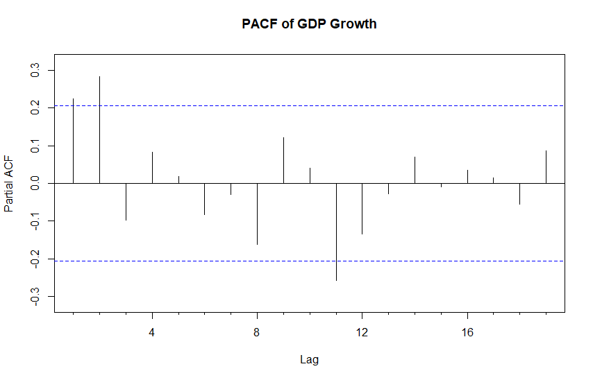

# ARMA processes {#part-ch5 .chapter-title}

## AR($p$) process {#ARprocess}

Earlier, we considered the AR(1) process. This can be generalized to the **AR($p$) process**
\begin{equation*}
    y_{t} = \nu + \phi_{1}y_{t-1}+\cdots+\phi_{p}y_{t-p}+u_{t}, \quad u_{t}\sim\mathsf{iid}(0,\sigma^{2}), 
\end{equation*}
which can be rewritten
\begin{equation*}
    \phi\left(B\right) y_{t} = \nu + u_{t},
\end{equation*}
with the lag-polynomial $\phi\left(B\right)=1-\phi_{1}B-\cdots-\phi_{p}B^{p}$. The current value of the process hence depends linearly on $p$ past values of the process and the constant term, as well as on an unobserved random shock (or error term or "innovation", depending on the perspective and context).

- Analogously, we can rewrite (as in some references) AR($p$) for the demeaned process as
\begin{equation*}
    \phi\left(B\right) (y_{t}- \mu) = u_{t}.
\end{equation*}

- Notice that $\nu \equiv \phi\left(B\right) \mu \equiv \phi\left(1\right) \mu = \left(1-\phi_{1}-\cdots-\phi_{p}\right)\mu$.

&nbsp;

**A sufficient condition for the stationarity of an AR($p$) process**. A sufficient condition for the stationarity of the AR($p$) process is that the roots of the polynomial $\phi\left(z\right)$ $\left(z\in \mathbb{C}\right)$ lie outside the unit circle/disk in the complex plane, or equivalently that
\begin{equation*}
\phi\left(z\right)\neq 0 \,\, \mathrm{for}\,\, \left\vert z\right\vert \leq1.
\end{equation*}

- As an example, in the AR(1) case the polynomial is $\phi\left(z\right)=1-\phi_{1}z$, whose only root is $z=1/\phi_{1}$. Because $\left\vert z\right\vert = 1/\left\vert \phi_{1}\right\vert>1$ exactly when $\left\vert \phi_{1}\right\vert<1$, this shows why in the case $p=1$ the condition $\left\vert \phi_{1}\right\vert<1$ was found sufficient to ensure the existence of a (causal) stationary MA($\infty$) representation. 

- Notice that the resulting root (roots), when $p>1$, can also be complex numbers. Related to the above stationarity condition, the absolute value or norm of a complex number $z=x+iy$ $\left(i=\sqrt{-1}\right)$ is defined as $\left\vert z\right\vert=\sqrt{x^{2}+y^{2}}$. The latter form of the stationarity condition can be further expressed as $\phi\left(z\right)  =0\Rightarrow\left\vert z\right\vert>1$. 

<!-- - Still about possible complex roots: Because the coefficients of the polynomial $\phi\left(z\right)$ are real numbers, the potential complex roots always appear as conjugate roots, that is, if $\zeta=x+iy$ is a root, then also $\bar{\zeta}=x-iy$ is a root. -->

&nbsp;

::: {.callout-note collapse="true"}
## Extra: More details on stationarity condition


Still more about the possibility of getting complex roots. The absolute value or norm of a complex number $z=x+iy$ $\left(i=\sqrt{-1}\right)$ can be identified with the norm of the vector $\left(x,y\right)$. 

One way to illustrate this stationarity condition makes use of a well-known result in mathematics called the fundamental theorem of algebra. As a consequence of this result, the polynomial $\phi\left(z\right)$ can be written as (assuming that $\phi_{p}\neq0$)
\begin{equation*}
    \phi \left(z\right)=\left(1-\zeta _{1}^{-1}z\right) \cdots \left( 1-\zeta_{p}^{-1}z\right),
\end{equation*}
where for the roots $\zeta_{i}$ it therefore holds that $\phi\left(\zeta_{i}\right)=0$ and $\left\vert \zeta_{i}\right\vert>1$ ($i=1,\ldots,p$). Therefore, an AR($p$) process can be expressed as $\left(1-\zeta_{1}^{-1}B\right)\cdots\left(1-\zeta_{p}^{-1}B\right)  y_{t}=u_{t}$. If all the roots of $\phi\left(z\right)$ are real, this equation can be divided by the polynomials $\left(  1-\zeta_{i}^{-1}B\right)$, $i=1,\ldots,p$, one at a time, and in this way it can be seen (similarly as in the case $p=1$) that the resulting expression is a well-defined linear process. This procedure can also be generalized to the case of complex roots.

:::

&nbsp;

Based on the above-mentioned, a stationary AR($p$) process has an MA$\left(\infty\right)$ representation
\begin{equation*}
    (y_{t}- \mu)=\phi \left(B\right)^{-1}u_{t}=\psi \left(B\right)u_{t}=\sum_{j=0}^{\infty}\psi_{j}u_{t-j},
\end{equation*}
where $\psi\left(B\right) =\sum_{j=0}^{\infty}\psi_{j}B^{j}=\phi\left(B\right)^{-1}$. The coefficients $\psi_{j}$ can be solved as a function of the parameters $\phi_{1},\ldots,\phi_{p}$ from equation 
\begin{equation*}
    \left(1-\phi_{1}B-\cdots-\phi_{p}B^{p}\right) \left(\psi_{0}+\psi_{1}B+\psi_{2}B^{2}+\cdots \right)=1
\end{equation*}
by interpreting the right hand side as a power series in $B$, and setting the coefficients of $B^{j}$ equal to each other on both sides of the equation. 

- Recall that two polynomials are the same if their coefficients are the same. 

- For instance, the coefficient of $B^{0}$ is 1, so that $\psi_{0}=1$. Next, the coefficient of $B^{1}$ is zero, so that $\psi_{1}-\phi_{1}\psi_{0}=0$ from which $\psi_{1}=\phi_{1}$ follows. The general solution is left as an exercise.

&nbsp;

**Autocorrelation function**. The autocorrelation function of an AR($p$) process could be derived by making use of its MA$\left(\infty\right)$ representation. Instead, we present an often used and rather practical alternative approach based on the AR($p$) model equation.

Multiplying both sides of the demeaned AR($p$) process representation by $y_{t-h}-\mu$ $\left(h\geq0\right)$ and taking expectations, we obtain
\begin{eqnarray*}
    \mathsf{E}\Big((y_{t}-\mu)(y_{t-h}-\mu)\Big)  &=& \phi_{1}\mathsf{E}\Big((y_{t-1}-\mu) (y_{t-h}-\mu)\Big)+\cdots \\
    &+& \phi_{p}\mathsf{E}\Big((y_{t-p}-\mu)(y_{t-h}-\mu)\Big)  +\mathsf{E}\Big(u_{t}(y_{t-h}-\mu)\Big).
\end{eqnarray*}
Because $y_{t-h}$ (and likewise $y_{t-h}-\mu$) is a linear function of the innovation terms $u_{t-h},$ $u_{t-h-1},\ldots$, the variables $y_{t-h}$ and $u_{t}$ are independent when $h>0$. Therefore, we get

- $\mathsf{E}\Big(u_t (y_{t-h}-\mu)\Big)=0, \quad h>0$,

- For $h=0$, we get $\mathsf{E}\Big(u_{t}(y_{t}-\mu)\Big)=\mathsf{E}\left(u_{t}^{2}\right)  =\sigma^{2}$. 

As $\gamma_{h}=\gamma_{-h}$, we get
\begin{equation*}
    \gamma_{h}=\left\{
    \begin{array}
        [c]{l}
        \phi_{1}\gamma_{1}+\cdots+\phi_{p}\gamma_{p}+\sigma^{2},\,\, h=0\\
        \phi_{1}\gamma_{h-1}+\cdots+\phi_{p}\gamma_{h-p},\,\, h > 0.
    \end{array}
    \right.
\end{equation*}
Dividing this (in the case $h>0$) by the variance $\gamma_{0}$, we get the autocorrelation function of an AR($p$) process
\begin{equation*}
    \rho_{h}=\phi_{1}\rho_{h-1}+\cdots+\phi_{p}\rho_{h-p}, \quad h>0,
\end{equation*}
so that it satisfies a difference equation similar to the one the AR($p$) process itself satisfies. 

- When the roots of $\phi\left(z\right)$ lie outside the unit disk in the complex plane, the solution $\rho_{h}$ to this difference equation decays exponentially to zero as the lag length $h$ increases. 
<!-- , potentially with a pattern resembling a dampening sine wave (this follows from properties of solutions to difference equations -- skip details).  -->

- The solution $\phi_{1}^{h}$ for the AR(1) is an example of this (this solution can also be easily obtained by solving the difference equation above in the case $p=1$ using the initial value $\rho_{0}=1$).

&nbsp;

**Partial autocorrelation function**. We next define the partial autocorrelation function, which is, among other things, a useful tool for model selection. Assume that $\alpha_h$ equals the conventional partial correlation coefficient that measures the correlation between the random variables $y_t$ and $y_{t-h}$ when the linear effect of the random variables $y_{t-1}, \ldots, y_{t-h+1}$ has been first eliminated. 

- Therefore, a particular consequence is that $\left\vert \alpha_{h}\right\vert\leq1$.

In the case of an AR($p$) process, the partial autocorrelation function $\alpha_h$ has a special useful feature: For $m>p$, an AR($p$) process can be interpreted as an AR($m$) process with $\phi_{p+1}=\cdots=\phi_{m}=0$, which makes it clear that the partial autocorrelation function of an AR($p$) process satisfies (also $\alpha_0=1$): 
\begin{equation*}
y_t \sim \mathrm{AR}(p) \Rightarrow \alpha_p = \phi_p \quad 
\mathrm{and} \quad \alpha_h=0 \,\, \mathrm{for}\,\, h > p.
\end{equation*}
In other words, **the partial autocorrelation function of an AR($p$) process drops to zero after lag $p$** (assuming $\phi_p \neq 0$). 

- The sample counterpart of the (population) partial autocorrelation function is obtained by using the sample autocovariances $\mathsf{c}_{h}$.

- The (sample) partial autocorrelation function is typically estimated using recursive algorithms or regression techniques, which are closely related to the Yule-Walker framework (see details in the Extra section below).

&nbsp;

**Model selection implications**. An important detail for model selection is that if an observed time series has been generated by an AR($p$) process, its estimated autocorrelation function should decay to zero as the lag length increases with no apparent breaks, whereas the estimated partial autocorrelation function should have a visible break after lag $p$**. 

&nbsp;

To identify the location of the break point in the estimated partial autocorrelation function, one can make use of the following result: 

- In the case of an AR($p$) process, the estimators $\widehat{\alpha}_{h}$, $h>p$, are approximately independent with $\mathsf{N}\left(0,T^{-1}\right)$--distribution. Therefore,
\begin{equation*}
\mathsf{P}(\left\vert \widehat{\alpha}_{h}\right\vert \geq1.96/\sqrt{T})\approx0.05
\end{equation*}
when $h>p$. 

- On the other hand, because the estimators $\mathsf{c}_{1},\ldots,\mathsf{c}_{p}$ are consistent, the estimator $\widehat{\alpha}_{p}$ converges in probability to the value of the theoretical partial autocorrelation coefficient $\alpha_{p}$ which for an AR($p$) process is nonzero. Therefore, for $h=p$, $\mathsf{P}(\left\vert \widehat{\alpha}_{h}\right\vert \geq1.96/\sqrt{T})$ approaches one as the sample size increases. 

- These remarks justify depicting the sample partial autocorrelation coefficients similarly to the usual autocorrelation coefficients, and adding horizontal critical/confidence bands to make their interpretation easier.

&nbsp;

::: {.callout-note collapse="true"}
## Extra: Yule-Walker equations and autocorrelation and partial autocorrelation coefficients


Choosing $h=1,\ldots,p$ in the AR($p$) autocorrelation function leads to the equations ($\rho_{0}=1$ and $\rho_{h}=\rho_{-h}$)
\begin{align*}
    \rho_{1}& =\phi_{1}+\phi_{2}\rho_{1}+\cdots+\phi_{p}\rho_{p-1}\\
    \rho_{2}& =\phi_{1}\rho_{1}+\phi_{2}+\cdots+\phi_{p}\rho_{p-2}\\
    & \vdots\\
    \rho_{p}& =\phi_{1}\rho_{p-1}+\phi_{2}\rho_{p-2}+\cdots+\phi_{p},
\end{align*}
which collectively are called the **Yule-Walker equations**. In matrix notation, these can be expressed as
\begin{equation*}
    \boldsymbol{\rho}=\boldsymbol{P}\boldsymbol{\phi},
\end{equation*}
where $\boldsymbol{\rho}=\left[\rho_{1}\text{ }\cdots\text{ }\rho_{p}\right]^{\prime}$, $\boldsymbol{\phi}=\left[\phi_{1}\text{ }\cdots\text{ }\phi_{p}\right]^{\prime}$ and $\boldsymbol{P}=\left[\rho_{i-j}\right]_{i,j=1,\ldots,p}$ is a $p\times p$ matrix, whose row $i$ and column $j$ element equals $\rho_{i-j}$. This makes it clear that the parameter vector $\boldsymbol{\phi}$ can be expressed as a function of the autocovariance or autocorrelation coefficients. The result is the Yule-Walker equation
\begin{equation*}
    \boldsymbol{\phi}=\boldsymbol{P}^{-1}\boldsymbol{\rho}=\boldsymbol{\Gamma}^{-1}\boldsymbol{\gamma},
\end{equation*}
where $\boldsymbol{\gamma}=\left[\gamma_{1}\text{ }\cdots\text{ }\gamma_{p}\right]^{\prime}=\gamma_{0}\boldsymbol{\rho}$ and $\boldsymbol{\Gamma}=\left[\gamma_{i-j}\right]  _{i,j=1,\ldots,p}=\gamma_{0}\boldsymbol{P}$. From the equations derived above it follows that also the parameter $\sigma^{2}$ can be expressed as a function of the autocovariance coefficients and the parameters $\phi_{1},\ldots,\phi_{p}$ as
\begin{equation*}
    \sigma^{2}=\gamma_{0}-\phi_{1}\gamma_{1}-\cdots-\phi_{p}\gamma_{p}.
\end{equation*}

A note on $\boldsymbol{P}^{-1}$: It is rather clear that this inverse matrix exists here. If not, there would need to be an exact linear relationship between the variables $y_{t-1},\ldots,y_{t-p}$, which (except for the case $\sigma^{2}=0$) is not possible. The sufficient condition for stationarity of an AR($p$) process guarantees that $\boldsymbol{P}$ is invertible, although seeing this is somewhat technical.

&nbsp;

To be more precise, let us denote $\boldsymbol{\gamma}=\boldsymbol{\gamma}_{p}$ and $\boldsymbol{\Gamma}=\boldsymbol{\Gamma}_{p}$ in the Yule-Walker equation. Now, the partial autocorrelation function with lag $h$ is defined as
\begin{equation*}
    \alpha_{h}=\left\{
    \begin{array}
        [c]{l}
        1, \,\, \mathrm{for} \,\, h=0\\
        \text{the last component of the vector }\boldsymbol{\Gamma}_{h}^{-1}
        \boldsymbol{\gamma}_{h}\text{, when }h\geq1.
    \end{array}
    \right.
\end{equation*}
Because the second and third expressions of the Yule-Walker equation can be defined for any weakly stationary (non-deterministic) process, so can also the partial autocorrelation function.

The sample counterpart of the (population) partial autocorrelation function is straightforward to define, simply estimating the vector $\boldsymbol{\gamma}_{h}$ and matrix $\boldsymbol{\Gamma}_{h}$ using the obvious estimators $\boldsymbol{c}_{h}=\left[\mathsf{c}_{1}\text{ }\cdots\text{ }\mathsf{c}_{h}\right]^{\prime}$ and $\boldsymbol{C}_{h}=\left[  \mathsf{c}_{i-j}\right]_{i,j=1,\ldots,h}$. Therefore, the sample partial autocorrelation coefficient $\widehat{\alpha}_{h}$ equals $1$ for $h=0$, and the last component of the Yule-Walker estimate $\boldsymbol{\widehat{\phi}}_{YW}=\boldsymbol{C}_{h}^{-1}\boldsymbol{c}_{h}$ of the parameter $\boldsymbol{\phi}$ for $h\geq1$. As a remark, we note that there exist recursive formulas that can be used to compute both theoretical and sample partial autocorrelation coefficients that avoid computing the inverse of the (potentially large) matrix $\boldsymbol{C}_{h}$, but we omit the details of this.

:::


&nbsp;

**Empirical example**. As an example, below we present the estimated sample partial autocorrelation functions (with lag lengths $h=1,\ldots,19$) of the quarterly U.S. real GDP growth series, together with the above-mentioned critical/confidence bands.

- The corresponding sample autocorrelation coefficients are shown already above.

- The first two sample partial autocorrelation coefficients $\widehat{\alpha}_{1}$ and $\widehat{\alpha}_{2}$ are outside the confidence bands, whereas the rest lie within these bands (except the 11th lag), pointing towards an AR(2) process. The sample autocorrelation function partly supports this conclusion, while an MA(2) or some other ARMA model might also be a potential candidate for the GDP growth.

- We will come back to empirical model selection later in this material. 

```{r, PACFrealGDPGM, echo=FALSE, out.width="75%", fig.align = "center", fig.cap=""}

```
<span class="fig-caption">Figure: Sample partial autocorrelation function (PACF) of the quarterly U.S. real GDP growth rate.</span>


&nbsp;


## MA($q$) process and invertibility

The MA($q$) process is defined as
\begin{equation*}
    y_{t} = \mu + u_{t}+\theta_{1}u_{t-1}+\cdots+\theta_{q}u_{t-q}, \quad u_{t}\sim\mathsf{iid}(0,\sigma^{2}), 
\end{equation*}
or alternatively using the lag operator as
\begin{equation*}
    (y_{t}-\mu)=\theta\left(B\right)u_{t},
\end{equation*}
with the lag-polynomial $\theta\left(B\right)=1+\theta_{1}B+\cdots+\theta_{q}B^{q}$. Therefore, the current value of the process is assumed to depend linearly on the present and last $q$ unobservable random shocks. Because an MA($q$) process is a special case of the (causal) linear process, it is always both weakly and strictly stationary. Moreover, we get 

- $\mathsf{E}\left( y_{t}\right) = \mu$,

- $\mathsf{Var}\left( y_{t}\right) =\gamma _{0}=\left( 1+\theta _{1}^{2}+\cdots +\theta _{q}^{2}\right) \sigma^{2}$.

&nbsp;

**Autocorrelation function**. By making use of the general results of the linear process, the MA($q$) process has the autocovariance function given by
\begin{equation*}
    \gamma_{h}=
        \begin{cases}
        \sigma^{2}\sum_{j=0}^{q-h}\theta_{j}\theta_{j+h}, & \text{for } \, 0\leq h\leq q,\\
        0, & \text{for } \, h>q,
    \end{cases}
\end{equation*}
where $\theta_0=1$. The autocorrelation function is then obtained via the formula $\rho_{h}=\gamma_{h} / \gamma_{0}$. 

- Therefore, the autocorrelation function of an MA($q$) process drops to zero after lag $q$ (assuming that $\theta_{q}\neq0$). 

- If one observes a similar feature in a sample autocorrelation function, one can consider an MA($q$) process as a good candidate to model the time series. 

When considering the suitability of an MA($q$) process, one can make use of the following result: In the case of an MA($q$) process, the estimators $\mathsf{r}_{h}$, $h>q$, are approximately normally distributed with mean zero and variance $\left(1+2\rho_{1}^{2}+\cdots+2\rho_{q}^{2}\right)/T$. Therefore, if one wants to test whether an individual autocorrelation coefficient is statistically different from zero at the 5\% significance level, the estimates $\mathsf{r}_{h}$, $h>q$, should be compared with the critical bounds
\begin{equation*}
\pm1.96\sqrt{\widehat{\mathsf{w}}_{q}/T}, \quad \widehat{\mathsf{w}}_{q}=1+2\mathsf{r}_{1}^{2}+\cdots+2\mathsf{r}_{q}^{2}.
\end{equation*}
In this case, $\mathsf{P}(\left\vert \mathsf{r}_{h}\right\vert \geq1.96\sqrt{\widehat{\mathsf{w}}_{q}/T})\approx0.05$. Note also that these bounds are wider than the ones obtained in the case $y_{t}\sim\mathsf{iid}\left(\mu,\sigma^{2}\right)$, where $\widehat{\mathsf{w}}_{q}$ is replaced by $1$.

&nbsp;

**Invertibility**. It can be shown that in a (causal) AR($p$) process there exists a one-to-one correspondence between the parameters $\boldsymbol{\phi}=\left(\phi_{1},\ldots,\phi_{p}\right)^{\prime}$ and $\sigma^{2}$, and the autocovariance function. For an MA($q$) process, a similar result does not hold. 

- To see this, consider as an example the MA(1) process for which it holds that (assume that $\theta_1 \neq0$) 
\begin{equation*}
    \gamma_{0}=\sigma^{2}\left(1+\theta_1^{2}\right)=\sigma^{2}\theta_1^{2}\left(1+1/\theta_1^{2}\right) \,\, \mathrm{and} \,\, \gamma_{1}=\sigma^{2}\theta_1=\theta_1^{2}\sigma^{2}\left(1/\theta_1\right)\text{.}
\end{equation*}
Define $\theta_1^{\ast}=1/\theta_1$ and $\sigma_{\ast}^{2}=\theta_1^{2}\sigma^{2}$, so that $u_{t}^{\ast}=\theta_1u_{t}\sim\mathsf{iid}\left(0,\sigma_{\ast}^{2}\right)$. Now, it can be seen that the two MA(1) processes $y_{t}=u_{t}+\theta_1 u_{t-1}$ and $y_{t}^{\ast}=u_{t}^{\ast}+\theta_1^{\ast}u_{t-1}^{\ast}$ have exactly the same autocovariance function, so that they cannot be distinguished from each other based on autocovariances. 

- If in addition $u_{t}\sim\mathsf{nid}(0,\sigma^{2})$, the entire probability structures of these two processes are indistinguishable. 

- A consequence is that the parameters cannot be estimated from an observed time series unless one "tells" the method which of the parameter combinations $\left(\theta_1,\sigma^{2}\right)$ and $\left(\theta_1^{\ast},\sigma_{\ast}^{2}\right)$ (that fit the data equally well) should be chosen. 

The typical solution to the above problem is to set the condition $\left\vert \theta_1\right\vert <1$. When one assumes $\left\vert \theta_1\right\vert<1$ in an MA(1) process, one can use the equation $u_{t}=y_{t}-\mu - \theta_1 u_{t-1}$ and repetitive substitutions to first obtain $u_{t} = (y_{t}-\mu) -\theta_1 (y_{t-1}-\mu) +\theta_1^{2}u_{t-2}$, and eventually
\begin{equation*}
    (y_{t}-\mu)=-\sum_{j=1}^{k}\left(-\theta_1\right)^{j}(y_{t-j}-\mu)-\left(-\theta_1\right)^{k+1}u_{t-k-1}+u_{t}.
\end{equation*}
Similarly as when considering the stationarity of an AR(1) process, it can be concluded, given the condition $\left\vert \theta_1\right\vert <1$,
\begin{equation*}
    y_{t} -\mu =-\sum_{j=1}^{\infty}\left(-\theta_1\right)^{j} (y_{t-j}-\mu) + u_{t}.
\end{equation*}
That is, when $\left\vert \theta_1 \right\vert<1$ holds, an MA(1) process can be "inverted" to an AR$\left(\infty\right)$ process, which explains why in the case $\left\vert \theta_1\right\vert<1$ an MA(1) process is called **invertible**. 

&nbsp;

**Invertibility condition of an MA($q$) process**. An MA($q$) process is invertible, if the roots of the polynomial $\theta\left(z\right)$ $\left(z\in\mathbb{C}\right)$ lie outside the unit circle/disk in the complex plane or, equivalently, if 
\begin{equation*}
\theta\left(z\right) \neq0 \,\,\, \mathrm{for} \,\,\, \left\vert z\right\vert\leq1.
\end{equation*}

Similarly as in the case of the stationarity condition of an AR($p$) process, invertibility ensures that there exists an AR$\left(\infty\right)$ representation also for MA($q$) processes. In other words, when the invertibility condition holds, one can formally solve $u_{t}$ from the equation $(y_{t}-\mu)=\theta\left(B\right)u_{t}$ by multiplying both sides by $\theta\left(B\right)^{-1}$. The solution is
\begin{equation*}
    \pi\left(B\right)(y_{t}-\mu) = u_{t} \,\,\, \mathrm{or} \,\,\, \sum_{j=0}^{\infty}\pi_{j}(y_{t-j}-\mu)=u_{t},
\end{equation*}
where $\pi\left(B\right)=\sum_{j=0}^{\infty}\pi_{j}B^{j}=\theta\left(B\right)^{-1}$ and the coefficients $\pi_{j}$ can be solved as a function of the parameters $\theta_{1},\ldots,\theta_{q}$ from the equation
\begin{equation*}
    \left(1+\theta_{1}B+\cdots+\theta_{q}B^{q}\right) \left(\pi_{0}+\pi_{1}B+\pi_{2}B^{2}+\cdots\right)=1
\end{equation*}
by interpreting the right hand side as a power series in $B$, setting the coefficients of $B^{j}$ equal on both sides of the equation (and $\pi_{0}=1$).

As in the MA(1) case, invertibility ensures that there exists a one-to-one correspondence between the autocovariance function of an MA($q$) process and the parameters $\boldsymbol{\theta}=\left(\theta_{1},\ldots,\theta_{q}\right)^{\prime}$ and $\sigma^{2}$. 

- Except for the first-order case, this correspondence is rather complicated, and we omit the details. 

- In what follows (unless otherwise mentioned), MA processes are always assumed to be invertible.

&nbsp;

**Partial autocorrelation function of the MA($q$) process**. The general definition of the partial autocorrelation function presented above in connection with the AR($p$) process can also be applied in the case of an MA($q$) process, but the calculations involved would become rather complicated. However, because an MA($q$) process has (due to invertibility and assuming here $\theta_{q}\neq0$) an AR($\infty$) representation, and based on what was said above about the partial autocorrelation function of an AR($p$) process, it is intuitively clear that the partial autocorrelation function of an MA($q$) process does not drop to zero at any point, but rather smoothly decays towards zero.

- It can be shown that the partial autocorrelation function of an MA(1) process is
\begin{equation*}
    \alpha_{h}=-\left(-\theta_{1}\right)^{h}/\left(1+\theta_{1}^{2}+\cdots+\theta_{1}^{2h}\right).
\end{equation*}
Because $\left\vert \theta_{1}\right\vert<1$, the partial autocorrelation function of an MA(1) process decays to zero at an exponential rate as the lag length $h$ increases. 

- For a general MA($q$) process, it can be shown that the partial autocorrelation function decays to zero at an exponential rate, potentially following the shape of a dampening sine wave. 


&nbsp;


## ARMA($p,q$) process

An ARMA($p$,$q$) process can be characterized as a combination of AR($p$) and MA($q$) processes. It is defined by the equation
\begin{equation*}
    y_{t} = \nu + \phi_{1}y_{t-1}+\cdots+\phi_{p}y_{t-p}+u_{t}+\theta_{1}u_{t-1}+\cdots+\theta_{q}u_{t-q},
\end{equation*}
where $u_{t}\sim\mathsf{iid}(0,\sigma^{2})$. Similarly as in the case of an AR($p$) process, the current value $y_{t}$ is assumed to depend linearly on $p$ past values of the process. Unlike the AR($p$) process, the error term is now (generally) not an independent random shock, but instead an autocorrelated MA($q$) process. 

Using the lag operator and the lag-polynomials $\phi\left(B\right)=1-\phi_{1}B-\cdots-\phi_{p}B^{p}$ and $\theta\left(B\right)=1+\theta_{1}B+\cdots+\theta_{q}B^{q}$, the ARMA($p,q$) process can be expressed as
\begin{equation*}
    \phi\left(B\right)(y_{t}-\mu) = \theta\left(B\right)u_{t}.
\end{equation*}

- If $\theta\left(B\right)=1$ (that is, $q=0$), one obtains the AR($p$) process as a special case. 

- If $\phi\left(B\right)=1$ (that is, $p=0$), one obtains the MA($q$) process.

&nbsp;

**Stationarity and invertibility**. Based on what was said for linear processes, it is clear that an ARMA($p$,$q$) process has a well-defined (causal) MA($\infty$) representation if the polynomial $\phi\left(z\right)$ satisfies the sufficient stationarity condition of an AR($p$) process (what was said in the case of an AR($p$) process holds, but now with an MA($q$) error term). 

- A sufficient condition for the stationarity of the ARMA($p$,$q$) process is that the roots of the polynomial $\phi\left(z\right)$ $\left(z\in\mathbb{C}\right)$ lie outside the unit circle/disk in the complex plane, or equivalently that 
\begin{equation*}
\phi\left(  z\right)  \neq0 \,\,\, \mathrm{for} \,\,\, \left\vert z\right\vert \leq1.
\end{equation*}

- An ARMA($p$,$q$) process is invertible, if the roots of the polynomial $\theta\left(z\right)$ $\left(z\in\mathbb{C}\right)$ lie outside the unit circle/disk in the complex plane, or equivalently if 
\begin{equation*}
\theta\left(z\right)\neq0 \,\,\, \mathrm{for} \,\,\, \left\vert z\right\vert \leq1.
\end{equation*}
The general discussion concerning invertibility in the previous subsection in connection with the MA(1) process also holds here and generalizes to the case of an ARMA($p$,$q$) process.

&nbsp;

As can be deduced from what was discussed above, when the stationarity condition holds, an ARMA($p$,$q$) process has an MA$\left(\infty\right)$ representation (cf. the AR($p$) case) 
\begin{equation*}
    (y_{t}-\mu)=\frac{\theta\left(B\right)}{\phi\left(B\right)}u_{t}=\psi\left(B\right)u_{t},
\end{equation*}
where $\psi\left(B\right)=\sum_{j=0}^{\infty}\psi_{j}B^{j}=\theta\left(B\right)\phi\left(B\right)^{-1}$ and the coefficients $\psi_{j}$ can be solved as a function of the parameters $\phi_{1},\ldots,\phi_{p}$ and $\theta_{1},\ldots,\theta_{q}$ by equating the coefficients of $B^{j}$ on both sides of the equation
\begin{equation*}
\left(1-\phi_{1}B-\cdots-\phi_{p}B^{p}\right)\left(\psi_{0}+\psi_{1}B+\psi_{2}B^{2}+\cdots\right)=1+\theta_{1}B+\cdots+\theta_{q}B^{q}.
\end{equation*}

- From this equation, it can be solved that $\psi_{0}=1$, $\psi_{1}=\phi_{1}\psi_{0}+\theta_{1}$, and in general,
\begin{equation*}
    \psi_{j}=\sum_{i=1}^{p}\phi_{i}\psi_{j-i}+\theta_{j}, \,\, j=0,1,2,\ldots,
\end{equation*}
where $\theta_{0}=1,$ $\theta_{j}=0$, $j>q$, and $\psi_{j}=0$, $j<0$. 

On the other hand, when the invertibility condition holds, then an ARMA($p$,$q$) process has an AR$\left(\infty\right)$ representation
\begin{equation*}
    \frac{\phi\left(B\right)}{\theta\left(B\right)}(y_{t}-\mu)=\pi\left(B\right)(y_{t}-\mu)=u_{t},
\end{equation*}
where $\pi\left(B\right)=\sum_{j=0}^{\infty}\pi_{j}B^{j}=\phi\left(B\right)\theta\left(B\right)^{-1}$. The coefficients $\pi_{j}$ can be solved similarly as the $\psi_{j}$'s above (just exchange the roles of the polynomials $\phi\left(B\right)$ and $\theta\left(B\right)$). The end result can be expressed as
\begin{equation*}
    \pi_{j}=-\sum_{i=1}^{q}\theta_{i}\pi_{j-i}-\phi_{j},\,\, j=0,1,2,\ldots,
\end{equation*}
where $\phi_{0}=-1,$ $\phi_{j}=0$, $j>p$, and $\pi_{j}=0$, $j<0$. In particular, it holds that $\pi_{0}=1$ and, as in the case of the coefficients $\psi_{j}$, $\pi_{j}\rightarrow 0$ at an exponential rate as $j\rightarrow \infty$. 

&nbsp;

**Identification condition**. Earlier in connection to MA processes, the invertibility condition was motivated by the fact that it guarantees the existence of a one-to-one correspondence between the autocovariance function of a process and its model parameters. For general ARMA($p$,$q$) processes, invertibility alone is not sufficient to guarantee the existence of such a correspondence, which is also required for maximum likelihood estimation of the parameters.

- Consider as an example the simple case of an ARMA(1,1) process with the linear representation
\begin{equation*}
    (y_{t}-\mu)=\frac{1+\theta_{1}B}{1-\phi_{1}B}u_{t}.
\end{equation*}
In the special case $\phi_{1}=-\theta_{1}$, it is clear that the polynomials on the right hand side can be cancelled out, resulting in the equation $y_{t}-\mu=u_{t}$ so that the process is not a "real" ARMA(1,1) process, but instead just white noise. This implies that the parameters $\phi_{1}$ and $\theta_{1}$ are not identified in the sense that maximum likelihood estimation will not work because this method cannot distinguish different pairs of parameter values that satisfy the restriction $\phi_{1}=-\theta_{1}$ (and $\left\vert \phi_{1}\right\vert <1$, $\left\vert \theta_{1}\right\vert<1$). 


**Identification (or uniqueness) condition of an ARMA($p$,$q$) process**. The polynomials $\phi\left(z\right)=1-\phi_{1}z-\cdots-\phi_{p}z^{p}$ and $\theta\left(z\right)=1+\theta_{1}z+\cdots+\theta_{q}z^{q}$ of a stationary and invertible ARMA($p$,$q$) process are assumed to have no common roots and $\phi_{p}\neq0$ or $\theta_{q}\neq0$. 

- Quite often, the requirement that $\phi_{p}\neq0$ or $\theta_{q}\neq0$ is not explicitly mentioned but is understood to be contained in the condition ruling out common roots. 

- Unless otherwise mentioned, in what follows, we assume that this identification condition holds.

&nbsp;

**Autocorrelation function of an ARMA($p$,$q$) process** can be derived in a manner similar to the AR($p$) case. 

- In what follows, we only present the general principle of the solution. 

Multiplying both sides of the demeaned ARMA($p,q$) model equation by $y_{t-h}-\mu$ $\left(h\geq0\right)$ and taking expectations yields
\begin{eqnarray*}
    \mathsf{E}\Big((y_{t}-\mu)(y_{t-h}-\mu)\Big) &=&  \phi_{1}\mathsf{E}\Big((y_{t-1}-\mu)(y_{t-h}-\mu)\Big)+\cdots \\
    &+& \phi_{p}\mathsf{E}\Big((y_{t-p}-\mu)(y_{t-h}-\mu)\Big) +\mathsf{E}\Big(u_{t}(y_{t-h}-\mu)\Big) \\ &+& \theta_{1}\mathsf{E}\Big(u_{t-1}(y_{t-h}-\mu)\Big)+\cdots+ \theta_{q}\mathsf{E}\Big(u_{t-q}(y_{t-h}-\mu)\Big).
\end{eqnarray*}
Making use of the MA$\left(\infty\right)$ representation and the definition of autocovariance this further leads to
\begin{equation*}
    \gamma_{h} =
    \begin{cases}
        \phi_{1} \gamma_{h-1} + \cdots + \phi_{p}\gamma_{h-p} + \sigma^{2}\sum_{j=0}^{\infty}\theta_{h+j}\psi_{j}, & 0 \leq h < \max\left\{p, q+1\right\}, \\
        \phi_{1} \gamma_{h-1} + \cdots + \phi_{p}\gamma_{h-p}, & h \geq \max\left\{p, q+1\right\},
    \end{cases}
\end{equation*}
where $\theta_{0}=1$ and $\theta_{j}=0$ for $j\notin\left\{0,\ldots,q\right\}$. The autocorrelation function is then obtained using the formula $\rho_{h}=\gamma_{h}/\gamma_{0}$.  Moreover, the coefficients $\psi_{j}$ can be expressed as a function of the parameters $\phi_{1},\ldots,\phi_{p}$ and $\theta_{1},\ldots,\theta_{q}$. 

- Because this recursive solution is obtained from a difference equation similar to the one the autocovariances of an AR($p$) process satisfy, it is rather clear that as the lag length $h$ increases, the autocorrelation function of an ARMA($p,q$) process decays exponentially to zero, potentially following the shape of a dampening sine wave (in the case $p=1$ this is rather easy to verify).

- Because an ARMA($p,q$) process has an AR($\infty$) representation when the invertibility condition holds, one can use the general definition of the partial autocorrelation function to conclude that the general shape of the partial autocorrelation function of an ARMA($p,q$) process is comparable to that of the autocorrelation function. 

To conclude and importantly, for a genuine ARMA($p,q$) process (that is, with $p\geq1$ and $q\geq1$), neither the autocorrelation nor the partial autocorrelation function ever drops to zero, but instead both steadily decay towards zero.


## Briefly on ARIMA($p,d,q$) process 

In many applications, time series often exhibit trends, implying that their properties cannot be modeled by stationary processes. (Note that the term "trend" is used quite loosely here.) However, as already discussed in connection to transformations in Section 1, quite often the differences of such time series $y_{t}-y_{t-1} \equiv \Delta y_{t}$ (that is, $\Delta =1-B$) look stationary and hence could be modeled as stationary processes. 

- If the differenced series is trending, then one may consider modeling the change of the difference $\Delta^{2}y_{t}$. 

- One might apply the same idea to justify using higher order differences, but this is very rare in practice (even second differences are already rare).

Generally, a process $y_{t}$ is called an ARIMA($p,d,q$) process if it becomes a stationary and invertible ARMA($p,q$) process after differencing $d$ times, i.e., $\Delta ^{d}y_{t}\sim$ ARMA($p,q$). 

- In practice, the case $d=1$ is by far the most common. 

- When $d=0$, the special case is an ARMA($p,q$) process, and thus also an AR($p$) process when $q=0$.

We will consider nonstationary processes more detail in Section 12.

&nbsp;

&nbsp;