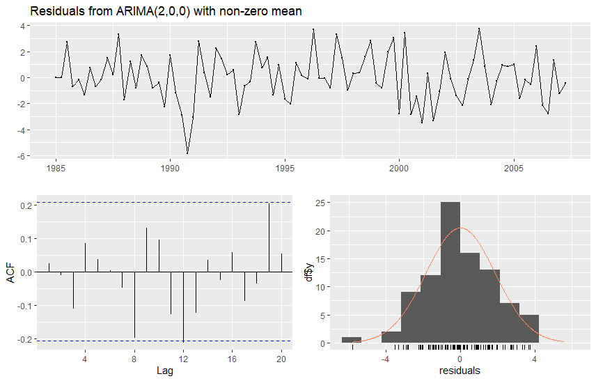

# ARMA model selection {#part-ch7 .chapter-title}

## Starting point

Consider an observed time series $y_1,\ldots,y_T$, which is assumed, based on its graph or other diagnostics, to be generated by a stationary process, making an ARMA($p$,$q$) specification reasonable. 

- As mentioned earlier, achieving stationarity may require preliminary transformations: differencing (possibly combined with a logarithmic transformation), which amounts to selecting the differencing order $d$ of an ARIMA($p,d,q$) model and then modelling the differenced data as an ARMA process, or removing deterministic trends by an appropriate detrending method. Nonstationary processes with unit roots are considered later.

- For example, if the process follows a deterministic linear trend, the model can be written as
\begin{equation*}
y_t= \mu_0 + \mu_1 t + z_t, \quad t=1,\ldots,T,
\end{equation*}
where $z_t$ is an ARMA($p,q$) process (cf. the decomposition $y_t = \mu_t + z_t$ in Section 2). This is an example of a **trend-stationary process**. The usual approach is to estimate $\mu_0$ and $\mu_1$ by least squares and then analyse the residual series, that is, to estimate the deterministic part and the ARMA($p,q$) parameters of $z_t$ separately. An obvious alternative is to estimate all the parameters jointly.

&nbsp;

Finding a suitable ARMA($p,q$) process, or, using terminology commonly employed in statistical modelling, an **ARMA($p,q$) model**, traditionally involves the following interrelated stages:

1) Specifying (selecting) the model orders $p$ and $q$

2) Estimating the model parameters (which may include preliminary estimation steps)

3) Evaluating the adequacy of the estimated model through diagnostic checks and, in some cases, assessing forecasting performance

If the model is found to be inadequate in Step 3, one must return to Step 1 to select new orders $p$ and $q$, re-estimate the parameters, and re-evaluate the model. As noted, Steps 1--3 are interdependent and are not always performed in a strictly sequential manner. 

**In practice, one can never know with certainty whether the true (correct) orders of the ARMA($p,q$) model have been identified**. 

- If the orders are chosen too small, part of the autocorrelation structure of the time series remains unmodelled. This is clearly suboptimal from a modelling standpoint, and potentially harmful for forecasting as well. One might then be tempted, but erroneously so, to select overly large orders to avoid underfitting.

- However, choosing orders that are too large leads to inefficiencies in parameter estimation, which can degrade forecasting accuracy. This is especially problematic when both $p$ and $q$ are chosen too large, as it may result in a model where $\phi_{p}=0=\theta_{q}$, violating the identification condition of the ARMA process. In such cases, the model parameters are not identifiable, making meaningful estimation impossible.

For these reasons, it is generally advisable to follow the **principle of parsimony**: select a model that is as simple as possible while still being sufficiently rich to capture the essential dynamics of the data.

&nbsp;

**In what follows in this section**, we assume that the error term satisfies $u_{t}\sim\mathsf{iid}(0,\sigma^{2})$. 

- In the context of maximum likelihood estimation, we adopt the stronger assumption $u_{t}\sim\mathsf{nid}(0,\sigma^{2})$. 

- Unless otherwise stated, we also assume that the stationarity and invertibility conditions hold. 

&nbsp;

**Constant term or demeaning?** As previously discussed, the mean $\mathsf{E}(y_t)=\mu$ is typically nonzero, which means that we need to include a constant term in the model, or alternatively to work with a demeaned time series. A few clarifying points from an empirical modelling perspective:

- The mean is typically estimated using the sample mean $\bar{y}$, after which one may consider the **centered time series** $y_{t}-\bar{y}$, $t=1,\ldots,T$, and proceed as if $\bar{y}$ exactly equals the unknown population mean $\mu$. While this introduces a small approximation error, it can be shown that the error becomes negligible in large samples. 

- **If the time series is not centered, you should always include the constant term** in the model equation.


&nbsp;


## Sample autocorrelations and partial autocorrelations

A good second step after visualizing the series is to investigate the autocorrelation structure of the time series using the estimated (sample) autocorrelation function (ACF) and partial autocorrelation function (PACF). In many cases, these functions may contain clues regarding the suitable lag lengths $p$ and $q$ concerning an adequate ARMA($p,q$) model.

In particular, recall the theoretical properties of AR, MA and ARMA processes: **one should look for potential cutoffs ("sudden drops to zero") in the sample ACF and sample PACF**. 

- A sharp cutoff in the ACF with a gradually decaying PACF suggests an MA($q$) process.

- A sharp cutoff in the PACF with a gradually decaying ACF suggests an AR($p$) process.

- Gradual decay in both ACF and PACF may indicate an ARMA($p$,$q$) process.

This approach is part of the **Box-Jenkins model selection procedure**. While this method does not always point to a single, definitive model, it is useful for **ruling out implausible alternatives** and narrowing down the set of candidate models. It is often used in conjunction with other model selection criteria, which will be introduced in the following sections.

&nbsp;

## Information criteria and sequential tests in model selection

As with the use of the sample ACF and PACF, the goal here is to select the orders $p$ and $q$ of the ARMA($p,q$) model after one has first set "sufficiently large" maximum lag lengths, denoted $p^{\ast}$ and $q^{\ast}$. This preliminary selection can be guided, for instance, by examining the sample autocorrelation and partial autocorrelation functions.

- Let $\tilde{\sigma}_{p,q}^{2}$ ($0\leq p\leq p^{\ast}$, $0\leq q\leq q^{\ast}$) be the estimator of the innovation variance $\sigma^{2}$ of an ARMA($p,q$) process. 

- Suppose also that the quantity $\max\left(p^{\ast},q^{\ast}\right)$ used in this estimation method is held constant for all attempted values of $p$ and $q$. 

As discussed, it is preferable to avoid choosing $p$ and $q$ too large. 

- One possible way to choose $p$ and $q$ would be to minimize $\tilde{\sigma}_{p,q}^{2}$ over the possible values $0\leq p\leq p^{\ast}$, $0\leq q\leq q^{\ast}$. This does not work, however: by the nature of the least squares and maximum likelihood methods, $\tilde{\sigma}_{p,q}^{2}$ decreases as the orders increase, so one would always end up choosing orders that are too large.

To fix this obvious problem, one approach to select the orders $p$ and $q$ is to minimize the function
\begin{equation*}
    C\left(p,q\right)  =\log\tilde{\sigma}_{p,q}^{2}+ \frac{\left(p+q+1\right)  g\left(  T\right)}{T}, \quad 0\leq p\leq p^{\ast},\,\, 0\leq q\leq q^{\ast},
\end{equation*}
where the so-called **penalty function** $g\left(\cdot\right)$ is positive valued and satisfies $g\left(  T\right)  /T\rightarrow0$ as $T\rightarrow \infty$ ("+1" due to the inclusion of the constant term $\nu$). The idea behind the penalty function is to penalize for using an unnecessarily large model. If increasing the order $p$ or $q$ does not make $\tilde{\sigma}_{p,q}^{2}$ sufficiently much smaller, then one does not choose the larger model. 

Typically used penalty functions (which have been derived based on different principles) are:

- AIC: $g\left( T\right) =2$ (Akaike information criterion)

- HQ: $g\left( T\right) =2\log (\log T)$ (Hannan and Quinn information criterion)

- BIC: $g\left( T\right) =\log T$ (Schwarz information criterion/Bayesian information criterion)

The first of these (AIC) penalizes the least (favors larger models) and the last (BIC) the most (favors smaller models). 

- Note that for the HQ penalty function there exist also other versions, in which the constant 2 is replaced by some other constant.

&nbsp;

**Some notes on empirical model selection**. In practice, it is often advisable to use the criteria described above only as one tool in model selection, rather than relying solely on the mechanical minimization of the criterion $C\left(  p,q\right)$. Ideally, the final model selection should be made after successful parameter estimation (i.e. when there is clearly no suspicious behaviour in the estimates) and after conducting diagnostic checks to assess the adequacy of the model (see the next subsection).

However, from a modern and partly **machine learning-oriented perspective**, information criteria and similar tools are often applied in a more automated fashion to select the lag lengths of ARMA models. While not always ideal, this reflects a practical compromise: with large and complex datasets, detailed diagnostic checks at every step of the selection process may not be feasible, or even reasonable.

**Neighbouring models**. For time series that appear difficult to model, it may be useful to consider as alternatives also models in which the lag lengths $p$ and $q$ are one larger than in the model minimizing the criterion function.

- However, it is important to keep in mind that selecting both orders too large can lead to identification problems (cf. the identification condition of the ARMA processes).

Another practical approach is to select a small set of models corresponding to the lowest values of the information criterion function and subject them to more detailed investigation. It is also common to use multiple information criteria simultaneously and examine whether they point to the same model.

&nbsp;

**Sequential tests**. One way to choose the AR($p$) or ARMA($p,q$) model orders is based on sequential tests. In what follows, we consider an AR($p$) model for simplicity, but the procedure generalizes to ARMA models as well.

- Start by choosing a relatively large model order $p^{\ast}$.

- Estimate an AR($p^{\ast}$) model
  \begin{equation*}
      y_t = \nu + \phi_1 y_{t-1} + \cdots + \phi_{p^{\ast}-1} y_{t-p^{\ast}+1} + \phi_{p^{\ast}} y_{t-p^{\ast}} + u_t.
  \end{equation*}

- Test the restriction $\mathsf{H}_0:\phi_{p^{\ast}}=0$.

- If the null hypothesis cannot be rejected, estimate an AR($p^{\ast}-1$) model and test $\mathsf{H}_0:\phi_{p^{\ast}-1}=0$.

- Continue until the null hypothesis is rejected for the first time.

The procedure above can be applied mechanically using $t$-tests or Wald test statistics, or using information criteria. Note the obvious multiple testing problem and its effect on the $p$-values, although this is often ignored in this context.

&nbsp;

## Evaluating the adequacy of the estimated model

In the previous sections, it is assumed that the lag lengths (orders) $p$ and $q$ of the ARMA($p,q$) model have been chosen, in one way or another, so that the model is adequate. This means that the error term $u_{t}$ satisfies at least the assumption $u_{t}\sim\mathsf{iid}(0,\sigma^{2})$, while $p$ and $q$ are not, at least simultaneously, unnecessarily large.

- If the normality of the error term is also assumed, the error term should preferably satisfy $u_{t}\sim\mathsf{nid}(0,\sigma^{2})$.

As discussed above, one often follows **the principle of parsimony** when choosing the model, which can sometimes lead to a model in which at least one of the orders is chosen too small. In such a case, the error term of the selected model remains autocorrelated, and moving to a larger model to capture this remaining correlation may improve, for instance, the forecasting performance of the model.

&nbsp;

**Residuals**. A natural way to investigate the adequacy of an estimated model is to use residuals, whose properties should resemble those of the theoretical error terms $u_{t}$. As with linear regression models, the residuals are obtained as the difference between the observed values $y_t$ and the fitted values $\widehat{y}_t$ of the selected and estimated ARMA model
\begin{equation*}
\widehat{u}_t = y_t - \widehat{y}_t.
\end{equation*}
In practice, one can also scale further and divide the residuals $\widehat{u}_{t}$ by their estimated standard deviation $\widehat{\sigma}$. The **standardized residuals** obtained in this way, $\widehat{u}_{t}/\widehat{\sigma}$, should in the case of a correctly specified model be approximately independent with mean zero and variance one.

&nbsp;

**Graphical and formal residual analysis**. The first step in the investigation of the properties of the residuals is to plot their time series graph. If the estimated model is correct (or, empirically more realistically, "adequate"), the residual series should not exhibit trends, cyclical components, systematic variation in its level or variance over time (that is, heteroskedasticity), too many outlying observations, and so on. 

- This is because the residuals $\widehat{u}_t$ should reflect the assumptions made on the error term $u_t$.

The next step is to examine whether the residuals are uncorrelated. This is done similarly to how autocorrelation is assessed in the original time series—by analyzing the sample ACF and PACF of the residuals. If significant autocorrelation remains, it suggests that the model has not fully captured the dynamics of the data, and further refinement may be necessary.

- It should be noted, though, that for the autocorrelation coefficients computed from residuals, the critical bounds $\pm1.96/\sqrt{T}$ are not valid, not even asymptotically. 

- Asymptotically correct bounds do exist but are complicated, although some computer programs plot them automatically. If they are not readily available, the somewhat incorrect bounds $\pm1.96/\sqrt{T}$ are sometimes used as a rough guide to the significance of the residual autocorrelations. 

For testing remaining autocorrelation in the residuals, the **Ljung-Box test statistic** (introduced earlier) can also be used.

- However, when considering an ARMA($p,q$) model with a constant term, instead of the (asymptotic) $\chi_{H}^{2}$--distribution used earlier, one should now use the $\chi_{H-p-q-1}^{2}$--distribution where one has to choose $H$ "large enough" for this (asymptotic) distribution to be valid.

- In practice, $H$ is chosen somewhere around 10--20 depending on the sample size $T$. Moreover, typically a couple of different selections of $H$ are considered to see whether the testing results are similar for different selections.

&nbsp;

**Possible (remaining) nonlinearities**. Although the errors of the chosen model could be considered to have no autocorrelation, they are not necessarily independent. In line with the earlier discussion on possible nonlinearities, one (admittedly restricted) way of investigating potential nonlinear dependence in the errors is to use the autocorrelations of the squared residuals. 

It can be shown that when errors satisfy the assumption $u_{t}\sim\mathsf{nid}\left(  0,\sigma^{2}\right)$, the sample autocorrelation coefficients of the squared residuals $\widehat{u}_{t}^{2}$ ($t=1,\ldots,T$) are approximately independent and $\mathsf{N}\left(0,1/T\right)$--distributed. Therefore, to these coefficients one can apply the critical bounds $\pm1.96/\sqrt{T}$ as well as the **McLeod-Li test** presented earlier (that is, the Ljung-Box test applied to the squared residuals). 

- If one notices that the errors are not autocorrelated, but that their squares are autocorrelated, one can also conclude that the errors cannot be Gaussian (for Gaussian processes, being uncorrelated is equivalent to being independent). Although the asymptotic results of the estimators presented in the previous section do hold even without the normality of the errors, it is still useful to investigate how realistic the normality assumption is by checking the histogram of the residuals or using a quantile-quantile plot.

- If the errors are only serially uncorrelated, but not independent, the covariance matrix of the maximum likelihood estimator $\widehat{\boldsymbol{\beta}}$ is not necessarily the one given in the parameter estimation section. The consistency and asymptotic normality of $\widehat{\boldsymbol{\beta}}$ can still hold under more general assumptions, but the estimated standard errors or test statistics are not necessarily valid.

&nbsp;

**Empirical example**. Let us take a look at the sufficiency of the AR(2) model estimated for the U.S. real GDP growth series. Below we depict the residual time series from the fitted model, as well as their sample autocorrelations and histogram. 

- It turns out that there is no (substantial) statistically significant residual autocorrelation left in the residuals. In addition to the sample autocorrelations, the Ljung-Box test statistics for different lag lengths $H$ generally also confirm this conclusion (at least at the 5\% significance level).

- As an example, the Ljung-Box test statistic based on the first $H=16$ lags takes the value $17.546$, and the corresponding $p$-value from the $\chi_{13}^{2}$--distribution is $0.176$ (degrees of freedom $H-p-q-1=13$). 

The histogram of the residuals suggests that the normality assumption is reasonable (see bottom right). Residual histograms rarely match the normal density function (also shown in the figure below) exactly, but in this case the normality assumption seems relatively adequate. 

```{r, residdiagusrealgdp, echo=FALSE, out.width="85%", fig.align = "center", fig.cap=""}

```
<span class="fig-caption">Figure: The residual time series of the AR(2) model estimated for the U.S. real GDP growth series (upper figure), their estimated autocorrelation function ($h=0,\ldots,20$, bottom left) and their histogram (bottom right).</span>

&nbsp;

The main conclusions from residual diagnostics do not substantially change if using the AIC to select the lag length of the AR model. In the resulting AR(3) model, the third lag ($y_{t-3}$) is not a statistically significant predictor in terms of its estimated $t$-value. Moreover, when ARMA($p,q$) models are considered, the AIC selects an MA(2) model, with essentially the same conclusions from residual diagnostics as in the AR(2) model.

When considering squared residuals and the McLeod-Li test statistics for different lag lengths, it turns out that with essentially any lag length the resulting $p$-values are very high (typically higher than 0.50). Therefore, for the Great Moderation time period in the U.S. economy, there is no initial evidence for strong nonlinearities in the real GDP growth. 

&nbsp;

:::: {.content-visible when-format="html"}

## R Lab

::: {.callout-tip collapse="true"}
## R Lab, Sections 5--7: ARMA modelling

```{r, message=FALSE, warning=FALSE}
# ARMA MODELLING

# U.S. GDP GROWTH ANALYSIS: DETAILED SELECTION & EXTENDED DIAGNOSTICS
# Final version with restored comparative model selection (AR vs. ARMA)
# and a dedicated step for the user to choose the final model.


#  LOAD LIBRARIES
# -------------------------------------------------------------------
packages_to_load <- c("tseries", "forecast", "ggplot2", "readxl", "dplyr", 
                      "lubridate", "astsa", "TSA")
for (pkg in packages_to_load) {
  if (!require(pkg, character.only = TRUE)) {
    install.packages(pkg)
    library(pkg, character.only = TRUE)
  }
}


#  DATA ACQUISITION AND PREPARATION
# -------------------------------------------------------------------
start_date <- "1984-10-01"
end_date   <- "2007-04-01"

full_data <- read_excel("GDPC1-qdata.xlsx")

raw_data <- full_data %>%
  rename(date = Date, value = GDPC1) %>%
  filter(date >= as.Date(start_date) & date <= as.Date(end_date))

gdp_ts <- ts(raw_data$value, 
             start = c(year(raw_data$date[1]), quarter(raw_data$date[1])), 
             frequency = 4)

gdp_growth <- diff(log(gdp_ts)) * 400  # Annualized growth rate
gdp_growth <- na.omit(gdp_growth)


#  VISUALIZATION AND MANUAL IDENTIFICATION
# -------------------------------------------------------------------
autoplot(gdp_growth) + ggtitle("(Annualized) quarterly U.S. real GDP growth rate (1985:Q1-2007:Q2)")

par(mfrow=c(1,2))
Acf(gdp_growth, main="ACF of GDP Growth")  # forecast package
Pacf(gdp_growth, main="PACF of GDP Growth") # forecast package
par(mfrow=c(1,1))

# --- Extended Ljung-Box Test ---
cat("\nExtended Ljung-Box Test for multiple lags:\n")
lags_to_test <- c(4, 8, 12, 16, 20)
lb_results <- data.frame(Lag=integer(), "Q-statistic"=double(), "p-value"=double(),
                         check.names = FALSE)
for (l in lags_to_test) {
  test <- Box.test(gdp_growth, type = "Ljung-Box", lag = l, fitdf = 0)
  lb_results[nrow(lb_results) + 1,] <- c(l, round(test$statistic, 3), round(test$p.value, 3))
}
print(lb_results)


# --- McLeod-Li Test ---
cat("\nExtended McLeod-Li Test for multiple lags:\n")

ml_results <- data.frame(
  Lag = integer(),
  p_value = numeric()
)

for (l in lags_to_test) {
  test <- TSA::McLeod.Li.test(y = gdp_growth, gof.lag = l)
  pval <- test$p.values[l] # Extract p-value for the current lag
  ml_results[nrow(ml_results) + 1, ] <- c(l, round(pval, 3)) # Append row: lag and p-value
}

print(ml_results) # This package does not print out the values of the test 
# statistic (only p-values)


#  DETAILED MODEL SELECTION (using Conditional MLE)
# -------------------------------------------------------------------
cat("\n--- Running Detailed Model Selection ---\n")

# --- (i) - Restricting to AR Models Only ---
cat("\n--- SCENARIO 1: AR-ONLY MODELS ---\n")
ar_aic <- auto.arima(gdp_growth, seasonal = FALSE, max.q = 0, method = "CSS", ic = "aic")
cat("\nBest AR model selected by AIC:\n")
print(ar_aic)

ar_bic <- auto.arima(gdp_growth, seasonal = FALSE, max.q = 0, method = "CSS", ic = "bic")
cat("\nBest AR model selected by BIC:\n")
print(ar_bic)

# --- (ii) - Allowing ARMA Models ---
cat("\n--- SCENARIO 2: ARMA MODELS ---\n")
arma_aic <- auto.arima(gdp_growth, seasonal = FALSE, method = "CSS", ic = "aic")
cat("\nBest ARMA model selected by AIC:\n")
print(arma_aic)

arma_bic <- auto.arima(gdp_growth, seasonal = FALSE, method = "CSS", ic = "bic")
cat("\nBest ARMA model selected by BIC:\n")
print(arma_bic)


#  CHOOSE YOUR FINAL MODEL
# -------------------------------------------------------------------
# After reviewing the 4 models above, assign your choice to 'final_model'.
# The default is the AR model selected by AIC.
cat("\n\n--- Selecting Final Model for Detailed Analysis ---\n")

#final_model <- ar_aic   # <--- SET YOUR CHOICE HERE
final_model <- ar_bic
# final_model <- arma_aic
# final_model <- arma_bic  


#  FINAL MODEL ESTIMATION AND DUAL OUTPUT
# -------------------------------------------------------------------
cat("\n\n--- Final Model Estimation Results ---\n")

# --- Output with Mean (µ) ---
cat("\nVERSION 1: Model Output Reporting the MEAN (µ)\n")
print(summary(final_model))

# --- Output with the constant term (nu) ---
cat("\n\nVERSION 2: Model Output Reporting the CONSTANT (c)\n")
# Build the results table from scratch
estimates <- final_model$coef
std_errors <- sqrt(diag(final_model$var.coef))
t_values <- estimates / std_errors
p_values <- 2 * pnorm(-abs(t_values))

mean_form_table <- data.frame(
  Estimate = estimates, `Std. Error` = std_errors,
  `t value` = t_values, `Pr(>|t|)` = p_values, check.names = FALSE
)

ar_coefs <- mean_form_table[grepl("^ar", rownames(mean_form_table)), "Estimate"]
mean_est <- mean_form_table["intercept", "Estimate"]
se_mean <- mean_form_table["intercept", "Std. Error"]

constant_c <- mean_est * (1 - sum(ar_coefs))
se_constant_approx <- abs(1 - sum(ar_coefs)) * se_mean
t_val_c <- constant_c / se_constant_approx
p_val_c <- 2 * pnorm(-abs(t_val_c))

constant_form_table <- mean_form_table[!grepl("intercept", rownames(mean_form_table)), ]
constant_row <- data.frame(
  Estimate = constant_c, `Std. Error` = se_constant_approx,
  `t value` = t_val_c, `Pr(>|t|)` = p_val_c,
  row.names = "constant", check.names = FALSE
)
constant_form_table <- rbind(constant_row, constant_form_table)

cat("\nDerived Constant-Form Coefficient Table:\n")
print(round(constant_form_table, 6))


#  EXTENDED RESIDUAL DIAGNOSTICS
# -------------------------------------------------------------------
cat("\n\n--- Performing Extended Residual Diagnostics on Final Model ---\n")
checkresiduals(final_model)
model_residuals <- residuals(final_model) # Here for ARIMA model

resid_lagmax <- 16 # Maximum lag length for residual autocorrelations and tests

# Plot ACF without default x-axis. For a quarterly 'ts' object acf() measures
# the lag in years, so the tick positions have to be divided by the frequency
# in order to label them in lags.
acf(model_residuals, lag.max = resid_lagmax, main = "ACF of residuals", xaxt = "n")
axis(1, at = (0:resid_lagmax)/frequency(model_residuals), labels = 0:resid_lagmax)


# Perform Ljung-Box test
lb_test <- Box.test(model_residuals, lag = resid_lagmax, type = "Ljung-Box", 
                    fitdf = length(final_model$coef))
cat("\nLjung-Box test p-value:", round(lb_test$p.value, 3), "\n")


# --- Extended Ljung-Box Test ---
cat("\nExtended Ljung-Box Test for multiple lags:\n")
lags_to_test <- c(4, 8, 12, 16, 20)
lb_results <- data.frame(Lag=integer(), "Q-statistic"=double(), "p-value"=double(),
                         check.names = FALSE)
for (l in lags_to_test) {
  test <- Box.test(model_residuals, type = "Ljung-Box", lag = l, fitdf = length(final_model$coef))
  lb_results[nrow(lb_results) + 1,] <- c(l, round(test$statistic, 3), round(test$p.value, 3))
}
print(lb_results)


# --- McLeod-Li Test ---
cat("\nExtended McLeod-Li Test for multiple lags:\n")

ml_results <- data.frame(
  Lag = integer(),
  p_value = numeric()
)

for (l in lags_to_test) {
  test <- TSA::McLeod.Li.test(y = model_residuals, gof.lag = l)
  pval <- test$p.values[l] # Extract p-value for the current lag
  ml_results[nrow(ml_results) + 1, ] <- c(l, round(pval, 3)) # Append row: lag and p-value
}

print(ml_results) # This package does not print out the values of the test 
                  # statistic (only p-values)


```
:::


&nbsp;

::::