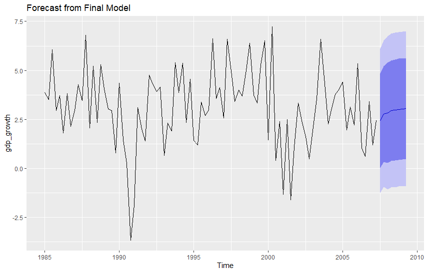

# Forecasting ARMA processes {#part-ch8 .chapter-title}

## Properties of the conditional expectation 

Before considering forecasting with an ARMA($p$,$q$) process, we examine a general situation where the objective is to forecast the (scalar) random variable $Y$ using the realized value $\boldsymbol{X}=\boldsymbol{x}$ of a random vector $\boldsymbol{X}$. A result from probability theory tells us that the optimal forecast, in the sense of minimum mean square forecast error, is the conditional expected value of $Y$ given $\boldsymbol{X}=\boldsymbol{x}$. In other words,
\begin{equation*}
    \mathsf{E}\left[\left(Y-\mathsf{E}\left(Y\left\vert \boldsymbol{X}=\boldsymbol{x}\right.\right)\right)^{2}\right]\leq\mathsf{E}\left[\left(Y-g\left(\boldsymbol{x}\right)\right)^{2}\right]
\end{equation*}
for any function $g\left(\boldsymbol{x}\right)$ of $\boldsymbol{x}$ (assuming the expectations above are finite). 

&nbsp;

::: {.callout-note collapse="true"}
## Extra: Some details on the conditional expectations


In the case of continuous distributions, the conditional expectation of $Y$ given $\boldsymbol{X} = \boldsymbol{x}$ is defined by the equation
\begin{equation*}
    \mathsf{E}\left(Y\left\vert \boldsymbol{X} = \boldsymbol{x} \right.\right)=\int_{-\infty}^{\infty}yf_{Y|\boldsymbol{X}}\left(y; \boldsymbol{x} \right)dy=\int_{-\infty}^{\infty}y\frac{f_{Y,\boldsymbol{X}} \left(y,\boldsymbol{x}\right)}{f_{\boldsymbol{X}}\left(\boldsymbol{x}\right)}dy,
\end{equation*}
where 
  
  - $f_{Y,\boldsymbol{X}}\left(y, \boldsymbol{x}\right)$ is the joint density function of the random vector $\left(Y,\boldsymbol{X} \right)$, 
  
  - $f_{\boldsymbol{X}}\left(\boldsymbol{x} \right)=\int_{-\infty }^{\infty}f_{Y,\boldsymbol{X}}\left(y,\boldsymbol{x}\right) dy$ is the marginal density function of $\boldsymbol{X}$, and  
  
  - $f_{Y|\boldsymbol{X}}\left(y;\boldsymbol{x}\right)=f_{Y,\boldsymbol{X}}\left(y,\boldsymbol{x} \right)/f_{\boldsymbol{X}}\left(\boldsymbol{x} \right)$ defines the conditional density function of $Y$ given $\boldsymbol{X} = \boldsymbol{x}$.

When $\boldsymbol{x}$ varies over the possible values of the random vector $\boldsymbol{X}$, $\mathsf{E}\left(Y\left\vert \boldsymbol{X} = \boldsymbol{x} \right.\right)$ as a function of $\boldsymbol{x}$ defines a random variable for which it is natural to use the notation $\mathsf{E}\left(Y\left\vert \boldsymbol{X} \right.\right)$. 

<!-- - In fact, in more advanced probability theory, conditional expectation is directly defined as a particular random variable.  -->

:::

&nbsp;

The above definition can be generalized to the case where the random vector $\boldsymbol{X}$ might be infinite-dimensional. This case will be encountered in the ARMA($p$,$q$) context assuming that all the values of the process $\left\{y_{t},\text{ }t=0,\pm1,\ldots\right\}$ that precede the **forecast origin** (the time when the forecast is constructed) are known. 

For our purposes, it suffices to know some simple properties of the conditional expected value (which also hold in the case of an infinite-dimensional conditioning variable). In this course, we will use the following properties of the conditional expected value:

- **CEV1**: $\mathsf{E}\left(aY_{1}+bY_{2}\left\vert \boldsymbol{X} \right.\right)=a\mathsf{E}\left(Y_{1}\left\vert \boldsymbol{X} \right.\right) +b\mathsf{E}\left(Y_{2}\left\vert \boldsymbol{X} \right.\right)$, when $a$ and $b$ are constants.
    
- **CEV2**: $\mathsf{E}\left(Y\left\vert \boldsymbol{X} \right.  \right)=\mathsf{E}\left(Y\right)$, when $Y$ and $\boldsymbol{X}$ are independent random variables.
    
- **CEV3**: $\mathsf{E}\left(Y\right)=\mathsf{E}\left[\mathsf{E}\left(Y\left\vert \boldsymbol{X} \right.\right)\right]$  (the so-called law of iterated expectations).
    
- **CEV4**: $\mathsf{E}\left[h\left(\boldsymbol{X} \right)Y\left\vert \boldsymbol{X} \right.\right]=h\left(\boldsymbol{X} \right)\mathsf{E}\left(Y\left\vert \boldsymbol{X} \right.\right)$ for any function $h$ (assuming the expected value of $h\left(\boldsymbol{X}\right)Y$ exists and is finite).


&nbsp;


## Forming forecasts {#ennusteidenmuodostus}

**Forecasting an ARMA($p$,$q$) process**. As the discussion above suggests, we consider forecasting an ARMA($p$,$q$) process assuming that the entire infinitely long history of the process is known. 

In what follows, we again assume that the constant term is included in the model equation to control a nonzero mean of $y_t$ (i.e. $\mathsf{E}(y_t) = \mu \neq 0$). 

- When we are interested in forecasting the levels of $y_t$, which is typically the case, it is important to consider how forecasts for the original levels are recovered if the series has been demeaned and/or detrended. That is, all such transformations must be carefully taken into account in forecast computations.

- We will also assume that the ARMA($p$,$q$) process under consideration is stationary and invertible and that the innovation term satisfies the condition $u_{t}\sim\mathsf{iid}\left(0,\sigma^{2}\right)$. 

In the calculations that follow, we repeatedly make use of the above-mentioned properties of the conditional expected value (CEV1--CEV4).

&nbsp;

**AR(1) case**. Consider forecasting an AR($p$) process; for simplicity, we first assume that $p=1$. 

- In one-step forecasting, the aim is to forecast the value $y_{t+1}$, when the preceding history $\left\{y_{t},y_{t-1},\ldots\right\}$ of the process is known. 

- More generally, in $h$-step forecasting, the aim is to forecast the value of $y_{t+h}$, when $\left\{y_{t},y_{t-1},\ldots\right\}$ is known.

For brevity, denote the conditional expectation as 
\begin{equation*}
\mathsf{E}\left(y_{t+h}\left\vert y_{s},\text{ }s\leq t\right.\right) \equiv \mathsf{E}_{t}\left(  y_{t+h}\right), \quad \left(h\geq1\right).
\end{equation*}
Taking conditional expectations of both sides of the AR(1) equation (forwarded first by one period)
\begin{equation*}
    y_{t+1} = \nu + \phi_{1}y_{t}+u_{t+1}
\end{equation*}
leads to (see CEV1)
\begin{equation*}
   \mathsf{E}_{t}\left(y_{t+1}\right) = \nu + \phi_{1}\mathsf{E}_{t}\left(y_{t}\right)+\mathsf{E}_{t}\left(u_{t+1}\right).
\end{equation*}

- Under the stationarity condition $\left\vert \phi_{1}\right\vert<1$, the variables $y_{t},y_{t-1},\ldots$ depend only on the variables $u_{t},u_{t-1},\ldots$. Recall the MA($\infty$) representation of $y_t$ to see this.

- Therefore, in the conditional expectation $\mathsf{E}_{t}\left(u_{t+1}\right)$, the conditioning random variables $\left\{y_{s},s\leq t\right\}$ are independent of $u_{t+1}$. Following the property CEV2, we then obtain
\begin{equation*}
\mathsf{E}_{t}\left(u_{t+1}\right)=\mathsf{E}\left(u_{t+1}\right)=0.
\end{equation*}
More generally, it holds that
\begin{equation*}
\mathsf{E}_{t}\left(u_{t+k}\right)=\mathsf{E}\left(u_{t+k}\right)=0, \quad k \ge 1.
\end{equation*}

- Moreover, $\mathsf{E}_{t}\left(y_{t}\right)=y_{t}$ (see CEV4: $y_t$ is included in the information set at time $t$).

Putting the above results together, we obtain
\begin{equation*}
    \mathsf{E}_{t}\left(y_{t+1}\right) = \nu + \phi_{1}y_{t}.
\end{equation*}

When forecasting $y_{t+2}$, we obtain
\begin{eqnarray*}
    \mathsf{E}_{t}\left(y_{t+2}\right) &=& \nu + \phi_{1}\mathsf{E}_{t}\left(y_{t+1}\right)+\mathsf{E}_{t}\left(u_{t+2}\right) \\
    &=& \nu + \phi_{1}\mathsf{E}_{t}\left(y_{t+1}\right) \\
    &=& (1+\phi_1) \nu + \phi_{1}^{2}y_{t},
\end{eqnarray*}
and inductively (given $|\phi_1|<1$), $h$-period forecast
\begin{equation*}
    \mathsf{E}_{t}\left(y_{t+h}\right)= \left(1+\phi_{1} + \cdots + \phi_{1}^{h-1}\right) \nu + \phi_{1}^{h}y_{t} =
    \mu + \phi_{1}^{h}\left(y_{t}-\mu\right),
\end{equation*}
where the last equality uses $\mu = \nu/(1-\phi_{1})$.

&nbsp;

**AR($p$) case**. In the case of a general AR($p$) process, we use similar steps to obtain forecasts. Taking conditional expectations of both sides of
\begin{equation*}
    y_{t+1} = \nu + \phi_{1}y_{t}+\cdots+\phi_{p}y_{t+1-p}+u_{t+1},
\end{equation*}
and using similar arguments as in the case $p=1$, including the results $\mathsf{E}_{t}\left(u_{t+1}\right)=0$ and $\mathsf{E}_{t}\left(y_{t-j}\right)=y_{t-j}$ $\left(j\geq0\right)$, we obtain
\begin{equation*}
    \mathsf{E}_{t}\left(y_{t+1}\right) = \nu + \phi_{1}y_{t}+\cdots+\phi_{p}y_{t+1-p}.
\end{equation*}
When forecasting $y_{t+2}$, we similarly obtain
\begin{equation*}
    \mathsf{E}_{t}\left(y_{t+2}\right)= \nu + \phi_{1}\mathsf{E}_{t}(y_{t+1})+\phi_{2}y_{t}+\cdots+\phi_{p}y_{t+2-p},
\end{equation*}
where the conditional expected value on the right hand side could be replaced with the expression obtained for it above. 

- In other words, the variable $y_{t+1}$, unknown at time $t$, has been replaced with its forecast $\mathsf{E}_{t}(y_{t+1})$.

- The variables $y_{t},\ldots,y_{t+2-p}$ are known at time $t$. Therefore, they remain on the right hand side as they are included in the information set at the forecast origin. 

Inductively, it is straightforward to see that the above generalizes to forecasting $h$ periods ahead
\begin{equation*}
    \mathsf{E}_{t}\left(y_{t+h}\right) = \nu + \phi_{1}\mathsf{E}_{t}(y_{t+h-1})+\phi_{2}\mathsf{E}_{t}(y_{t+h-2})+\cdots+\phi_{p}\mathsf{E}_{t}(y_{t+h-p}), \quad h\geq1,
\end{equation*}
where $\mathsf{E}_{t}\left(y_{t+h-j}\right)=y_{t+h-j}$ for $h\leq j$. This means that forecasts can be computed recursively, starting with the one-step-ahead case $h=1$, and proceeding one step at a time to the forecast horizons $h=2$, $h=3,\ldots$.

&nbsp;

**ARMA($p,q$) case**. Obtaining forecasting formulae for an ARMA($p$,$q$) process is quite similar to forecasting with an AR($p$) process. 

- When the stationarity condition holds, $y_{t}-\mu = \sum_{j=0}^{\infty}\psi_{j}u_{t-j}$, from which it follows that $u_{t+i}$, $i\geq1$, is independent of the variables $\left\{y_{t},y_{t-1},\ldots\right\}$. Therefore, $\mathsf{E}_{t}(u_{t+i})=\mathsf{E}(u_{t+i})=0$ for all $i\geq1$ (see CEV2). 

- On the other hand, when the invertibility condition holds, $u_{t}=\sum_{j=0}^{\infty}\pi_{j}(y_{t-j}-\mu)$, and therefore $\mathsf{E}_{t}(u_{t-i})=u_{t-i}$ for all $i\geq0$ (see CEV4). 

Taking conditional expectations of both sides of the equation defining an ARMA($p$,$q$) and using the above-mentioned properties, we obtain $h$-period-ahead forecast
\begin{eqnarray*}
    \mathsf{E}_{t}(y_{t+h}) &=& \nu +  \phi_{1}\mathsf{E}_{t}(y_{t+h-1})+\cdots+\phi_{p}\mathsf{E}_{t}(y_{t+h-p}) \\
    && +\, \theta_{1}\mathsf{E}_{t}(u_{t+h-1})+\cdots+\theta_{q}\mathsf{E}_{t}(u_{t+h-q}), \quad h \geq 1,
\end{eqnarray*}
where $\mathsf{E}_{t}\left(y_{t+h-j}\right)=y_{t+h-j}$ for $h\leq j$, and
\begin{equation*}
    \mathsf{E}_{t}\left(u_{t+h-j}\right)=\left\{
    \begin{array}
        [c]{l}
        u_{t+h-j}, \,\, \mathrm{when} \,\, h\leq j, \\
        0, \,\, \mathrm{when}\,\, h>j.
    \end{array}
    \right.
\end{equation*}
Using this forecast formula, forecasts can again be computed recursively, starting with the one-step-ahead case $h=1$, and proceeding one step at a time to the horizons $h=2, h=3,\ldots$.

&nbsp;

**In practice**. The discussion above makes the unrealistic assumption that the parameters of the examined process are known. In practice, unknown parameters are replaced by their estimates, and in this case the above-mentioned optimality of forecasts (forecast construction) only holds approximately. 

Moreover, for ARMA models, the innovation terms appearing in the forecasting formulae above (not in the AR($p$) case) have to be computed using the observed time series, so in the formula $u_{t}=\sum_{j=0}^{\infty}\pi_{j}(y_{t-j}-\mu)$ we have to truncate the sum at some point (e.g., $\sum_{j=0}^{t-1}\pi_{j} (y_{t-j}-\mu)$). 

- A popular alternative is to calculate $u_{t}$ using the difference equation
\begin{equation*}
    u_{t}=y_{t} - \nu - \phi_{1}y_{t-1}-\cdots-\phi_{p}y_{t-p}-\theta_{1}u_{t-1}-\cdots-\theta_{q}u_{t-q}, \quad t=1,2,\ldots,
\end{equation*}
where the initial values $y_{0},\ldots,y_{1-p}$ can be assumed known (observed), and the initial values $u_{0},\ldots,u_{1-q}$ can be set to $u_{0}=\cdots=u_{1-q}=0$ (that is, to the unconditional mean of $u_{t}$). When $t$ is large, the effect of initial values is negligible.


&nbsp;


## Prediction intervals

An alternative way to approach forecasting an ARMA($p$,$q$) process is via the MA$\left(\infty\right)$ representation. Taking conditional expectations of both sides of the equation
\begin{equation*}
    y_{t+h}= \mu + \sum_{j=0}^{\infty}\psi_{j}u_{t+h-j},
\end{equation*}
and using results of conditional expectations used above, we obtain
\begin{equation*}
    \mathsf{E}_{t}(y_{t+h}) = \mu + \sum_{j=h}^{\infty}\psi_{j}u_{t+h-j}.
\end{equation*}
This formula is not useful in practice, but it is convenient for investigating the properties of the forecast error $y_{t+h}-\mathsf{E}_{t}(y_{t+h})$. From the two equations above, we obtain
\begin{equation*}
    y_{t+h}-\mathsf{E}_{t}(y_{t+h})=\sum_{j=0}^{h-1}\psi_{j}u_{t+h-j}.
\end{equation*}
Note, in particular, that the forecast error of the one-step forecast is $u_{t+1}$.

- Taking (unconditional) expectations from both sides of the last equation shows that the forecast $\mathsf{E}_{t}(y_{t+h})$ is unbiased in the sense that the forecast error has an expected value of zero:
\begin{equation*}
\mathsf{E}\Big(y_{t+h}-\mathsf{E}_{t}(y_{t+h})\Big)=0.
\end{equation*}

- Furthermore, we can compute the variance of the forecast error. With straightforward computation, we obtain
\begin{equation*}
    \mathsf{Var}\Big(y_{t+h}-\mathsf{E}_{t}(y_{t+h})\Big)=\sigma^{2}\sum_{j=0}^{h-1}\psi_{j}^{2}\equiv\sigma_{h}^{2}.
\end{equation*}

- Importantly, note that as $h$ increases, the forecast converges (in mean square) to the mean of the process, whereas the variance of the forecast error $\sigma_{h}^{2}$ converges to the variance of the process being predicted ($y_{t}$), namely $\sigma^{2}\sum_{j=0}^{\infty}\psi_{j}^{2}$ (cf. the properties of the ARMA process).

&nbsp;

In addition to the results obtained above, if one assumes that $u_{t}\sim\mathsf{nid}\left(0,\sigma^{2}\right)$, then
\begin{equation*}
    y_{t+h}-\mathsf{E}_{t}(y_{t+h})\sim\mathsf{N}\left(0,\sigma_{h}^{2}\right),
\end{equation*}
and, therefore, $y_{t+h}$ is contained in the interval 
\begin{equation*}
\mathsf{E}_{t}(y_{t+h})\pm1.96\sigma_{h}
\end{equation*}
with 95\% probability (in repeated sampling). In practice, the unknown parameters in the forecast $\mathsf{E}_{t}(y_{t+h})$ and in the standard deviation $\sigma_{h}$ are replaced by their estimates, and hence the normality of the forecast errors holds only approximately.

&nbsp;

**Empirical example (continued)**. In the previous two sections, we concluded that an AR(2) model is one possible candidate for the U.S. real GDP growth (1985:Q1--2007:Q2). The estimated AR(2) model
\begin{equation*}
    y_{t} = \underset{\left(0.197\right) }{1.693} + \underset{\left(0.101\right) }{0.160} y_{t-1} + \underset{\left(0.101\right) }{0.287} y_{t-2} + \widehat{u}_{t}, \quad \widehat{\sigma}^{2}=3.536,
\end{equation*}
is now used to compute 8-quarter-ahead predictions. Starting from the last observation (2007:Q2), forecasts are obtained with the forecasting formulae above applied in the case of $p=2$ (and $q=0$) and $h=8$. The resulting (point) forecasts of the estimated AR(2) model and their 80\% and 95\% prediction intervals are presented below.

```
        Point Forecast      Lo 80    Hi 80      Lo 95    Hi 95
2007 Q3       2.427727 0.01787587 4.837578 -1.2578223 6.113277
2007 Q4       2.781453 0.34098863 5.221917 -0.9509150 6.513820
2008 Q1       2.834604 0.28036903 5.388840 -1.0717615 6.740971
2008 Q2       2.944709 0.38002888 5.509388 -0.9776305 6.867048
2008 Q3       2.977582 0.40040373 5.554759 -0.9638718 6.919035
2008 Q4       3.014464 0.43506842 5.593860 -0.9303814 6.959310
2009 Q1       3.029805 0.44884169 5.610767 -0.9174375 6.977047
2009 Q2       3.042852 0.46149492 5.624209 -0.9049929 6.990696
```

The figure below depicts the 8-step forecasts and the prediction intervals. As we can see, the forecast converges towards the mean $\widehat{\nu}/(1-\widehat{\phi}_{1}-\widehat{\phi}_{2})\approx3.06$ as the forecast horizon lengthens. The prediction intervals are quite broad.

```{r, computedforecastsusrealgdp, echo=FALSE, out.width="65%", fig.align = "center", fig.cap=""}

```
<span class="fig-caption">Figure: 8-step-ahead forecasts for the U.S. real GDP growth and their 80\% and 95\% prediction intervals from the AR(2) process.</span>

&nbsp;

Obviously, these forecasts, constructed at 2007:Q2, turned out to be far too optimistic for the years 2008 and 2009 because of the Great Financial Crisis (2008--2009) and the possible end of the Great Moderation. It can generally be concluded that no econometric model was able to predict such a downturn. These forecasts should therefore be seen more as a scenario of how the U.S. economy might have evolved without the financial crisis.


&nbsp;


## Introduction to out-of-sample forecasting

In various fields, particularly in economics and finance, it is crucial to assess the reliability and accuracy of forecasts generated by estimated time series models. A popular method for this evaluation is (pseudo) **out-of-sample forecasting**. This approach aims to mimic a real-time forecasting situation as closely as possible, using only information that would have been available at the time the forecast was made.

The fundamental idea is to evaluate the forecast performance by systematically reserving a portion of the data, unknown to the model during its estimation, to serve as a "future" against which forecasts are compared. This method is at times termed "pseudo" out-of-sample forecasting because, while we simulate real-time forecasting, we do have full knowledge of the entire dataset beforehand. In true real-time forecasting, future observations are, by definition, unknown.

- The test sample period (forecast evaluation sample) is typically around 30--50\% of the (last) observations. This amount, however, varies in different applications.

- Notice that **backtesting** in the financial industry is essentially a form of out-of-sample forecasting applied specifically to financial data and trading strategies. The underlying principle is the same, but the terminology and focus differ slightly: a time series analyst might use out-of-sample forecasting to evaluate how accurately a stock's price can be predicted, whereas a financial analyst would use backtesting to see whether a strategy based on those predictions would actually have made money.

&nbsp;

**Out-of-sample forecasting** generally involves the following steps:

1.  **Define the initial estimation sample**: An initial segment of the time series, say the first $T$ observations ($y_1, \dots, y_T$), is used to estimate the model's parameters. This period is often referred to as the **training sample** or **estimation sample**.

2.  **Define the forecast horizon $h$**: Like above where we introduced how to construct forecasts with ARMA models, we specify how many periods ahead we want to forecast (e.g., $h=1$ for one-period-ahead, $h=2$ for two-periods-ahead, etc.).

3.  **Define the forecasting evaluation period**: A subsequent segment of the data, known as the **test sample** or **forecasting sample**, is set aside. This period spans from $y_{T+1}$ up to $y_{T+m+h-1}$, where $m$ is the number of distinct **forecast origins** (i.e., the number of times we re-estimate the model and generate a new $h$-step forecast). In other words, with this notation, we assume that we have observations $y_1,\ldots,y_T, y_{T+1},\ldots, y_{T+m+h^{\mathrm{max}}-1}$ where $h^{\mathrm{max}}$ is the maximum forecast horizon considered. 

4.  **Iterative forecasting and parameter updating**: The core of (pseudo) out-of-sample forecasting is its iterative nature. We start by estimating the model using the initial $T$ observations, then we construct forecasts $h$ periods ahead. We then "advance time" by one period, potentially re-estimate the model with updated information, and generate a new $h$-period-ahead forecast. This process is repeated $m$ times.

&nbsp;

Let's clarify the notation with an example. Suppose we want to evaluate two-period-ahead forecasts ($h=2$).

- Let $T$ denote the end of our *initial* estimation sample.

- Let $j$ be an index for the forecast origin, running from $j=0, 1, \dots, m-1$. For simplicity, let $m=4$, **which is far too short in practice** but is used here for pedagogical reasons.

The sequence of forecasts at different forecast origins and their corresponding actual values would be:

* Forecast origin $T$ (i.e., $j=0$):
    * Estimate the model using data $y_1, \dots, y_T$.
    * Generate the $h=2$ step forecast, denoted $\widehat{y}_{T+2|T}$.
    * This forecast is compared against the actual observation $y_{T+2}$.
    * The forecast error is $\widehat{e}_{T+2} = y_{T+2} - \widehat{y}_{T+2|T}$.

* Forecast origin $T+1$ (i.e., $j=1$):
    * Update the estimation sample. This is where rolling vs. expanding parameter updating window (see below) becomes relevant.
    * Generate the $h=2$ step forecast, denoted $\widehat{y}_{T+3|T+1}$.
    * This forecast is compared against the actual observation $y_{T+3}$.
    * The forecast error is $\widehat{e}_{T+3} = y_{T+3} - \widehat{y}_{T+3|T+1}$.

* Forecast origins $T+2$ and $T+3$ (i.e., $j=2$ and $j=3$): proceed in the same way, which gives the forecasts $\widehat{y}_{T+4|T+2}$ and $\widehat{y}_{T+5|T+3}$, and the corresponding forecast errors $\widehat{e}_{T+4}$ and $\widehat{e}_{T+5}$.

In general, for $j=0, 1, \dots, m-1$, we compute the $h$-period forecast from the information available at $T+j$, denoted $\widehat{y}_{T+h+j|T+j}$. The corresponding forecast error is:
\begin{equation*}
\widehat{e}_{T+h+j} = y_{T+h+j} - \widehat{y}_{T+h+j|T+j}
\end{equation*}

&nbsp;

**Parameter updating strategies**. In a real forecasting situation, the information set used for model estimation typically includes the most recent observations. The way this information set is updated over time defines different parameter estimation strategies:

- **Expanding window**: In this approach, the estimation sample grows by one observation in each forecast computation iteration. If the initial estimation sample is $y_1, \dots, y_T$, the next estimation sample will be $y_1, \dots, y_{T+1}$, then $y_1, \dots, y_{T+2}$, and so on. This means older observations are always retained. This is suitable when one believes that all past data is equally relevant for estimating the current parameters.

- **Rolling window**: Here, the estimation sample has a fixed size (e.g., $T$ observations) and "rolls" forward by one observation in each iteration. If the initial sample is $y_1, \dots, y_T$, the next sample will be $y_2, \dots, y_{T+1}$, then $y_3, \dots, y_{T+2}$, and so on, with the forecast origin moving forward as in the expanding window approach. This approach gives more weight to recent observations and is useful when model parameters are suspected to change over time (i.e., the presence of structural breaks or regime changes).

The accompanying R code (R Lab below) allows you to select either a `rolling` or `expanding` window strategy using the `window_type` parameter.

&nbsp;

**Evaluating forecast accuracy**. Once the forecast errors ($\widehat{e}_{T+h+j}$) for the entire test sample are computed, a typical measure for evaluating forecast accuracy is the **Mean Squared Forecast Error (MSFE)**:
\begin{equation*}
\mathrm{MSFE} = \frac{1}{m} \sum_{j=0}^{m-1} \widehat{e}_{T+h+j}^2.
\end{equation*}
The MSFE penalizes larger errors more heavily because the forecast errors are squared. Its square root, the **Root Mean Squared Forecast Error (RMSFE)**, is also commonly used as it is in the same units as the original series, making it easier to interpret.

Another popular alternative is the **Mean Absolute Forecast Error (MAFE)**:
\begin{equation*}
\mathrm{MAFE} = \frac{1}{m} \sum_{j=0}^{m-1} \left\vert \widehat{e}_{T+h+j}\right\vert.
\end{equation*}
The MAFE is less sensitive to outliers than the MSFE.

The objective of this exercise is to identify the model(s) that produce the smallest MSFE and/or MAFE values, indicating superior forecasting performance.

&nbsp;

**Empirical example (continued)**. Let us continue with an illustration of out-of-sample forecasting of the quarterly U.S. real GDP growth. Assume that we start out-of-sample forecasting in 2010:Q1 and construct one-quarter ($h=1$) and four-quarter ($h=4$) ahead out-of-sample forecasts for the forecast evaluation (test) sample period 2010:Q1--2018:Q4. We compare the performance of AR(1), AR(2), AR(3) and AR(4) models.

- The first estimation sample is between 1985:Q1--2009:Q4.

- Note that the previous results (for the sample period excluding the Great Financial Crisis) suggested the AR(2) model.

- Parameter updating is done via expanding and rolling window approaches separately.

- The MSFEs suggest that the AR(3) model yields the smallest MSFE in all the comparisons, except for the $h=4$ horizon with the rolling window, where the AR(4) model does. 

```

--- MSFE Results for AR(1), AR(2), AR(3), AR(4) (h=1, expanding window) ---
$`AR(1)`
[1] 3.010018
$`AR(2)`
[1] 2.810865
$`AR(3)`
[1] 2.760154
$`AR(4)`
[1] 3.451758

--- MSFE Results for AR(1), AR(2), AR(3), AR(4) (h=1, rolling window) ---
$`AR(1)`
[1] 3.032567
$`AR(2)`
[1] 2.793521
$`AR(3)`
[1] 2.731007
$`AR(4)`
[1] 3.481733

--- MSFE Results for AR(1), AR(2), AR(3), AR(4) (h=4, expanding window) ---
$`AR(1)`
[1] 2.628715
$`AR(2)`
[1] 2.662022
$`AR(3)`
[1] 2.457973
$`AR(4)`
[1] 2.467844

--- MSFE Results for AR(1), AR(2), AR(3), AR(4) (h=4, rolling window) ---
$`AR(1)`
[1] 2.602836
$`AR(2)`
[1] 2.633853
$`AR(3)`
[1] 2.496958
$`AR(4)`
[1] 2.478106
```

&nbsp;


:::: {.content-visible when-format="html"}

## R Lab

All the R code examples considered in this section are compiled in the following tabs.


::: {.callout-tip collapse="true"}
## R Lab: Forecast computation in ARMA models

```{r, message=FALSE, warning=FALSE}
#  FORECASTING
# -------------------------------------------------------------------

# ARMA MODELLING

# U.S. GDP GROWTH ANALYSIS: DETAILED SELECTION & EXTENDED DIAGNOSTICS
# Final version with restored comparative model selection (AR vs. ARMA)
# and a dedicated step for the user to choose the final model.


#  LOAD LIBRARIES
# -------------------------------------------------------------------
packages_to_load <- c("tseries", "forecast", "ggplot2", "readxl", "dplyr", 
                      "lubridate", "astsa", "TSA")
for (pkg in packages_to_load) {
  if (!require(pkg, character.only = TRUE)) {
    #install.packages(pkg) # uncomment this
    library(pkg, character.only = TRUE)
  }
}


#  DATA ACQUISITION AND PREPARATION
# -------------------------------------------------------------------
start_date <- "1984-10-01"
end_date   <- "2007-04-01"

full_data <- read_excel("GDPC1-qdata.xlsx")

raw_data <- full_data %>%
  rename(date = Date, value = GDPC1) %>%
  filter(date >= as.Date(start_date) & date <= as.Date(end_date))

gdp_ts <- ts(raw_data$value, 
             start = c(year(raw_data$date[1]), quarter(raw_data$date[1])), 
             frequency = 4)

gdp_growth <- diff(log(gdp_ts)) * 400  # Annualized growth rate
gdp_growth <- na.omit(gdp_growth)


#  VISUALIZATION AND MANUAL IDENTIFICATION
# -------------------------------------------------------------------
autoplot(gdp_growth) + ggtitle("(Annualized) quarterly U.S. real GDP growth rate (1985:Q1-2007:Q2)")

par(mfrow=c(1,2))
Acf(gdp_growth, main="ACF of GDP Growth")  # forecast package
Pacf(gdp_growth, main="PACF of GDP Growth") # forecast package
par(mfrow=c(1,1))

# --- Extended Ljung-Box Test ---
cat("\nExtended Ljung-Box Test for multiple lags:\n")
lags_to_test <- c(4, 8, 12, 16, 20)
lb_results <- data.frame(Lag=integer(), "Q-statistic"=double(), "p-value"=double(),
                         check.names = FALSE)
for (l in lags_to_test) {
  test <- Box.test(gdp_growth, type = "Ljung-Box", lag = l, fitdf = 0)
  lb_results[nrow(lb_results) + 1,] <- c(l, round(test$statistic, 3), round(test$p.value, 3))
}
print(lb_results)


# --- McLeod-Li Test ---
cat("\nExtended McLeod-Li Test for multiple lags:\n")

ml_results <- data.frame(
  Lag = integer(),
  p_value = numeric()
)

for (l in lags_to_test) {
  test <- TSA::McLeod.Li.test(y = gdp_growth, gof.lag = l)
  pval <- test$p.values[l] # Extract p-value for the current lag
  ml_results[nrow(ml_results) + 1, ] <- c(l, round(pval, 3)) # Append row: lag and p-value
}

print(ml_results) # This package does not print out the values of the test 
# statistic (only p-values)


#  DETAILED MODEL SELECTION (using Conditional MLE)
# -------------------------------------------------------------------
cat("\n--- Running Detailed Model Selection ---\n")

# --- (i) - Restricting to AR Models Only ---
cat("\n--- SCENARIO 1: AR-ONLY MODELS ---\n")
ar_aic <- auto.arima(gdp_growth, seasonal = FALSE, max.q = 0, method = "CSS", ic = "aic")
cat("\nBest AR model selected by AIC:\n")
print(ar_aic)

ar_bic <- auto.arima(gdp_growth, seasonal = FALSE, max.q = 0, method = "CSS", ic = "bic")
cat("\nBest AR model selected by BIC:\n")
print(ar_bic)

# --- (ii) - Allowing ARMA Models ---
cat("\n--- SCENARIO 2: ARMA MODELS ---\n")
arma_aic <- auto.arima(gdp_growth, seasonal = FALSE, method = "CSS", ic = "aic")
cat("\nBest ARMA model selected by AIC:\n")
print(arma_aic)

arma_bic <- auto.arima(gdp_growth, seasonal = FALSE, method = "CSS", ic = "bic")
cat("\nBest ARMA model selected by BIC:\n")
print(arma_bic)


#  CHOOSE YOUR FINAL MODEL
# -------------------------------------------------------------------
# After reviewing the 4 models above, assign your choice to 'final_model'.
# The default is the AR model selected by AIC.
cat("\n\n--- Selecting Final Model for Detailed Analysis ---\n")

#final_model <- ar_aic   # <--- SET YOUR CHOICE HERE
final_model <- ar_bic
# final_model <- arma_aic
# final_model <- arma_bic  


# Computing forecasts. Forecast origin is the last observation of time series

# Notice that this part requires the running of ARMA modelling code above in 
# Sections 5-7 (i.e. "final model" contain estimation result for gdp growth).

cat("\n\n--- Forecasting from Final Model ---\n")
gdp_forecast <- forecast(final_model, h=8, level = c(80, 95))
gdp_forecast
autoplot(gdp_forecast) + ggtitle("Forecast from Final Model")

```
:::


::: {.callout-tip collapse="true"}
## R Lab: Out-of-sample forecasting

```{r, message=FALSE, warning=FALSE}

# OOS FORECASTING (with AR models)

# See OUT-OF-SAMPLE FORECASTING FOR GDP GROWTH at the end after developing
# ar_forecast function

# LOAD LIBRARIES
# -------------------------------------------------------------------
packages_to_load <- c("tseries", "forecast", "ggplot2", "readxl", "dplyr",
                      "lubridate", "astsa", "TSA", "writexl") 
for (pkg in packages_to_load) {
  if (!require(pkg, character.only = TRUE)) {
    #install.packages(pkg) # uncomment this
    library(pkg, character.only = TRUE)
  }
}


# DATA ACQUISITION AND PREPARATION
# -------------------------------------------------------------------
# This section defines the *full range* of data available for your analysis.
# The 'start_date' and 'end_date' here constrain the raw data loaded from the Excel file.
# The out-of-sample forecasting will operate *within* this prepared 'gdp_growth' series.

start_date <- "1984-10-01"
end_date   <- "2018-10-01" # This is your desired end date for the *filtered* data

# --- IMPORTANT: Ensure 'GDPC1-qdata.xlsx' exists in your working directory ---
# --- and contains data up to or beyond the 'end_date' specified above. ---


full_data <- read_excel("GDPC1-qdata.xlsx")

raw_data <- full_data %>%
  rename(date = Date, value = GDPC1) %>%
  filter(date >= as.Date(start_date) & date <= as.Date(end_date)) # This filter now correctly uses your end_date

gdp_ts <- ts(raw_data$value,
             start = c(year(raw_data$date[1]), quarter(raw_data$date[1])),
             frequency = 4)

gdp_growth <- diff(log(gdp_ts)) * 400  # Annualized growth rate
gdp_growth <- na.omit(gdp_growth) # Remove NA from differencing

# Display a glimpse of the prepared gdp_growth series
cat("\n--- GDP Growth Series Prepared ---\n")
print(head(gdp_growth))
print(tail(gdp_growth))
cat("Full length of gdp_growth series available for forecasting:", length(gdp_growth), "observations.\n")
cat("Time attributes:", paste(start(gdp_growth), collapse="-"), "to", paste(end(gdp_growth), collapse="-"), "at frequency", frequency(gdp_growth), "\n")


# --- MODIFIED AR_FORECAST FUNCTION ---
# Allows selection of initial estimation sample period by its end index or date.
ar_forecast <- function(
    data,                # Your time series data (numeric vector or ts object)
    p_values,            # Vector of p values to compare (e.g., c(1, 2, 3))
    train_end_index = NULL, # End index of the initial training sample
    train_end_date = NULL,  # End date of the initial training sample (if data is ts)
    min_train_obs = NULL,   # Minimum number of observations in training sample (now a soft check)
    window_type = c("rolling", "expanding"), # Window type for parameter updating
    forecast_horizon = 1, # Forecast horizon h (number of periods ahead to forecast)
    plot_results = TRUE  # Whether to plot the results
) {
  
  # Input validation
  if (!is.numeric(data) && !inherits(data, "ts")) stop("data must be a numeric vector or a ts object.")
  if (!is.numeric(p_values) || any(p_values <= 0) || any(p_values != round(p_values))) stop("p_values must be positive integers.")
  if (is.null(train_end_index) && is.null(train_end_date)) {
    stop("Either train_end_index or train_end_date must be provided to define the initial training sample.")
  }
  if (!is.null(train_end_index) && (!is.numeric(train_end_index) || train_end_index <= 0 || train_end_index != round(train_end_index))) stop("train_end_index must be a positive integer.")
  if (!is.null(min_train_obs) && (!is.numeric(min_train_obs) || min_train_obs <= 0 || min_train_obs != round(min_train_obs))) stop("min_train_obs must be a positive integer.")
  window_type <- match.arg(window_type)
  if (!is.numeric(forecast_horizon) || forecast_horizon <= 0 || forecast_horizon != round(forecast_horizon)) stop("forecast_horizon must be a positive integer.")
  
  n <- length(data)
  
  # Determine initial training sample size based on index or date
  initial_train_size <- NULL
  if (!is.null(train_end_date)) {
    if (!inherits(data, "ts")) stop("train_end_date can only be used with a 'ts' object.")
    
    # Convert the character date to a 'Date' object first
    target_date_obj <- as.Date(train_end_date)
    
    # Extract year and appropriate sub-period
    target_year <- year(target_date_obj)
    target_freq <- frequency(data)
    
    target_sub_period <- NULL
    if (target_freq == 4) { # Quarterly data
      target_sub_period <- quarter(target_date_obj)
    } else if (target_freq == 12) { # Monthly data
      target_sub_period <- month(target_date_obj)
    } else if (target_freq == 1) { # Yearly data
      target_sub_period <- 1 # Not relevant, but keeps structure
    } else {
      stop("Unsupported frequency for train_end_date. Only 1 (yearly), 4 (quarterly), 12 (monthly) are directly supported.")
    }
    
    # Create a time series index value from the target date
    target_time_value <- target_year
    if (target_freq > 1) {
      target_time_value <- target_time_value + (target_sub_period - 1) / target_freq
    }
    
    # Find the index in the time series data that matches or is closest to target_time_value
    # Use which.min(abs(...)) to find the closest time point if an exact match isn't present
    initial_train_size <- which.min(abs(time(data) - target_time_value))
    
    # Check if the found index's time value is truly before or at the target
    if (time(data)[initial_train_size] > target_time_value + (1/(target_freq*2)) && time(data)[initial_train_size] > target_time_value) { # Add a small tolerance
      stop(paste("train_end_date (", train_end_date, ") resulted in an index where the time point (", time(data)[initial_train_size], ") is *after* the target date. Please ensure the date is within the series range or select a valid end date.", sep=""))
    }
    
    # Ensure that the found index isn't past the end of the series
    if (initial_train_size > n) {
      stop(paste("train_end_date (", train_end_date, ") is after the end of the provided data series.", sep=""))
    }
    
  } else { # Use train_end_index
    initial_train_size <- train_end_index
  }
  
  # Final check on initial_train_size
  if (is.null(initial_train_size) || initial_train_size < 1 || initial_train_size > n) {
    stop("Calculated initial training sample size is invalid or out of bounds for the data series.")
  }
  
  # Apply min_train_obs if provided, primarily as a check or warning
  if (!is.null(min_train_obs) && initial_train_size < min_train_obs) {
    warning(paste("Specified train_end_index/date results in an initial training sample (", initial_train_size, ") smaller than min_train_obs (", min_train_obs, "). Proceeding with the smaller size.", sep=""))
  }
  
  if (initial_train_size < max(p_values) + 1) {
    stop("Initial training sample size (", initial_train_size, ") is too small to fit an AR model for the largest p value (", max(p_values), "). Increase train_end_index/date.")
  }
  if (initial_train_size + forecast_horizon > n) {
    stop("The initial training sample period is too long (", time(data)[initial_train_size], ") given the forecast horizon (", forecast_horizon, ") and total data length (", time(data)[n], "). Not enough data left for testing.")
  }
  
  cat(paste0("\n--- Initial Sample Selection ---\n"))
  cat(paste0("Initial training (estimation) sample ends at index: ", initial_train_size, "\n"))
  cat(paste0("Corresponding time point: ", time(data)[initial_train_size], "\n"))
  cat(paste0("Out-of-sample forecasting (test) period starts at index: ", initial_train_size + 1, "\n"))
  cat(paste0("Corresponding time point: ", time(data)[initial_train_size + 1], "\n"))
  
  
  # Initialize lists to store forecasts and errors
  all_forecasts <- list() # This will store the forecast series
  all_msfe <- list()      # This will store only the MSFE values
  
  for (p in p_values) {
    cat(paste0("\n--- Forecasting for AR(", p, ") ---\n"))
    
    # The length of the 'forecasts' vector corresponds to the number of forecast origins
    num_forecast_origins <- n - initial_train_size - forecast_horizon + 1
    if (num_forecast_origins <= 0) {
      warning(paste0("Not enough data to make any forecasts for AR(", p, ") with current settings. Skipping."))
      all_msfe[[paste0("AR(", p, ")")]] <- NA
      all_forecasts[[paste0("AR(", p, ")_series")]] <- NA
      next
    }
    forecasts_for_p <- numeric(num_forecast_origins)
    
    
    # Loop through the test set (i.e., each forecast origin)
    for (i in 0:(num_forecast_origins - 1)) {
      current_train_end_idx <- initial_train_size + i
      
      if (window_type == "rolling") {
        start_roll_idx <- current_train_end_idx - initial_train_size + 1
        # The rolling window should always be `initial_train_size` long.
        # If current_train_end_idx == initial_train_size (first iter), start_roll_idx == 1.
        # If current_train_end_idx == initial_train_size + 1, start_roll_idx == 2.
        # This ensures the window size is constant.
        train_data <- data[start_roll_idx:current_train_end_idx]
      } else { # expanding
        train_data <- data[1:current_train_end_idx]
      }
      
      # If train_data is too short for AR(p), skip this iteration
      if (length(train_data) <= p) {
        warning(paste("Training data (length:", length(train_data), ") too short for AR(", p, ") for current window (end:", time(data)[current_train_end_idx], "). Skipping forecast.", sep=""))
        forecasts_for_p[i + 1] <- NA
        next
      }
      if (length(unique(train_data)) < 2) { # Check for constant data, which can break lm
        warning(paste("Training data is constant for AR(", p, ") for current window (end:", time(data)[current_train_end_idx], "). Skipping forecast.", sep=""))
        forecasts_for_p[i + 1] <- NA
        next
      }
      
      # Create lagged variables for lm
      lag_matrix <- matrix(NA, nrow = length(train_data) - p, ncol = p)
      for (j in 1:p) {
        lag_matrix[, j] <- train_data[(p - j + 1):(length(train_data) - j)]
      }
      ar_df <- data.frame(Y = train_data[(p + 1):length(train_data)], lag_matrix)
      names(ar_df)[-1] <- paste0("L", 1:p)
      
      # Fit AR(p) model using lm
      lm_model <- lm(Y ~ ., data = ar_df)
      lm_coeffs <- coef(lm_model)
      
      # Handle cases where some coefficients might be NA
      if (any(is.na(lm_coeffs))) {
        warning(paste("Model fitting failed (NA coefficients) for AR(", p, ") at current window (end:", time(data)[current_train_end_idx], "). Skipping forecast.", sep=""))
        forecasts_for_p[i + 1] <- NA
        next
      }
      
      lm_intercept <- lm_coeffs[1]
      lm_ar_coeffs <- lm_coeffs[-1]
      
      # Store the last p observations from the training data for forecasting
      forecast_input_values <- tail(train_data, p)
      
      # Forecast h steps ahead
      h_step_forecast_values <- numeric(forecast_horizon)
      
      for (h_idx in 1:forecast_horizon) {
        values_to_use_for_h_step <- numeric(p)
        for (j in 1:p) {
          if (h_idx - j >= 1) { # Use previous forecasts from this h-step sequence
            values_to_use_for_h_step[j] <- h_step_forecast_values[h_idx - j]
          } else { # Use actual observed values from forecast_input_values
            # forecast_input_values = tail(train_data, p) is ordered oldest -> newest,
            # so the value at time T + h_idx - j sits at position p + h_idx - j.
            values_to_use_for_h_step[j] <- forecast_input_values[p + h_idx - j]
          }
        }
        h_step_forecast_values[h_idx] <- lm_intercept + sum(lm_ar_coeffs * values_to_use_for_h_step)
      }
      
      forecasts_for_p[i + 1] <- h_step_forecast_values[forecast_horizon]
    }
    
    # Calculate MSFE for the specific horizon h
    start_actual_index <- initial_train_size + forecast_horizon
    end_actual_index <- start_actual_index + length(forecasts_for_p) - 1
    
    end_actual_index <- min(end_actual_index, n) # Ensure end_actual_index does not exceed data length
    
    actuals_for_comparison <- data[start_actual_index:end_actual_index]
    valid_forecasts <- forecasts_for_p[1:length(actuals_for_comparison)] # Trim forecasts if actuals vector is shorter
    
    valid_indices <- !is.na(valid_forecasts)
    if (sum(valid_indices) == 0) {
      warning(paste("No valid forecasts generated for AR(", p, "). MSFE cannot be computed.", sep=""))
      all_msfe[[paste0("AR(", p, ")")]] <- NA
      all_forecasts[[paste0("AR(", p, ")_series")]] <- NA
    } else {
      msfe <- mean((actuals_for_comparison[valid_indices]-valid_forecasts[valid_indices])^2)
      all_msfe[[paste0("AR(", p, ")")]] <- msfe
      all_forecasts[[paste0("AR(", p, ")_series")]] <- valid_forecasts
    }
    
    cat(paste0("AR(", p, ") Forecasts Generated. MSFE (h=", forecast_horizon, "): ", round(all_msfe[[paste0("AR(", p, ")")]], 6), "\n")) # More precision for MSFE
  }
  
  # Plotting results
  if (plot_results && length(all_msfe) > 0) {
    plot_start_idx <- initial_train_size + forecast_horizon
    plot_end_idx <- n
    if (plot_start_idx > plot_end_idx || length(data[plot_start_idx:plot_end_idx]) == 0) {
      warning("Not enough data to plot forecasts in the test period.")
      return(list(msfe_results = all_msfe, all_forecast_series = all_forecasts))
    }
    
    x_axis_labels <- time(data)[plot_start_idx:plot_end_idx] # Use time attributes for x-axis
    
    par(mfrow = c(1, 1), mar = c(4, 4, 3, 2) + 0.1)
    
    # Collect all forecast series to determine appropriate y-axis limits
    all_plot_values <- c(data[plot_start_idx:plot_end_idx])
    for(s_name in names(all_forecasts)) {
      if(!is.na(all_forecasts[[s_name]][1])) { # Only add non-NA series
        all_plot_values <- c(all_plot_values, all_forecasts[[s_name]])
      }
    }
    
    plot(x_axis_labels, data[plot_start_idx:plot_end_idx], type = "l", col = "black", lwd = 2,
         xlab = "Date", ylab = "GDP Growth (%)", main = paste0("Actual vs. Forecasts (h=", forecast_horizon, ", ", window_type, " window)"),
         xlim = range(x_axis_labels),
         ylim = range(all_plot_values, na.rm=TRUE) # Dynamically adjust ylim based on all valid series
    )
    
    # Add initial training end marker
    abline(v = time(data)[initial_train_size], lty = 2, col = "grey", lwd = 1.5)
    text(time(data)[initial_train_size], par("usr")[4], "Train End", pos = 4, col = "grey40", cex = 0.8)
    
    # Plot forecasts
    p_val_names <- names(all_msfe) # Use the names from MSFE list
    colors <- rainbow(length(p_val_names))
    lty_values <- 2:(length(p_val_names) + 1)
    legend_labels <- c("Actual")
    legend_cols <- c("black")
    legend_lwd <- c(2)
    legend_lty <- c(1)
    
    for (k in 1:length(p_val_names)) {
      p_str <- p_val_names[k]
      forecast_values <- all_forecasts[[paste0(p_str, "_series")]] # Retrieve the actual series
      if (!is.null(forecast_values) && !is.na(forecast_values[1])) {
        lines(x_axis_labels[1:length(forecast_values)], forecast_values, col = colors[k], lty = lty_values[k], lwd = 1)
        legend_labels <- c(legend_labels, p_str)
        legend_cols <- c(legend_cols, colors[k])
        legend_lwd <- c(legend_lwd, 1)
        legend_lty <- c(legend_lty, lty_values[k])
      }
    }
    legend("topleft", legend = legend_labels, col = legend_cols, lwd = legend_lwd, lty = legend_lty, cex = 0.8)
    
    par(mfrow = c(1, 1)) # Reset plot layout
  }
  
  # Return only MSFE values in the main list, and forecasts in a sub-list if needed
  return(list(msfe_results = all_msfe, all_forecast_series = all_forecasts))
}


# --- OUT-OF-SAMPLE FORECASTING FOR GDP GROWTH ---
cat("\n\n#####################################################")
cat("\n### RUNNING OUT-OF-SAMPLE FORECASTING FOR GDP GROWTH ###")
cat("\n#####################################################\n")


# -------------------------------------------------------------------
# >>> SELECTION OF TRAINING (ESTIMATION) AND FORECASTING (TEST) SAMPLE <<<
# This is where you define the split between your initial estimation period
# and where the out-of-sample forecasting exercise begins.
#
# This selection operates *within* the 'gdp_growth' series defined in the
# 'DATA ACQUISITION AND PREPARATION' section.
#
# Example: If 'gdp_growth' runs from 1985 Q1 to 2007 Q1:
#   - Setting `initial_train_end_date = "2000-10-01"` means the initial
#     training sample will be from 1985 Q1 up to and including 2000 Q4.
#     (Assuming the gdp_growth series covers 2000 Q4).
#   - The out-of-sample forecasting period will then start from 2001 Q1.
# -------------------------------------------------------------------

# Define initial training sample end by specific date (recommended for time series)
# Make sure this date exists within the 'gdp_growth' time series.
# Here, we end the initial training sample at the end of 2000 Q4.
# (Verify that 2000-10-01 corresponds to an actual point in your 'gdp_growth' series
# after differencing and NA removal.)

#initial_train_end_date_selected <- "2000-10-01" # This corresponds to 2000 Q4 for quarterly data
initial_train_end_date_selected <- "2009-10-01" # 


cat(paste0("\n--- Forecasting Run 1: 1-Quarter Ahead Forecasts (Expanding Window) ---\n"))
gdp_forecast_results_h1 <- ar_forecast(
  data = gdp_growth,
  p_values = c(1, 2, 3, 4), # Explicitly requesting AR(1) to AR(4)
  train_end_date = initial_train_end_date_selected,
  window_type = "expanding",
  forecast_horizon = 1, # 1-quarter ahead forecast
  plot_results = TRUE
)

cat("\n--- MSFE Results for AR(1), AR(2), AR(3), AR(4) (h=1, expanding window) ---\n")
print(gdp_forecast_results_h1$msfe_results)
cat("-----------------------------------------------------------------------\n")


cat(paste0("\n--- Forecasting Run 1: 1-Quarter Ahead Forecasts (Rolling Window) ---\n"))
gdp_forecast_results_h1 <- ar_forecast(
  data = gdp_growth,
  p_values = c(1, 2, 3, 4), # Explicitly requesting AR(1) to AR(4)
  train_end_date = initial_train_end_date_selected,
  window_type = "rolling",
  forecast_horizon = 1, # 1-quarter ahead forecast
  plot_results = TRUE
)

cat("\n--- MSFE Results for AR(1), AR(2), AR(3), AR(4) (h=1, rolling window) ---\n")
print(gdp_forecast_results_h1$msfe_results)
cat("-----------------------------------------------------------------------\n")


cat(paste0("\n--- Forecasting Run 2: 4-Quarter Ahead Forecasts (Expanding Window) ---\n"))
gdp_forecast_results_h4 <- ar_forecast(
  data = gdp_growth,
  p_values = c(1, 2, 3, 4), # Explicitly requesting AR(1) to AR(4)
  train_end_date = initial_train_end_date_selected, # Same initial training end
  window_type = "expanding",
  forecast_horizon = 4, # 4-quarters ahead forecast
  plot_results = TRUE
)

cat("\n--- MSFE Results for AR(1), AR(2), AR(3), AR(4) (h=4, expanding window) ---\n")
print(gdp_forecast_results_h4$msfe_results)
cat("-----------------------------------------------------------------------\n")


cat(paste0("\n--- Forecasting Run 2: 4-Quarter Ahead Forecasts (Rolling Window) ---\n"))
gdp_forecast_results_h4 <- ar_forecast(
  data = gdp_growth,
  p_values = c(1, 2, 3, 4), # Explicitly requesting AR(1) to AR(4)
  train_end_date = initial_train_end_date_selected, # Same initial training end
  window_type = "rolling",
  forecast_horizon = 4, # 4-quarters ahead forecast
  plot_results = TRUE
)

cat("\n--- MSFE Results for AR(1), AR(2), AR(3), AR(4) (h=4, rolling window) ---\n")
print(gdp_forecast_results_h4$msfe_results)
cat("-----------------------------------------------------------------------\n")


# Accessing specific MSFE values:
# gdp_forecast_results_h1$msfe_results$`AR(1)`
# gdp_forecast_results_h4$msfe_results$`AR(4)`

# Accessing specific forecast series:
# gdp_forecast_results_h1$all_forecast_series$`AR(2)_series`

```
:::


::: {.callout-note collapse="true"}
## Extra: Notes for attached out-of-sample forecasting code

**Connecting to the provided R code**

The R program, specifically the `ar_forecast` function, implements the pseudo out-of-sample forecasting methodology for Autoregressive (AR) models as described above.

1.  **Data acquisition and preparation:**
    The initial section of the R code, labelled `DATA ACQUISITION AND PREPARATION`, loads the `GDPC1-qdata.xlsx` file and transforms it into the `gdp_growth` time series. This `gdp_growth` series represents the *full dataset* available for the forecasting exercise. All subsequent training and test sample selections operate *within the bounds* of this `gdp_growth` series.

2.  **Initial training and test sample selection:**
    The section `>>> SELECTION OF TRAINING (ESTIMATION) AND FORECASTING (TEST) SAMPLE <<<` within the R code is crucial for defining the initial split. Here, you specify the `initial_train_end_date_selected` (or `initial_train_end_idx_selected`).
    * **Initial Training Sample (Estimation Sample):** The data from the beginning of `gdp_growth` up to and including the `initial_train_end_date_selected` comprises the initial training sample (our $y_1, \dots, y_T$).
    * **Forecasting (Test) Sample:** The data *after* `initial_train_end_date_selected` up to the end of the `gdp_growth` series forms the basis of the out-of-sample test period. The first forecast in the evaluation will be made for the observation immediately following `initial_train_end_date_selected`.

3.  **Parameters in `ar_forecast`:**
    * `data = gdp_growth`: This is your $y_1, \dots, y_N$ series.
    * `p_values = c(1, 2, 3, 4)`: This allows you to compare the forecasting performance of AR(1), AR(2), AR(3), and AR(4) models simultaneously.
    * `train_end_date = initial_train_end_date_selected`: This directly sets the $T$ value, defining the end of your initial estimation period.
    * `window_type = "rolling"` (or `"expanding"`): Corresponds directly to the parameter updating strategies discussed above.
    * `forecast_horizon = 1` (or `4`): This sets your $h$ value (e.g., $h=1$ for one-quarter-ahead forecasts, $h=4$ for four-quarter-ahead forecasts).
    * The `ar_forecast` function then iteratively:
        * Estimates an AR(p) model on the current training window.
        * Generates an $h$-step ahead forecast.
        * Calculates the forecast error.
        * Updates the training window according to `window_type`.

4.  **MSFE calculation and reporting:**
    The function automatically computes the MSFE for each AR(p) model and each specified `forecast_horizon` over the entire out-of-sample period (which contains $m$ forecast origins). The results, specifically the MSFE values, are returned and printed by the R script, allowing for direct comparison of model performance.

By running the accompanying R code, you can practically apply these theoretical concepts to evaluate the out-of-sample forecasting capabilities of different AR(p) models for GDP growth, understanding how parameter updating and forecast horizons influence performance.

:::


&nbsp;

::::