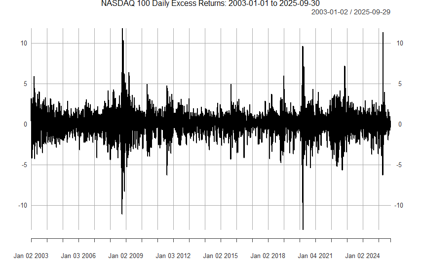
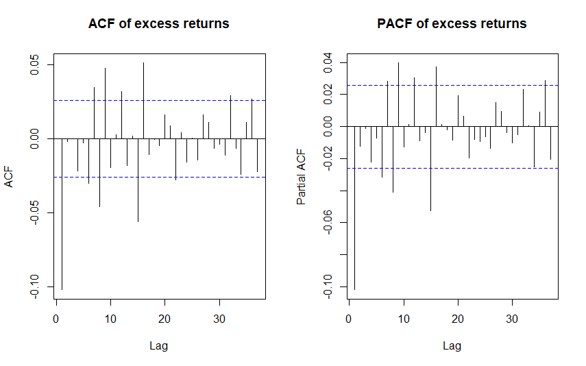
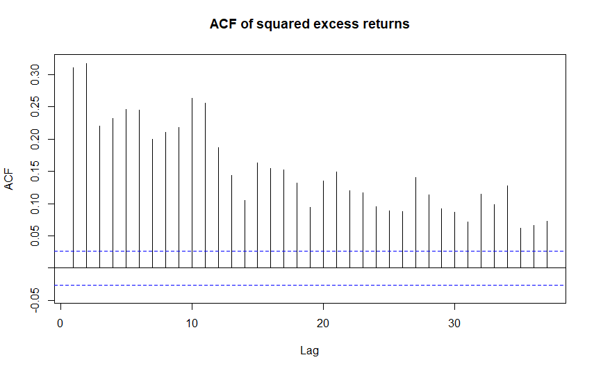
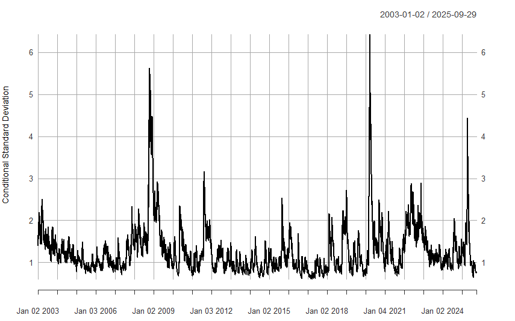
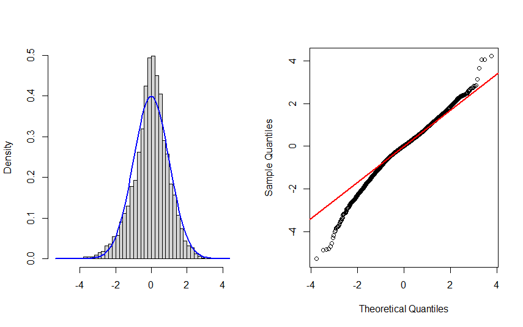

# Volatility modelling: AR-GARCH model {#part-ch9 .chapter-title}

## Modelling conditional variance

ARMA models can be characterized as models for the conditional mean of a stationary process. 

- When the invertibility condition holds, ARMA processes have the AR($\infty$) representation from which it can be seen that the conditional expected value of $y_{t}$, conditional on the past of the process $\left\{y_{t-1},y_{t-2},\ldots\right\}$, is $\mathsf{E}_{t-1}(y_t) = \mu -\sum_{j=1}^{\infty}\pi_{j} (y_{t-j}-\mu)$.

The conditional variance of an ARMA process (model) $y_t$ is 
\begin{eqnarray*}
\mathsf{Var}_{t-1}(y_t) &=& \mathsf{E}_{t-1}(y_t-\mathsf{E}_{t-1}(y_t))^2 \\
&=& \mathsf{E}_{t-1}(u^2_t) \\
&=& \mathsf{E}(u^2_t) \qquad (\mathrm{CEV2}) \\
&=& \sigma ^{2}.
\end{eqnarray*}
This shows that evident systematic variation in conditional variance, that several time series contain, cannot be taken into consideration with an ARMA model. Typical examples of such time series are financial time series and especially different asset return series.

&nbsp;

**Empirical example**. The NASDAQ 100 (ticker symbol ^NDX) is a major stock market index that tracks the performance of 100 of the largest non-financial companies listed on the NASDAQ stock market (U.S. stock market).

- It includes 100 of the largest domestic and international companies listed on NASDAQ, weighted by a modified market capitalization method to limit the influence of the very large firms. The index excludes financial companies and is heavily concentrated in the technology sector and dominated by a few extremely large companies like (as in 2025) NVIDIA Corporation (NVDA), Microsoft Corp. (MSFT), Apple Inc. (AAPL) and Amazon.com Inc. (AMZN).

- The NASDAQ 100 is widely viewed as the benchmark for large-cap growth stocks.

- The data source: quantmod package in R, which accesses publicly available financial data, seemingly sourced from Yahoo Finance.

Let us consider excess stock returns of the NASDAQ 100 over the 3-Month Treasury Bill rate. As a simple approximation, we can think that we are interested in the percentage changes (log-differences) of the NASDAQ 100 index adjusted for risk-free rate return (see Transformations in Section 1). Below we depict the daily excess stock returns between 1.1.2003--30.9.2025.

```{r, ndxreturns, echo=FALSE, out.width="85%", fig.align = "center", fig.cap=""}

```
<center>
<span style="color: #0069d9;">Figure: Excess stock returns of the NASDAQ 100 stock market index. (source: R package quantmod)</span>
</center>

&nbsp;

The return series seems quite stationary in terms of its level. Below we depict the sample autocorrelation and partial autocorrelation functions for the first 40 lags and their approximate 95\% critical bounds. These suggest that there is some autocorrelation but its degree is not very high.

- Typically asset returns are almost non-autocorrelated 

- For this sample period and NASDAQ returns, the resulting Ljung-Box test statistics reject the null hypothesis of no autocorrelation with all the relevant statistical significance levels. 

```{r, ndxacfpacf, echo=FALSE, out.width="85%", fig.align = "center", fig.cap=""}

```
<center>
<span style="color: #0069d9;">Figure: Sample autocorrelations and partial autocorrelations of the NASDAQ 100 excess returns.</span>
</center>

&nbsp;

The asset return series exhibits, however, some even more clear and typical variation, which is reflected by the autocorrelation function of the squared observations: All the reported autocorrelation coefficients of squared observations exhibit clear positive autocorrelation exceeding the 95\%-critical bound. The approximate $p$-value of the McLeod-Li test with $H=10$, and also with other lag length selections, is zero with four decimal precision. 

- There are periods (see above) during which the variation of the series is either larger or smaller than on average. This "**volatility clustering**" is a certain type of heteroskedasticity.

- When the definition of variance is taken into account, it is natural to investigate this using the autocorrelation function of the squared observations. Notable is also the large difference between large and small absolute values, which suggests a more fat-tailed distribution than the normal distribution.


```{r, ndxsquaredret, echo=FALSE, out.width="75%", fig.align = "center", fig.cap=""}

```
<center>
<span style="color: #0069d9;">Figure: Sample autocorrelations for squared observations (squared stock returns).</span>
</center>

&nbsp;

In what follows, heteroskedasticity similar to that of the stock return series above is thought to be not related with changes in unconditional variance, but rather with changes in the **conditional variance** when conditioning on the past values of the series. Next, we will first consider some general aspects of models used in modelling conditional variance, and then focus on some particular models that are most common in practice. 


&nbsp;


## Model formulation

In this section, we consider an AR-GARCH model determined by the following two equations
\begin{equation*}
y_{t} = \nu + \phi_{1}y_{t-1}+\cdots+\phi_{p}y_{t-p}+u_{t},
\end{equation*}
\begin{equation*}
u_{t} = h_{t}^{1/2}\varepsilon_{t},\quad \varepsilon_{t}\sim\mathsf{iid}(0,1),
\end{equation*}
where $h_{t}$ is a function of the variables $u_{t-j}$, $j>0$, and the error term $\varepsilon_{t}$ is assumed to be independent of the variables $y_{t-j}, \, j>0$, and hence also of the variables $u_{t-j}$, $j>0$. In other words, we consider an **AR($p$) model whose error term is conditionally heteroskedastic**.

- The coefficients $\phi_{1},\ldots,\phi_{p}$ are assumed to satisfy the (sufficient) stationarity condition of the AR($p$) process: $1 - \phi_1 z - \cdots - \phi_p z^p = \phi(z)  \neq 0, \, \mathrm{when} \, |z| \le 1$.

Regarding the conditional variance, by its definition, the variance of a random variable is associated with the squares of the random variable. Therefore, it seems natural that the conditional variance $h_t$ would depend on the past squared values of the process. For concreteness sake, consider a general **GARCH($r$,$s$) model**
\begin{equation*}
    h_{t}=\omega+\beta_{1}h_{t-1}+\cdots+\beta_{r}h_{t-r}+\alpha_{1}u_{t-1}^{2}+\cdots+\alpha_{s}u_{t-s}^{2},
\end{equation*}
whose parameters are assumed to satisfy the required conditions for non-negativeness, identification, and strict stationarity (to be considered below). 

As before, we denote the conditional expectation as $\mathsf{E}_{t-1}\left(\cdot\right)=\mathsf{E}\left(\cdot\left\vert y_{s},\text{ }s\leq t-1\right.\right)$. Because $u_{t}$ is a function of the variables $y_{t}$, ..., $y_{t-p}$, **the conditional variance** $h_{t}$ **is a function of the variables** $y_{t-j}$, $j>0$. Therefore, we can use the same arguments as considered, e.g., in forecast construction (see CEV4) to conclude that in the AR-GARCH model
\begin{equation*}
\mathsf{E}_{t-1}\left(  u_{t}\right)  =h_{t}^{1/2} \mathsf{E}_{t-1}\left(\varepsilon_{t}\right)  =h_{t}^{1/2}\mathsf{E}\left(\varepsilon_{t}\right)=0.
\end{equation*}
Together with this result, the model equations of the AR-GARCH model can be used to justify the following two results
\begin{equation*}
 \mathsf{E}_{t-1}(y_t) = \nu + \phi_{1} y_{t-1}+ \cdots + \phi_{p}y_{t-p} \quad \mathrm{and} \quad   \mathsf{Var}_{t-1}(y_t)=h_t.
\end{equation*}

- The latter result can be justified by noticing that $y_{t} = \mathsf{E}_{t-1}\left(y_{t}\right) + u_{t}$ and that
\begin{eqnarray*}
\mathsf{Var}_{t-1}\left(y_{t}\right) &=& \mathsf{E}_{t-1}(y_t - \mathsf{E}_{t-1}(y_t))^2 \\
&=& \mathsf{E}_{t-1}\left(u_{t}^{2}\right) \\
&=& h_t \mathsf{E}(\varepsilon_{t}^{2}) \\
&=& h_{t},
\end{eqnarray*}
where the result CEV2 and the identity $u_{t}^{2}=h_{t}\varepsilon_{t}^{2}$ are used (see the general model definition above). 

These two results demonstrate that the conditional mean and conditional variance of the process $y_{t}$ depend on the past values of the process. Based on the above points, **building a volatility model**, that is selecting the model equation for $h_t$, roughly consists of the following steps:

- Finding an adequate specification for the conditional mean $\mathsf{E}_{t-1}(y_t)$ (e.g., to select a suitable AR or ARMA model, and including also possible deterministic terms) is necessary to obtain a suitable specification for the conditional variance. 

- Checking for the (conditional) heteroskedasticity of the error term. This can be based on residuals, as they are empirical counterparts of the error terms. That is, testing for "ARCH effects" using, e.g., the McLeod-Li test or the ARCH-LM test described below.

- Finding a sufficient specification for the conditional variance $h_t$. There are a lot of different alternative model specifications to GARCH($r,s$) suggested in the econometric literature. Replacing it with one of the alternatives yields a straightforward extension of the AR-GARCH model introduced above.

- Estimation of the full model can be carried out by the method of maximum likelihood (see details below).


&nbsp;

::: {.callout-note collapse="true"}
## Extra: Relation to risk management and Value-at-Risk (VaR)


The core motivation for modeling conditional heteroskedasticity (time-varying volatility $h_t$) in asset returns $y_t$ is its direct and profound impact on risk management, particularly in calculating measures like Value-at-Risk (VaR).

The question that often arises in risk management is: What is the maximum expected loss over a specific time horizon with a given confidence level? This loss is the Value-at-Risk (VaR) threshold $c$. The VaR threshold $c$ is the loss level such that the probability of the actual loss $y_{t+1}$ being less than or equal to $c$ is a fixed, small probability $\pi$ (e.g., 1% or 5%):
\begin{equation*}
P_t(y_{t+1} \le c ) = G \Bigg(\frac{c - \mathsf{E}_{t}(y_{t+1})}{ h^{1/2}_{t+1}} \Bigg) = \pi,
\end{equation*}
where $P_t(\cdot)$ denotes the conditional probability given information up to time $t$, $\mathsf{E}_{t}(y_{t+1})$ is the conditional mean (return forecast), $h_{t+1}$ is the conditional variance forecast (volatility), and $G(\cdot)$ is the cumulative distribution function (CDF) of the standardized innovation $\frac{y_{t+1} - \mathsf{E}_{t}(y_{t+1})}{ h^{1/2}_{t+1}}$. 

The Value-at-Risk is the most commonly used risk measure. For the VaR model to be a useful and reliable tool in practice, the specification of the conditional variance $h_t$ is critical. Ignoring or otherwise misspecifying the time-varying nature of volatility (for example, treating $h_t$ as a constant) leads to severely flawed risk estimates.

:::


&nbsp;


## GARCH(1,1) and ARCH($s$) models

Instead of the general GARCH($r,s$) model, the **GARCH(1,1) model**
\begin{equation*}
h_t = \omega + \beta_1 h_{t-1} + \alpha_1 u^2_{t-1}
\end{equation*}
has been found adequate for most (financial) time series data. 

- In this GARCH(1,1) case, the non-negativeness of $h_t$ requires $\omega > 0$ and $\alpha_1, \beta_1 \ge 0$. Moreover, for $\beta_1$ to be identified, $\alpha_1$ must be strictly positive $\alpha_1 > 0$. 

- In the GARCH($r,s$) model, these non-negativeness conditions are clearly more complicated.

Another special case of GARCH models is obtained when $r=0$. That is the "GARCH-part" is missing and the GARCH($r,s$) model reduces to an **ARCH($s$)** model
\begin{equation*}
h_t = \omega +  \sum_{i=1}^{s} \alpha_i u^2_{t-i}.
\end{equation*}

In line with the idea of capturing volatility clustering with ARCH and GARCH models, the periods of high (and low) conditional variance tend to persist. This is easy to see with the **ARCH(1) model** ($s=1$)
\begin{equation*}
h_t = \omega + \alpha_1 u^2_{t-1},
\end{equation*}
where $\omega, \alpha_1 \ge 0$. A large shock ($u^2_{t-1}$) increases $h_t$, which then subsequently increases $u^2_t$ and $h_{t+1}$. This same logic holds also for more general ARCH and GARCH models. Moreover, in the ARCH(1) model, assuming normality of $\varepsilon_t$, the (unconditional) kurtosis of $u_t$ is
\begin{equation*}
\frac{\mathsf{E}(u^4_t)}{\mathsf{E}(u^2_t)^2} = \frac{3 (1 - \alpha^2_1)}{1 - 3 \alpha^2_1}.
\end{equation*}
The kurtosis is finite (i.e. the 4th moment exists) if $3\alpha^{2}_{1} < 1$, and it then always exceeds the value 3 implied by the normal distribution. The ARCH(1) model is hence capable of capturing excess kurtosis often present in financial data.

- Large outliers (in absolute value) appear in (observed) asset returns more often than implied by $\mathsf{nid}$ innovations. 

- Similar result on excess kurtosis holds also for more general ARCH and GARCH models, but the formulae become more complicated.

&nbsp;

As a summary of large past research, the GARCH(1,1) model has generally been found a successful and parsimonious alternative to the ARCH($s$) model with a typically large $s$ for asset returns. Why? By recursive substitutions, we get
\begin{eqnarray*}
h_t &=& \omega + \beta_1 h_{t-1} + \alpha_1 u^2_{t-1} \\
&=& \omega + \beta_1 \omega + \beta_1^2 h_{t-2} + \alpha_1 \beta_1 u^2_{t-2} + \alpha_1 u^2_{t-1} \\
& \vdots & \\
&=& \omega \sum_{j=0}^{k} \beta_1^j + \alpha_1 \sum_{j=0}^{k} \beta_1^j u^2_{t-1-j} + \beta_1^{k+1} h_{t-k-1}.
\end{eqnarray*}
This suggests that in the case $\beta_1 < 1$, 
\begin{equation*}
h_t = \omega \sum_{j=0}^{\infty} \beta_1^j + \alpha_1 \sum_{j=0}^{\infty} \beta_1^j u^2_{t-1-j},
\end{equation*}
which is a particular kind of ARCH($\infty$) form. Therefore, we can conclude that GARCH(1,1) is able to capture volatility clustering in a parsimonious way via only three parameters.

Another perspective on the GARCH models, and specifically on the GARCH(1,1) model, is obtained by substituting $h_{t}=u_{t}^{2}-\xi_{t}$ (and $h_{t-1}=u_{t-1}^{2}-\xi_{t-1}$) into the model equation. Therefore, the GARCH(1,1) can be rewritten as
\begin{equation*}
u^2_t = \omega + (\alpha_1 + \beta_1) u^2_{t-1} + \xi_t - \beta_1 \xi_{t-1},
\end{equation*}
where $\xi_t = u^2_t - h_t = h_t(\varepsilon^2_t-1)$ and $\mathsf{E}(\xi_t)=0$. This is an ARMA(1,1) type of presentation for $u_t^2$. Note, however, that $\xi_{t}$ is only a martingale difference sequence (uncorrelated with its own past, but heteroskedastic), not an $\mathsf{iid}$ error term. 

- As for the ARMA(1,1) process, the condition $\alpha_1 + \beta_1 < 1$ (together with $\omega>0$ and $\alpha_1, \beta_1 \ge 0$, which guarantee the non-negativity of $h_t$) is necessary and sufficient for the existence of a weakly stationary solution, i.e., for a finite unconditional variance 
\begin{equation*}
\mathsf{E}(u^2_t) = \frac{\omega}{1 - \alpha_1 - \beta_1}.
\end{equation*}

- Strict stationarity holds under the weaker condition $\mathsf{E}\left[\mathrm{log}(\alpha_{1}\varepsilon_{t}^{2}+\beta_{1})\right]<0$, which also allows $\alpha_{1}+\beta_{1}=1$. The latter borderline case is known as the integrated GARCH (IGARCH) model, in which the conditional variance process is strictly stationary but has no finite unconditional variance. 


&nbsp;

::: {.callout-note collapse="true"}
## Extra: Special case: AR-GARCH model with zero conditional mean


The AR-GARCH model presentation above contains also the special case of $\mathsf{E}_{t-1}(y_t) = 0$ often considered in various references (books etc.). This leads to the notation
\begin{equation*}
u_t= y_t = h^{1/2}_t \varepsilon_t, \quad \varepsilon_t \thicksim \mathsf{iid}(0,1).
\end{equation*}
Therefore, in this case the GARCH(1,1) model reduces to
\begin{equation*}
    h_{t}=\omega+\beta_1 h_{t-1}+\alpha_1 y_{t-1}^{2} 
\end{equation*}
and in the ARCH($s$) case, we get
\begin{equation*}
h_t = \omega +  \sum_{i=1}^{s} \alpha_i y^2_{t-i}.
\end{equation*}

:::


&nbsp;


## Parameter estimation

If it is assumed that the error term is Gaussian
\begin{equation*}
\varepsilon_{t}\sim\mathsf{nid}(0,1),
\end{equation*}
the (conditional) likelihood function can be derived following analogous principles as in ARMA models. In other words, assuming $\varepsilon_t \thicksim \mathsf{nid}(0,1)$, we get 
\begin{equation*}
u_t = h^{1/2}_t \varepsilon_t, \quad \varepsilon_t \thicksim \mathsf{nid}(0,1),
\end{equation*}
where $h_t = h_t(y_{t-1}, y_{t-2},\ldots)$, $\varepsilon_t$ and vector $(y_{t-1}, y_{t-2},\ldots)$ are independent, and $u_t = y_t - \mathsf{E}_{t-1}(y_t)$. Assume also that $y_t$ is stationary. Given the above assumptions and the conditional moments (conditional mean and variance) of the AR-GARCH model, we get the conditional density function of the observation $y_t$ as
\begin{equation*}
y_t|\ubar{\mathbf{Y}}_{t-1} \thicksim \mathsf{N}(\nu + \phi_1 y_{t-1} + \cdots + \phi_p y_{t-p}, h_t).
\end{equation*}
Therefore, the conditional distribution of $y_{t}$, conditional on $\ubar{\mathbf{Y}}_{t-1}=(y_1, \ldots y_{t-1}), \, t=1,\ldots,T$, is Gaussian with the conditional mean (see above) $\nu + \phi_{1}y_{t-1}+\cdots+\phi_{p}y_{t-p}$ and conditional variance $h_{t}$ where the model equation for $h_{t}$ needs to be specified.

Using the observed time series and required initial values (depending on the specific model) $\ldots, y_{-1}, y_0, y_1, \ldots, y_T$, as in the parameter estimation of ARMA models, this leads to the conditional joint density function
\begin{equation*}
\prod_{t=1}^{T} f_{y_t|\ubar{\mathbf{Y}}_{t-1}} = (2\pi)^{-T/2} \cdot
\prod_{t=1}^{T} h^{-1/2}_t \cdot \mathrm{exp}\Big(-\frac{1}{2} \sum_{t=1}^{T} \frac{u^2_t}{h_t} \Big).
\end{equation*}
Denote the parameter vector of the AR-GARCH model by $\boldsymbol{\vartheta}=(\boldsymbol{\phi}^{\prime},\boldsymbol{\lambda}^{\prime})^{\prime}$ where 

- $\boldsymbol{\phi} = (\nu, \phi_1,\ldots, \phi_p)^{\prime}$ contains the parameters related to the conditional mean, and 

- $\boldsymbol{\lambda} = (\omega, \alpha_1, \ldots, \alpha_s, \beta_1, \ldots, \beta_r)^{\prime}$ contains the parameters of the model for the conditional variance. As an example, in the GARCH(1,1) case ($r=s=1$), $h_{t} = \omega + \beta_1 h_{t-1} + \alpha_1 u_{t-1}^{2}$, and hence $\boldsymbol{\lambda} = (\omega, \alpha_1, \beta_1)^{\prime}$.

- A remark on the notation: in the estimation of ARMA models (see Section 6) the parameters of the conditional mean were collected in $\boldsymbol{\beta}$, so that the full parameter vector was $\boldsymbol{\vartheta}=(\boldsymbol{\beta}^{\prime},\sigma^{2})^{\prime}$. Here the symbol $\beta$ is reserved for the GARCH coefficients $\beta_{1},\ldots,\beta_{r}$, and hence the conditional mean parameters are denoted by $\boldsymbol{\phi}$ (which now contains the constant term $\nu$ as well). Otherwise the two setups are completely parallel: the single variance parameter $\sigma^{2}$ of the ARMA model is replaced by the vector $\boldsymbol{\lambda}$ that determines the time-varying conditional variance $h_{t}$.

The log-likelihood then becomes (omitting the constant term $-(T/2)\,\mathrm{log}(2\pi)$ that does not depend on the model parameters)
\begin{equation*}
l(\boldsymbol{\vartheta}) = \sum_{t=1}^{T} l_t(\boldsymbol{\vartheta}) =  -\frac{1}{2} \sum_{t=1}^{T} \mathrm{log}\, h_t(\boldsymbol{\phi}, \boldsymbol{\lambda}) - \frac{1}{2} \sum_{t=1}^{T} \frac{u_t(\boldsymbol{\phi})^2}{h_t(\boldsymbol{\phi},\boldsymbol{\lambda})},
\end{equation*}
where the notation $u_t(\boldsymbol{\phi}) = y_t - \nu - \phi_1 y_{t-1} - \cdots - \phi_p y_{t-p}$ and $h_t(\boldsymbol{\phi}, \boldsymbol{\lambda})$ emphasizes that both quantities are functions of the parameters. 

- Note that the conditional variance $h_{t}$ depends on the conditional mean parameters $\boldsymbol{\phi}$ as well, because it is a function of the lagged errors $u_{t-j}(\boldsymbol{\phi})$, $j>0$. This is why the estimation of the two equations cannot, in general, be separated.

- The connection to the ARMA case is seen by setting $h_{t}\equiv\sigma^{2}$: the log-likelihood above then reduces to $-(T/2)\,\mathrm{log}(\sigma^{2})-(1/2\sigma^{2})\sum_{t=1}^{T}u_{t}(\boldsymbol{\phi})^{2}$, which is exactly the conditional Gaussian log-likelihood function of Section 6 (there written in terms of $\boldsymbol{\beta}$).

- Just as in the ARMA case, the recursions require initial values: in the GARCH(1,1) case one needs $u_{0}$ and $h_{0}$. A common choice is to set $h_{0}$ equal to the sample variance of the series (or of the residuals of the conditional mean model). In the stationary case the effect of the initial values vanishes as $T$ increases, so that the conditional and exact ML estimators have the same asymptotic distribution.

Maximization of the likelihood function is performed using numerical methods, similarly as with ARMA models. In addition, the non-negativity and stationarity restrictions of the conditional variance parameters have to be imposed during the optimization.

&nbsp;

**Statistical inference**. If the normality assumption of the error term $\varepsilon_t \thicksim \mathsf{nid}(0,1)$ made above holds, the usual asymptotic properties of the maximum likelihood estimator (consistency and asymptotic normality) hold, as described for ARMA models in Section 6. If the Gaussianity assumption is found inappropriate, one could either (or both): 

- Use a non-Gaussian distribution, like the $t$-distribution for the error term. This leads to the different form for the log-likelihood function, but the general lines to obtain it are the same as above.

- Modify the asymptotic distribution and interpret the maximum likelihood estimator (MLE) as **quasi-MLE (QMLE)**.

&nbsp;

::: {.callout-note collapse="true"}
## Extra: Details on the QMLE


Concerning the QMLE approach, if the likelihood function is maximized at $\widehat{\boldsymbol{\vartheta}}=(\widehat{\boldsymbol{\phi}}^{\prime},\widehat{\boldsymbol{\lambda}}^{\prime})^{\prime}$, it can be shown, even without the normality assumption and under general assumptions and regularity conditions, that
\begin{equation*}
\widehat{\boldsymbol{\vartheta}} \underset{as}{\sim}\mathsf{N}\left(\boldsymbol{\vartheta},\boldsymbol{\mathrm{V}}\left(\boldsymbol{\vartheta}\right)^{-1} \boldsymbol{\mathrm{B}} \left(\boldsymbol{\vartheta}\right) \boldsymbol{\mathrm{V}}\left(\boldsymbol{\vartheta}\right)^{-1}\right), 
\end{equation*}
where
\begin{equation*}
    \boldsymbol{\mathrm{V}}\left(\boldsymbol{\vartheta}\right) = \mathsf{E}\left[-\frac{\partial^{2}l(\boldsymbol{\vartheta})}{\partial\boldsymbol{\vartheta}\partial\boldsymbol{\vartheta}^{\prime}}\right]
\end{equation*}
and 
\begin{equation*}
\boldsymbol{\mathrm{B}}\left(\boldsymbol{\vartheta}\right)  =\mathsf{E}\left[\sum_{t=1}^{T}\left(\frac{\partial}{\partial\boldsymbol{\vartheta}}l_{t}(\boldsymbol{\vartheta})\right)  \left(\frac{\partial}{\partial\boldsymbol{\vartheta}}l_{t}(\boldsymbol{\vartheta})\right)^{\prime}\right],
\end{equation*}
where $l_{t}(\boldsymbol{\vartheta})$ is as described above and its specific form naturally depends on the selected AR-GARCH model.

- The matrix $\boldsymbol{\mathrm{V}}(\boldsymbol{\vartheta})$ is the same (Fisher information) matrix as in Section 6. 
<!--, now written for the whole parameter vector $\boldsymbol{\vartheta}$ instead of the conditional mean parameters only. -->
The matrix $\boldsymbol{\mathrm{B}}(\boldsymbol{\vartheta})$ is the expected outer product of the scores, and the covariance matrix above is the corresponding "sandwich" matrix.

<!-- - As in Section 6, the result is stated here in the "unscaled" form, in which the covariance matrix is of order $1/T$. The formal statement of the result is $\sqrt{T}(\widehat{\boldsymbol{\vartheta}}-\boldsymbol{\vartheta})\overset{d}{\rightarrow}\mathsf{N}(\boldsymbol{0},\mathcal{I}^{-1}\mathcal{J}\mathcal{I}^{-1})$, where $\mathcal{I}$ and $\mathcal{J}$ are the limits of $T^{-1}\boldsymbol{\mathrm{V}}(\boldsymbol{\vartheta})$ and $T^{-1}\boldsymbol{\mathrm{B}}(\boldsymbol{\vartheta})$, respectively. -->

Using the empirical counterparts of the matrices $\boldsymbol{\mathrm{V}} \left(\boldsymbol{\vartheta}\right)$ and $\boldsymbol{\mathrm{B}}\left(\boldsymbol{\vartheta}\right)$, namely
\begin{equation*}
    \widehat{\boldsymbol{\mathrm{V}}}=-\frac{\partial^{2}l(\widehat{\boldsymbol{\vartheta}})}{\partial\boldsymbol{\vartheta}\partial\boldsymbol{\vartheta}^{\prime}} \quad \mathrm{and} \quad \widehat{\boldsymbol{\mathrm{B}}}=\sum_{t=1}^{T}\left(  \frac{\partial}{\partial\boldsymbol{\vartheta}}l_{t}(\widehat{\boldsymbol{\vartheta}})\right)\left(\frac{\partial}{\partial\boldsymbol{\vartheta}}l_{t}(\widehat{\boldsymbol{\vartheta}})\right)^{\prime}
\end{equation*}
(both evaluated at the estimates and, as in Section 6, computed in practice with numerical derivatives), the asymptotic distribution of the estimator $\widehat{\boldsymbol{\vartheta}}$ presented above can be used to form approximate standard errors and Wald tests concerning the parameter $\boldsymbol{\vartheta}$. Specifically, the approximate standard errors are the square roots of the diagonal elements of the estimated sandwich matrix
\begin{equation*}
    \widehat{\boldsymbol{\mathrm{V}}}^{-1}\widehat{\boldsymbol{\mathrm{B}}}\,\widehat{\boldsymbol{\mathrm{V}}}^{-1} = [\widehat{v}^{ij}], \quad \mathrm{s.e.}(\widehat{\vartheta}_{i}) = \sqrt{\widehat{v}^{ii}},
\end{equation*}
and individual $t$-ratios, confidence intervals, and (joint) Wald tests are formed exactly as described for ARMA models in Section 6: the null hypothesis $\vartheta_{i}=0$ is rejected at the 5\% level if $|\widehat{\vartheta}_{i}/\sqrt{\widehat{v}^{ii}}| \ge 1.96$, and the 95\% confidence interval is $\widehat{\vartheta}_{i}\pm1.96\sqrt{\widehat{v}^{ii}}$.

- Cf. the maximum likelihood estimation of AR (and ARMA) models.

- If the normality assumption (i.e. $\varepsilon_t \thicksim \mathsf{nid}(0,1)$) holds, then $\boldsymbol{\mathrm{V}}\left(\boldsymbol{\vartheta}\right) = \boldsymbol{\mathrm{B}}\left(\boldsymbol{\vartheta}\right)$ (the information matrix equality), and the expressions above for the (QMLE) asymptotic distribution and the standard errors and Wald tests simplify to the usual MLE (maximum likelihood estimator) case $\boldsymbol{\mathrm{V}}(\boldsymbol{\vartheta})^{-1}$, that is, to the result of Section 6.

- Unlike the Wald test, the likelihood ratio test is *not* robust to the misspecification of the error distribution: under the QMLE interpretation the $LR$ statistic no longer has the $\chi^{2}$ limiting distribution. When the normality assumption is questionable, hypotheses concerning $\boldsymbol{\vartheta}$ should therefore be tested with Wald tests based on the robust covariance matrix above.

- The asymptotic results require the parameters to be interior points of the admissible parameter space. In particular, testing $\alpha_{1}=0$ ("no ARCH effects") with a $t$-ratio is *not* a standard testing problem, because $\alpha_{1}\ge0$ is a boundary value and $\beta_{1}$ is not identified when $\alpha_{1}=0$. This is one reason why the presence of conditional heteroskedasticity is tested with the ARCH-LM (or McLeod-Li) test described below rather than with a $t$-ratio. Similarly, the results require strict stationarity, and the normal approximation deteriorates when $\alpha_{1}+\beta_{1}$ is very close to unity (cf. the "nearly violated" conditions in Section 6).

- If the distribution of $\varepsilon_{t}$ is symmetric, the information matrix is block diagonal with respect to $\boldsymbol{\phi}$ and $\boldsymbol{\lambda}$, so that the estimators of the conditional mean and conditional variance parameters are asymptotically independent. With asymmetric (skewed) innovations this is no longer the case, and the full covariance matrix has to be used.

:::

&nbsp;

The practical message from above is that it is often reasonable to rely on the QMLE-based asymptotic distribution result and resulting robust standard errors in the first place, such as so called Bollerslev-Wooldridge standard errors, for different parameter estimates of the AR-GARCH model. 

- The rationale is that the model specification, and especially the distributional assumption $\varepsilon_t \thicksim \mathsf{nid}(0,1)$, is rarely exactly correct. Even though the model is not entirely correctly specified, the QMLE-based standard errors allow for additional robustness against such misspecification, which makes their use advisable.

- Using the QMLE specifically means that we obtain the same estimates $\widehat{\boldsymbol{\vartheta}}$ but we rely on the robust (sandwich) asymptotic covariance matrix and hence on the resulting robust standard errors.


&nbsp;

**Empirical example (continue)**. Consider the estimation result of the AR-GARCH model with Gaussian error term for the excess stock returns of the NASDAQ 100 index. For simplicity, fit a relatively simple AR(1)-GARCH(1,1) model (see above with selections $p=r=s=1$). That is, we specify

- AR(1) model for the conditional mean. 

- GARCH(1,1) model for the conditional variance

That is, we estimate an AR(1) model with GARCH(1,1) errors. The estimation result of the maximum likelihood estimation, based on the normality assumption of $\varepsilon_t$, yields
\begin{eqnarray*}
y_{t} &=& \underset{{\left(0.013\right) }}{0.087} - \underset{{\left(0.013\right) }}{0.044} y_{t-1} +
\widehat{u}_{t}, 
\notag \\
&& \\
\widehat{h}_{t} &=&\underset{{\left(0.006\right) }}{0.035} +\underset{{\left(
0.013\right) }}{0.876}\widehat{h}_{t-1}+\underset{{\left( 0.012 \right) }}{0.105}\widehat{u}_{t-1}^{2},  \notag
\end{eqnarray*}
where we report the robust standard errors under the parameter estimates (see the QMLE asymptotic distribution result). The full estimation result provided by **rugarch package** in R yields the following results:

<center>
```markdown
*---------------------------------*
*          GARCH Model Fit        *
*---------------------------------*

Conditional Variance Dynamics 	
-----------------------------------
GARCH Model	: sGARCH(1,1)
Mean Model	: ARFIMA(1,0,0)
Distribution	: norm 

Optimal Parameters
------------------------------------
        Estimate  Std. Error  t value Pr(>|t|)
mu      0.087229    0.012889   6.7679 0.000000
ar1    -0.043797    0.014149  -3.0954 0.001965
omega   0.035129    0.004868   7.2160 0.000000
alpha1  0.104804    0.008170  12.8272 0.000000
beta1   0.876000    0.008975  97.6078 0.000000

Robust Standard Errors:
        Estimate  Std. Error  t value Pr(>|t|)
mu      0.087229    0.012567   6.9412 0.000000
ar1    -0.043797    0.012630  -3.4677 0.000525
omega   0.035129    0.006497   5.4066 0.000000
alpha1  0.104804    0.012428   8.4331 0.000000
beta1   0.876000    0.012869  68.0716 0.000000

LogLikelihood : -9030.906 

Information Criteria
------------------------------------
                   
Akaike       3.1583
Bayes        3.1641
Shibata      3.1583
Hannan-Quinn 3.1603

Weighted Ljung-Box Test on Standardized Residuals
------------------------------------
                        statistic p-value
Lag[1]                     0.1471  0.7014
Lag[2*(p+q)+(p+q)-1][2]    0.6119  0.9317
Lag[4*(p+q)+(p+q)-1][5]    2.0557  0.6952
d.o.f=1
H0 : No serial correlation

Weighted Ljung-Box Test on Standardized Squared Residuals
------------------------------------
                        statistic p-value
Lag[1]                      1.998  0.1575
Lag[2*(p+q)+(p+q)-1][5]     4.486  0.1993
Lag[4*(p+q)+(p+q)-1][9]     6.661  0.2292
d.o.f=2

Weighted ARCH LM Tests
------------------------------------
            Statistic Shape Scale P-Value
ARCH Lag[3]   0.09937 0.500 2.000  0.7526
ARCH Lag[5]   4.68135 1.440 1.667  0.1217
ARCH Lag[7]   5.49080 2.315 1.543  0.1794
```
</center>

The estimation result shows well the point using the QMLE:

- The estimated coefficients ("AR", "ARCH" and "GARCH" estimates) are the same for the "optimal parameters" (that is, when we assume that the normality assumption $\varepsilon_t$ holds) and for QMLE (resulting robust estimation results), but the estimated standard errors are different. Especially for the GARCH part this means, as often in these circumstances, that the robust standard errors are somewhat higher, reflecting the additional uncertainty coming from possible model misspecification.

- All in all, all the estimated coefficients are statistically significant at the conventional significance levels. Moreover, the typical pattern of the GARCH(1,1) model is also present where the GARCH parameter (here $\beta_1$) is larger than the ARCH coefficient $\alpha_1$, and their sum is relatively close to 1. Estimated volatility, which is here the conditional standard deviation $\widehat{h}^{1/2}_t$ of the estimated model and is at times interpreted as a measure of risk in financial markets, is depicted below.

```{r, ndxestimcondstd, echo=FALSE, out.width="75%", fig.align = "center", fig.cap=""}

```
<center>
<span style="color: #0069d9;">Figure: Estimated conditional standard deviation based on the AR(1)-GARCH(1,1) model for the NASDAQ 100 excess returns.</span>
</center>

&nbsp;

Residual diagnostics show that: 

- There is no remaining autocorrelation in the residuals and squared residuals (based on the Ljung-Box and the McLeod-Li tests and residual autocorrelation coefficients). 

- The ARCH LM tests do not reject the null hypothesis of no remaining conditional heteroskedasticity in the standardized residuals $\widehat{\varepsilon}_{t}=\widehat{u}_{t}/\widehat{h}_{t}^{1/2}$ either. Together with the previous point, the $p$-values reported above show that the parsimonious AR(1)-GARCH(1,1) is an adequate model for the NASDAQ 100 excess returns.

- There is some deviation from the normality assumption in the (standardized) residuals. This suggests that the estimates should be interpreted as QMLEs, as above.

&nbsp;

```{r, ndxresidnormality, echo=FALSE, out.width="55%", fig.align = "center", fig.cap=""}

```
<center>
<span style="color: #0069d9;">Figure: Histogram and Q-Q plot of (standardized) residuals.</span>
</center>

&nbsp;

::: {.callout-note collapse="true"}
## Extra: Details on the ARCH-LM test and "weighted" test statistics reported by rugarch


**Testing for ARCH effects: the ARCH-LM test**. Recall the second step of building a volatility model above: before (and after) specifying a model for $h_{t}$, one has to check whether the error term really is conditionally heteroskedastic. The most common test for this purpose, alongside the McLeod-Li test, is the **ARCH-LM test** of Engle (1982).

Let $\widehat{u}_{t}$, $t=1,\ldots,T$, denote the residuals of the estimated conditional mean model (here the AR($p$) model, estimated by OLS or ML). Under the null hypothesis there are no ARCH effects, that is, the conditional variance is constant, $h_{t}=\sigma^{2}$, whereas under the alternative $h_{t}$ follows an ARCH($m$) model. The test is based on the auxiliary regression
\begin{equation*}
    \widehat{u}_{t}^{2} = \gamma_{0} + \gamma_{1}\widehat{u}_{t-1}^{2}+\cdots+\gamma_{m}\widehat{u}_{t-m}^{2} + e_{t}, \quad t=m+1,\ldots,T,
\end{equation*}
in which the null hypothesis of no ARCH effects is
\begin{equation*}
    \mathsf{H}_{0}: \gamma_{1}=\cdots=\gamma_{m}=0.
\end{equation*}
The Lagrange multiplier (LM) test statistic is obtained from the coefficient of determination $R^{2}$ of this auxiliary regression as
\begin{equation*}
    \mathrm{ARCH\text{-}LM}(m) = TR^{2} \overset{d}{\rightarrow} \chi^{2}(m)
\end{equation*}
under the null hypothesis, so that $\mathsf{H}_{0}$ is rejected for large values of the statistic (small $p$-values), indicating the presence of conditional heteroskedasticity. Equivalently, the conventional $F$-test of the joint significance of the lagged squared residuals in the auxiliary regression can be used; the two versions are asymptotically equivalent.

- The intuition is transparent: if the squared errors are predictable from their own past, the conditional variance is time varying. Note the analogy with the ACF of the squared observations examined in the empirical example above.

- The test is of the Lagrange multiplier type, which means that only the *restricted* model has to be estimated: the residuals $\widehat{u}_{t}$ are obtained from the conditional mean model alone, and no GARCH model needs to be estimated. This makes the test convenient at the specification stage. As mentioned above, a Wald ($t$-ratio) test of $\alpha_{1}=0$ would not be valid here, because the null hypothesis lies on the boundary of the parameter space.

- Although the alternative hypothesis is an ARCH($m$) model, the test also has good power against GARCH alternatives, because a GARCH(1,1) model can be written as an ARCH($\infty$) model (see above). The lag length $m$ is chosen by the user, and it is advisable to report the results for a few different values of $m$.

- **Post-estimation use**. The same test can be applied to the **standardized residuals** $\widehat{\varepsilon}_{t}=\widehat{u}_{t}/\widehat{h}_{t}^{1/2}$ of the estimated AR-GARCH model, in which case it tests whether there is any conditional heteroskedasticity *left* in the residuals, that is, whether the specified model for $h_{t}$ is adequate. Rejection suggests increasing the orders $r$ and $s$ or changing the specification of the conditional variance.

- A caveat concerning this post-estimation use: because $\widehat{h}_{t}$ depends on the estimated parameters, the estimation of the model affects the asymptotic distribution of the statistic and the $\chi^{2}(m)$ approximation is no longer exact. The correct limiting distribution for the squared standardized residuals of a fitted GARCH model was derived by Li and Mak (1994). The tests reported by the rugarch package are based on this line of work (see the next remark).

&nbsp;

**Weighted test statistics**. The tests in the output above are *weighted* versions of the Ljung-Box and ARCH-LM tests. The reason for the modification is twofold.

- *The effect of estimation.* The Ljung-Box and ARCH-LM statistics introduced above have their $\chi^{2}$ limiting distributions when they are computed from the true errors. When they are computed from the residuals of an *estimated* model, the estimation of the parameters changes the asymptotic distribution of the (squared) residual autocorrelations. The conventional remedy is a degrees-of-freedom adjustment, $\chi^{2}(H-k)$, where $k$ is the number of estimated parameters. This is what the rows "d.o.f=1" and "d.o.f=2" in the output refer to: $k=1$ for the standardized residuals (the AR(1) coefficient $\phi_{1}$) and $k=2$ for the squared standardized residuals ($\alpha_{1}$ and $\beta_{1}$). For squared standardized residuals of a fitted GARCH model, the appropriate statistic was derived by Li and Mak (1994).

- *Power.* The conventional Ljung-Box statistic weights all the autocorrelations equally,
\begin{equation*}
    Q(H) = T(T+2)\sum_{j=1}^{H}\frac{\widehat{\rho}_{j}^{2}}{T-j},
\end{equation*}
so that its power deteriorates as $H$ grows: the informative low-order autocorrelations get diluted by a large number of uninformative higher-order ones. Fisher and Gallagher (2012) therefore propose weighting the squared autocorrelations by weights that decrease in the lag length,
\begin{equation*}
    Q_{W}(H) = T(T+2)\sum_{j=1}^{H}\frac{H-j+1}{H}\cdot\frac{\widehat{\rho}_{j}^{2}}{T-j},
\end{equation*}
and an analogous weighting is applied to the ARCH-LM statistic. The weighted statistic behaves asymptotically as a linear combination of $\chi^{2}$ distributed random variables, whose distribution is approximated by a **gamma distribution**. This is why the weighted ARCH LM output reports the columns "Shape" and "Scale" (the parameters of the gamma distribution) instead of degrees of freedom.

What this means in practice:

- The numerical values of the weighted statistics are **not** comparable with the values of the plain Ljung-Box, McLeod-Li, or ARCH-LM statistics computed as described above; only the $p$-values and the conclusions drawn from them are comparable. In the example above, both lead to the same conclusion that nothing systematic is left in the residuals.

- The labels of the type "Lag[$2(p+q)+(p+q)-1$]" indicate that rugarch selects the lag lengths as a function of the fitted model orders instead of letting the user pick them; the figure in the second brackets is the lag length actually used.

- For teaching purposes, the unweighted statistics remain the reference case: they are transparent and have the familiar $\chi^{2}$ limiting distribution. In applied work, when the tests are computed from the residuals of an estimated GARCH model, the weighted versions have better size and power properties. They are also directly available in the R package **WeightedPortTest** (functions `Weighted.Box.test` and `Weighted.LM.test`).

:::


&nbsp;


## Extra: Forecasting

Assume observations are available up to time $t$ and the object of interest is to forecast the future values of $y_{t+k}$\ ($k\geq1$). In addition to stationarity, assume that $\mathsf{E}\left(y_{t}^{2}\right)<\infty$. 

**Forecasts for $y_t$**. From the first equation of the AR($p$)-GARCH model, that is, the model for the conditional mean, it can be seen that the optimal (in the mean square sense) one-step-ahead forecast is 
\begin{equation*}
\mathsf{E}_{t}\left(y_{t+1}\right) = \nu + \phi_{1}y_{t}+\cdots+\phi_{p}y_{t+1-p}.
\end{equation*}
When $k\geq2$, it can be seen that (cf. forecasting formulae for AR(MA) models)
\begin{equation*}
    \mathsf{E}_{t}(u_{t+k})=\mathsf{E}_{t}\left[  \mathsf{E}_{t+k-1}(u_{t+k})\right]=0,
\end{equation*}
so that
\begin{equation*}
    \mathsf{E}_{t}\left(y_{t+k}\right) = \nu + \phi_{1}\mathsf{E}_{t}(y_{t+k-1})+\cdots+\phi_{p}\mathsf{E}_{t}(y_{t+k-p}), \quad k=1,2,\ldots,
\end{equation*}
where $\mathsf{E}_{t}(y_{t+k-j})=y_{t+k-j}$ for $j\geq k$. 

- In conclusion, from these and the forecasting formulae for an AR($p$) process with a homoskedastic error term, it can be concluded that the optimal forecasts can be formed recursively exactly in the same manner as in the (conditionally) homoskedastic case.

- In practice, when computing forecasts, unknown parameters naturally need to be replaced with their estimates, which are based on the finite sample sizes, and hence numerically here forecasts can be slightly different than obtained with an AR($p$) model with conditionally homoskedastic errors.

&nbsp;

As the above shows, conditional heteroskedasticity does not affect the forecasting formulae, which are the same as in the AR case discussed earlier. However, the presence of conditional heteroskedasticity changes how the prediction intervals are computed (see Extra below).

::: {.callout-note collapse="true"}
## Extra: Prediction intervals under conditional heteroskedasticity


To see this, note that because the forecasts can be derived exactly as in the homoskedastic AR($p$) model, the same also holds for the $k$-step forecast errors. Based on the calculations above,
\begin{equation*}
    \mathsf{E}_{t}\left(  u_{t+k-j}\right)  =\left\{
    \begin{array}{cc}
         & u_{t+k-j}, \quad \mathrm{when} \quad k\leq j \\
         & 0, \quad \mathrm{when} \quad k > j,
    \end{array}
    \right.
\end{equation*}
so that 
\begin{equation*}
    y_{t+k}-\mathsf{E}_{t}(y_{t+k})=\sum_{j=0}^{k-1}\psi_{j}u_{t+k-j}=\sum_{j=0}^{k-1}\psi_{j}h_{t+k-j}^{1/2}\varepsilon_{t+k-j},
\end{equation*}
where $\psi_{j}$ are again the coefficients of the power series $\psi\left(z\right)=\phi\left(z\right)^{-1}=\sum_{j=0}^{\infty}\psi_{j}z^{j}$ ($\psi_{0}=1$).

Let us focus our attention on the one-step-ahead forecast error, whose conditional expected value becomes
\begin{equation*}
    \mathsf{E}_{t}\left[y_{t+1}-\mathsf{E}_{t}(y_{t+1})\right]  =\mathsf{E}_{t}(u_{t+1})=0
\end{equation*}
with conditional variance
\begin{equation*}
    \mathsf{E}_{t}\left[\left(y_{t+1}-\mathsf{E}_{t}\left(y_{t+1}\right)\right)^{2}\right]=\mathsf{E}_{t}\left(u_{t+1}^{2}\right)=h_{t+1}.
\end{equation*}
This shows that the one-step-ahead prediction error is conditionally heteroskedastic, that is, the forecast accuracy depends on what kind of values the process attained at the forecast origin (at time of forecast computation) and just before it. 

- As can be seen from the expression of the forecast error, a similar result holds also for forecast horizons longer than one. Therefore, any analysis of forecast accuracy, such as prediction intervals is sensible to be based on the conditional distribution with conditioning on the history up until the date of forecasting.

If it is assumed that $\varepsilon_{t}\sim\mathsf{nid}\left(  0,1\right)$, then the conditional distribution of the one-step-ahead forecast error $u_{t}$ (conditioned on $\left\{y_{t-1},y_{t-2},\ldots\right\}$) is Gaussian with mean zero and variance $h_{t}$. 

- Using this result, one can form prediction intervals for the one-step-ahead forecast exactly as for ARMA process. 

- For multiple step ahead forecasts, the situation is not that straightforward, because the conditional distributions of multiple step forecast errors are not Gaussian and have no simple expressions. Therefore, forming prediction intervals for multiple step ahead forecasts is more complicated.

:::

&nbsp;

**Volatility forecasts**. Concerning forecasting the conditional variance, we assume that observations up to and including time $t$ (i.e. the forecast origin at time $t$) are available, and that forecasts for $h_{t+1}, h_{t+2},\ldots$ are desired. 

Since $h_{t+1}$ is a (deterministic) function of the variables $y_{t},y_{t-1},\ldots$, it is already known at the forecast origin, and thus the first conditional variance that genuinely needs to be forecast is $h_{t+2}$. For simplicity, let us concentrate on the GARCH(1,1) case. Taking conditional expected values (conditional on $\left\{y_{t},y_{t-1},\ldots\right\}$) of both sides of
\begin{equation*}
    h_{t+2}=\omega+\beta_1 h_{t+1}+\alpha_1 u_{t+1}^{2}
\end{equation*}
yields the optimal (in the mean squared error sense) forecast of $h_{t+2}$ as
\begin{equation*}
    \mathsf{E}_{t}\left(h_{t+2}\right)=\omega + \beta_1\mathsf{E}_{t}\left(h_{t+1}\right)+\alpha_1 \mathsf{E}_{t}\left(u_{t+1}^{2}\right),
\end{equation*}
where $\mathsf{E}_{t}\left(h_{t+1}\right)=h_{t+1}$ (see CEV4). Moreover, we obtain that (see CEV2 and CEV4)
\begin{equation*}
    \mathsf{E}_{t}\left(u_{t+1}^{2}\right) = \mathsf{E}_{t}\left(h_{t+1}\varepsilon_{t+1}^{2}\right)=h_{t+1}\mathsf{E}_{t}\left(\varepsilon_{t+1}^{2}\right)=h_{t+1}\mathsf{E}\left(\varepsilon_{t+1}^{2}\right)=h_{t+1},
\end{equation*}
so that
\begin{equation*}
    \mathsf{E}_{t}\left(h_{t+2}\right)=\omega+(\alpha_1+\beta_1)h_{t+1}.
\end{equation*}

When the forecast horizon is $k\geq3$, in a similar fashion, we obtain
\begin{equation*}
    \mathsf{E}_{t}\left(h_{t+k}\right) = \omega+\beta_1 \mathsf{E}_{t}\left(h_{t+k-1}\right)+\alpha_1 \mathsf{E}_{t}\left(u_{t+k-1}^{2}\right),
\end{equation*}
and finally
\begin{equation*}
    \mathsf{E}_{t}\left(h_{t+k}\right)=\omega \sum_{j=0}^{k-2}\left(\alpha_1+\beta_1\right)^{j}+\left(\alpha_1+\beta_1\right)^{k-1}h_{t+1}, \quad  k=2,3,\ldots,
\end{equation*}
where $h_{t+1}$ is a function of variables $\left\{y_{t},y_{t-1},\ldots\right\}$ known at the time when forecasts are constructed.

&nbsp;

::: {.callout-note collapse="true"}
## Extra: Details for forecasting formulae multiple periods ahead


Consider the part
\begin{equation*}
    \mathsf{E}_{t}\left(h_{t+k}\right) = \omega+\beta_1 \mathsf{E}_{t}\left(h_{t+k-1}\right)+\alpha_1 \mathsf{E}_{t}\left(u_{t+k-1}^{2}\right),
\end{equation*}
Here
\begin{equation*}
    \mathsf{E}_{t}\left(u_{t+k-1}^{2}\right)=\mathsf{E}_{t}\left(h_{t+k-1}\varepsilon_{t+k-1}^{2}\right) = \mathsf{E}_{t}\left[\mathsf{E}_{t+k-2}\left(h_{t+k-1}\varepsilon_{t+k-1}^{2}\right)\right],
\end{equation*}
where the latter equality can be justified based on a generalization of property CEV3, that is, a generalization of the law of iterated expectations.

This generalization says that $\mathsf{E}\left(Y\left\vert X_{2}\right.\right)=\mathsf{E}\left[\mathsf{E}\left(Y\left\vert X_{1}\right.\right)\left\vert X_{2}\right.\right]$, when the components of the (potentially infinite-dimensional) random vector $X_{2}$ are a subset of the components of $X_{1}$ (or more generally, $X_{2}$ is a function of $X_{1}$).

Because
\begin{equation*}
    \mathsf{E}_{t+k-2}\left(h_{t+k-1}\varepsilon_{t+k-1}^{2}\right)=h_{t+k-1}\mathsf{E}_{t+k-2}\left(\varepsilon_{t+k-1}^{2}\right)=h_{t+k-1},
\end{equation*}
we obtain
\begin{equation*}
    \mathsf{E}_{t}\left(u_{t+k-1}^{2}\right)=\mathsf{E}_{t}\left(h_{t+k-1}\right), \quad k=3,4,\ldots\text{ .}
\end{equation*}
To summarize, we have shown that
\begin{equation*}
    \mathsf{E}_{t}\left(h_{t+k}\right) = \omega+(\alpha_1+\beta_1)\mathsf{E}_{t}\left(h_{t+k-1}\right),\quad k=2,3,\ldots\text{ .}
\end{equation*}
Because $\mathsf{E}_{t}\left(h_{t+1}\right)=h_{t+1}$, we inductively obtain the solution
\begin{equation*}
    \mathsf{E}_{t}\left(h_{t+k}\right)=\omega \sum_{j=0}^{k-2}\left(\alpha_1+\beta_1\right)^{j}+\left(\alpha_1+\beta_1\right)^{k-1}h_{t+1}, \quad  k=2,3,\ldots,
\end{equation*}
where $h_{t+1}$ is a function of variables $\left\{y_{t},y_{t-1},\ldots\right\}$ known at the time of forecasting.

:::

&nbsp;

In practice, 

- the unknown parameters $\alpha_1$, $\beta_1$, and $\omega$ have to be replaced by corresponding estimates. 

- Unlike in ARMA models, the quantity being predicted is now unobserved, although it can be computed using GARCH model equation for all $t\geq1$ as long as parameter values and required initial values for $h_t$ and $y_t$ are available. A common choice in practice is to use the sample variance of the observed time series as the initial value $h_{0}$. In the stationary case, the effect of the initial values diminishes as $t$ increases.

- Forecasting with a more general GARCH($r,s$) model is carried out in principle in the same way as outlined above, although the resulting forecasting formulae become more cumbersome. Deriving interval predictions is also complicated, one major reason for this being that the distribution of the conditional variance deviates heavily from a Gaussian distribution.

- Overall, **volatility forecasting** is a separate and a large area in financial econometrics that we are not considering in this course more detail.


&nbsp;


## GARCH-in-mean model 

In the **GARCH-in-mean** (**GARCH-M**) **model**, the conditional variance is allowed to directly affect the conditional mean as well. 

To simplify the notation, let us consider the first-order special case, i.e., the AR(1)-GARCH(1,1)-M model 
\begin{eqnarray*} 
y_t = \nu + \phi_1 y_{t-1} + \delta g(h_t) + u_t, \quad 
h_t = \omega + \alpha_1 u^2_{t-1} + \beta_1 h_{t-1}, 
\end{eqnarray*} 
where, as before, $u_t = y_t - \nu - \phi_1 y_{t-1} - \delta g(h_t)$, but now the conditional variance $h_t$ also affects the level of $y_t$ through the function $g(h_t)$. Depending on the situation, the "in-mean effect" can be defined as 

- $g(h_t) = h_t$, 

- $g(h_t) = \sqrt{h_t}$, or 

- $g(h_t) = \mathrm{log} (h_t)$. 

A positive coefficient $\delta$ means that the value of $y_t$ increases when the conditional variance increases.

- As an extension of the GARCH-M version  presented above, the orders of the AR and GARCH models can naturally be greater than 1. 

- In general, instead of the AR($p$) model, another suitable model for the conditional mean of $y_t$ can be used. 

- Similarly, a model other than GARCH(1,1) can be chosen for the GARCH part.

The GARCH-M model is used, for example, in financial econometrics (empirical finance) to model the fundamental risk-return relation, where risk (here volatility, measured by the conditional variance or its transformation) is allowed to directly affect the expected return of a security.

**Empirical example (continue)**. Let us consider an GARCH-in-mean extension of the AR(1)-GARCH(1,1) model (with Gaussian innovations) obtained above for the NASDAQ 100 excess stock returns. That is we consider the following model for the conditional mean
\begin{eqnarray*} 
\nonumber y_t = \nu + \phi_1 y_{t-1} + \delta \sqrt{h_t} + u_t. 
\end{eqnarray*} 
That is, we include the conditional standard deviation in the conditional mean. 

- This is one possible way to examine the fundamental risk-return relationship in (excess) stock returns (here NASDAQ 100 index). The positive risk-return relation is the cornerstone of financial economics, as postulated, e.g., by the intertemporal capital asset pricing model (ICAPM). However, the existing empirical findings have been highly ambiguous: Different GARCH-M models have led to both positive and negative relationships (see, e.g., Engle, Lilien and Robins, 1987; Glosten et al., 1993; Scruggs, 1998; Lanne and Saikkonen, 2006; Nyberg, 2012).

QMLE-based estimation result obtained with the rugarch package on AR(1)-GARCH(1,1)-M model:
<center>
```markdown
Robust Standard Errors:
        Estimate  Std. Error   t value Pr(>|t|)
mu      0.000963    0.043060  0.022373 0.982151
ar1    -0.043796    0.012596 -3.477072 0.000507
archm   0.085665    0.040331  2.124019 0.033669
omega   0.035116    0.006429  5.462160 0.000000
alpha1  0.104836    0.012296  8.526169 0.000000
beta1   0.875948    0.012702 68.958838 0.000000
```
</center>

Therefore, it appears that the estimated coefficient $\delta$, here "archm", is positive and also statistically significant at the 5\% significance level based on the robust $t$-value ($2.12>1.96$). The statistical significance is not very strong, however, so the result gives only tentative support for a positive risk-return relation. Note also that the estimate of the constant term $\nu$ ("mu") is no longer significant, which is typical once the in-mean term is included. 

- The residual diagnostics of this GARCH-M model are essentially the same as those obtained without the in-mean effect, and hence the model seems adequate.

&nbsp;

:::: {.content-visible when-format="html"}

## R Lab 

::: {.callout-tip collapse="true"}
## R Lab: GARCH and GARCH-M models

```{r, message=FALSE, warning=FALSE}

# GARCH and GARCH-M MODELS

# Load the libraries
library(quantmod)
library(rugarch)
library(forecast)

# Set locale to English for dates
Sys.setlocale("LC_TIME", "English")

## User Inputs
# --------------------------------------------------------------------------
start_date <- "2003-01-01" # Start after the dot-com bubble burst
#end_date   <- Sys.Date()   # Use current date for the end period
end_date   <- "2025-09-30"   # Use current date for the end period

## Data Acquisition and Preparation (NASDAQ 100)
# --------------------------------------------------------------------------
# Download NASDAQ 100 (^NDX) and 3-Month T-Bill (^IRX) data
# NASDAQ 100 (^NDX) and 3-Month T-Bill (^IRX) data, originally downloaded
# from Yahoo Finance with the quantmod package. Download the files
# NDX_daily.csv and IRX_daily.csv from the course website and place them
# in the same folder as this file.
NDX <- as.xts(read.zoo("NDX_daily.csv", header = TRUE, sep = ","))
IRX <- as.xts(read.zoo("IRX_daily.csv", header = TRUE, sep = ","))

# Alternatively, download the data yourself (requires an internet
# connection; the results may then differ slightly from the material):
# NDX <- getSymbols("^NDX", src = "yahoo", from = start_date, to = end_date, auto.assign = FALSE)
# IRX <- getSymbols("^IRX", src = "yahoo", from = start_date, to = end_date, auto.assign = FALSE)

# Calculate daily log returns
nasdaq_returns <- dailyReturn(NDX, type = 'log')

# Prepare daily risk-free rate
rf_daily <- na.locf(IRX$IRX.Adjusted) / 100 / 252

# Align time series and calculate excess returns
returns_data <- merge(nasdaq_returns, rf_daily, join = 'inner')
excess_returns <- returns_data$daily.returns - returns_data$IRX.Adjusted
colnames(excess_returns) <- "ExcessReturn"

# Percentages Remove any NA values to ensure a clean series
excess_returns <- na.omit(excess_returns)*100

# Plot the excess returns to see the volatility
plot(excess_returns, main = "")
# Add the title manually above the plot area (line = 2 is often default, 
# use line = 3 or 4 to move it up)
mtext(text = paste("NASDAQ 100 Daily Excess Returns:", start_date, "to", end_date), 
      side = 3, # Side 3 is the top
      line = 3.3, # Move it up to line 3.5
      cex = 1.0) # Optional: adjust text size


#===========================================================================#
#===========================================================================#
# # Function to Export Excess Returns to CSV (Simpler Method)
# # -------------------------------------------------------------------
# export_excess_returns_to_csv <- function(ts_data, filename = "NASDAQ_Excess_Returns.csv") {
  
#  # 1. Convert the xts object to a data frame, preserving the Date index
#  # We explicitly name the columns for clarity in the CSV header.
#  data_df <- data.frame(
#    Date = index(ts_data),
#    ExcessReturn = coredata(ts_data)
#  )
  
#  # 2. Write the data frame to a CSV file
#  # row.names = FALSE prevents R from writing an unnecessary row number column.
#  # The file is overwritten if it already exists.
#  tryCatch({
#    write.csv(
#      x = data_df,
#      file = filename,
#      row.names = FALSE 
#    )
#    cat(paste0("✅ Successfully exported '", deparse(substitute(ts_data)), "' to ", filename, "\n"))
    
#  }, error = function(e) {
#    cat(paste0("❌ Error exporting data: ", e$message, "\n"))
#  })
#}

# ## Example Usage (Exporting only the 'excess_returns')
#export_excess_returns_to_csv(
#  ts_data = excess_returns,
#  filename = "NASDAQ_Daily_Excess_Returns.csv"
#)
# #Output CSV will look like this:
# #Date,ExcessReturn
# #2000-01-03,0.001234
# #2000-01-04,-0.005678
#
#===========================================================================#
#===========================================================================#


## Preliminary examination (autocorrelations in returns and squared returns)
# --------------------------------------------------------------------------
# Plot ACF and PACF for the returns series
par(mfrow=c(1,2))
Acf(excess_returns, main="ACF of excess returns")
Pacf(excess_returns, main="PACF of excess returns") 
par(mfrow=c(1,1))


# --- Extended Ljung-Box test on possible autocorrelation ---

cat("\nExtended Ljung-Box Test on Excess Returns (for mean dependence):\n")
lags_to_test <- c(5, 10, 15, 20) # Test relevant lags (e.g., weekly, bi-weekly)
lb_results_returns <- data.frame(Lag=integer(), "Q-statistic"=double(), "p-value"=double())

for (l in lags_to_test) {
  # fitdf=0 assumes no model has been fit yet
  test <- Box.test(excess_returns, type = "Ljung-Box", lag = l, fitdf = 0)
  lb_results_returns[nrow(lb_results_returns) + 1,] <- 
    c(l, round(test$statistic, 3), round(test$p.value, 3))
}
print(lb_results_returns)


# ----------- Autocorrelation in squared returns ---------------
cat("\n--- Autocorrelation in squared returns (possible need for ARCH/GARCH models) ---\n")
Acf(excess_returns^2, main="ACF of squared excess returns")

# McLeod-Li test (preliminary test for ARCH/GARCH effects on returns)
lags_to_test <- c(5, 10, 15, 20)
ml_results_squared <- data.frame(Lag = integer(), p_value = numeric())
for (l in lags_to_test) {
  test <- TSA::McLeod.Li.test(y = excess_returns, gof.lag = l)
  ml_results_squared[nrow(ml_results_squared) + 1, ] <- c(l, round(test$p.values[l], 3))
}
cat("\nExtended McLeod-Li Test (Low p-value suggests GARCH effects):\n")
print(ml_results_squared)


#===========================================================================#
#===========================================================================#

## Standard ARMA(1,0)-GARCH(1,1) Model Fitting
# -------------------------------------------------------------------

# Define lag lengths for ARMA model, typically, e.g., AR(1) or ARMA(0,0) for returns
# Based on common financial literature and often confirmed by the ACF/PACF plots:
arma_order <- c(1, 0) # Use AR(1) in the mean equation as a common starting point

# GARCH model using Gaussian distribution 
# -------------------------------------------------------------------
sGARCH_spec_norm <- ugarchspec(
  variance.model = list(model = "sGARCH", garchOrder = c(1, 1)),
  mean.model = list(
    armaOrder = arma_order, 
    include.mean = TRUE,
    archm = FALSE
  ),
  distribution.model = "norm" # Gaussian (Normal) Distribution
)

cat("\n[2] Fitting Standard ARMA(1,0)-GARCH(1,1) Model with Gaussian Dist...\n")
sGARCH_fit_norm <- ugarchfit(spec = sGARCH_spec_norm, data = excess_returns)
print(sGARCH_fit_norm)


# Extract the standardized residuals (should follow the assumed distribution: 'std')
std_residuals <- residuals(sGARCH_fit_norm, standardize = TRUE)
# Convert the xts object to a simple vector for plotting
std_residuals_vec <- as.numeric(std_residuals) 

# Set up the plotting area for two side-by-side plots
par(mfrow=c(1, 2))
par(mar = c(5.1, 4.1, 4.1, 2.1)) # Reset margins

# A. Histogram of Standardized Residuals
hist(std_residuals_vec, breaks = 50, # Use more bins for smooth visualization
     freq = FALSE,  main = "", xlab = "")
# Add the density curve of the assumed Standard Normal distribution (mean 0, SD 1)
curve(dnorm(x, mean = 0, sd = 1), 
      col = "blue", lwd = 2, add = TRUE)

# Q-Q Plot of Standardized Residuals
qqnorm(std_residuals_vec,  main = "", ylab = "Sample Quantiles",
       xlab = "Theoretical Quantiles")
# Add the theoretical Normal distribution line (qqline uses dnorm/qnorm by default)
qqline(std_residuals_vec, col = "red", lwd = 2) 
# Note: Since the default qqline() assumes a Normal distribution, 
# you can omit the explicit 'distribution' argument for a Normal fit.

# Reset the plotting area
par(mfrow=c(1, 1))


#  For comparison, a Model using Student's t-Distribution 
# -------------------------------------------------------------------
#  (standard practice for data with heavy tails, like asset returns)
sGARCH_spec_std <- ugarchspec(
  variance.model = list(model = "sGARCH", garchOrder = c(1, 1)),
  mean.model = list(
    armaOrder = arma_order, 
    include.mean = TRUE,
    archm = FALSE          # Explicitly disable GARCH-M
  ),
  distribution.model = "std" # Student's t-distribution (to capture heavy tails)
)

cat("\n[1] Fitting Standard ARMA(1,0)-GARCH(1,1) Model with Student's t-Dist...\n")
sGARCH_fit_t <- ugarchfit(spec = sGARCH_spec_std, data = excess_returns)
print(sGARCH_fit_t)


## Visualization of Conditional Volatility (Standard Deviation)
# -------------------------------------------------------------------
# Extract the conditional standard deviation (sigma) from the preferred model (t-dist)
# sigma(sGARCH_fit_std) returns an xts object of the conditional standard deviation.
sigma_t <- sigma(sGARCH_fit_norm)
# sigma_t <- sigma(sGARCH_fit_t)

# Use the previous margin settings for a clean plot
par(mar = c(5.1, 4.1, 4.1, 2.1)) 

# Plot the Conditional Standard Deviation
plot(sigma_t, 
  #   main = "Fitted Conditional Standard Deviation (Risk) of NASDAQ 100",
     main = "",
     ylab = "Conditional Standard Deviation",
     xlab = "Year",
     xaxt = 'n') # Suppress default x-axis labels

# Add custom x-axis labels for the years (reusing the logic from before)
yearly_indices <- endpoints(sigma_t, on = "years")
yearly_indices <- yearly_indices[yearly_indices > 0] 
break_points <- index(sigma_t)[yearly_indices + 1] 

axis.Date(side = 1,                 
          x = index(sigma_t),
          at = break_points,        
          format = "%Y",            
          tcl = -0.5,               
          cex.axis = 0.9)


#===========================================================================#
#===========================================================================#

## ARMA(1,0)-GARCH(1,1)-M Model (Gaussian Innovations)
# -------------------------------------------------------------------

arma_order <- c(1, 0) # Use AR(1) in the mean equation as a common starting point

sGARCH_M_spec_norm <- ugarchspec(
  variance.model = list(model = "sGARCH", garchOrder = c(1, 1)),
  mean.model = list(
    armaOrder = arma_order, 
    include.mean = TRUE,
    archm = TRUE,           # ENABLE GARCH-M
    archpow = 1             # Use conditional Standard Deviation (sigma_t)
  ),
  distribution.model = "norm" # "norm" for Gaussian errors
)

cat("\nFitting Standard ARMA(1,0)-GARCH(1,1)-M Model with Gaussian Innovations...\n")
sGARCH_M_fit_norm <- ugarchfit(spec = sGARCH_M_spec_norm, data = excess_returns)
print(sGARCH_M_fit_norm)
# Check the 'archm' coefficient (in-mean parameter)

```
:::


&nbsp;

::::